# 第3课-ARM寄存器详解

## ARM寄存器总览

ARM Architecture Reference Manual

<https://github.com/yifengyou/FriendlyARM-Tiny6410/blob/master/docs/%E5%9B%BD%E5%B5%8C%E5%85%A5%E9%97%A8%E4%BD%93%E9%AA%8C/%E7%AC%AC%E4%BA%8C%E5%AD%A3/ARM_Architecture_Reference_Manual.pdf/>

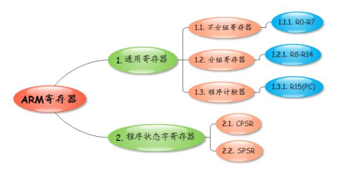

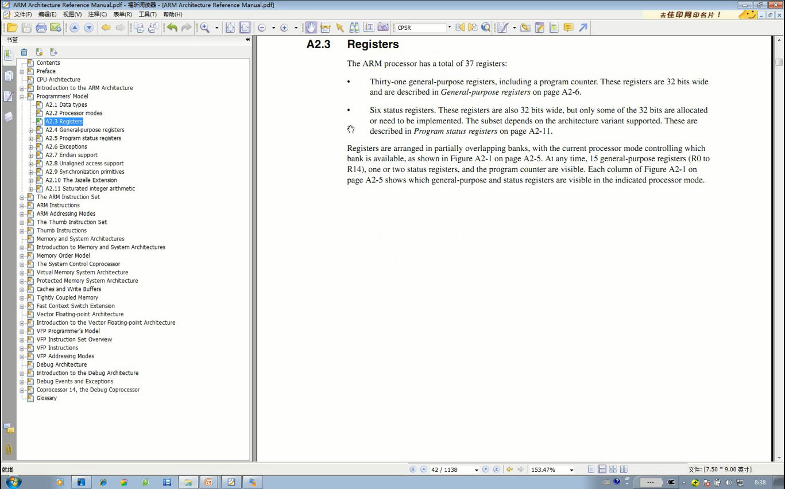

      ARM包含 - 37个寄存器
        * 31个通用寄存器：R0~R14 + PC + 特殊状态下的寄存器
        * 6个状态寄存器
      尖角阴影标记用于特殊模式，是具体存在的，不是寄存器复用

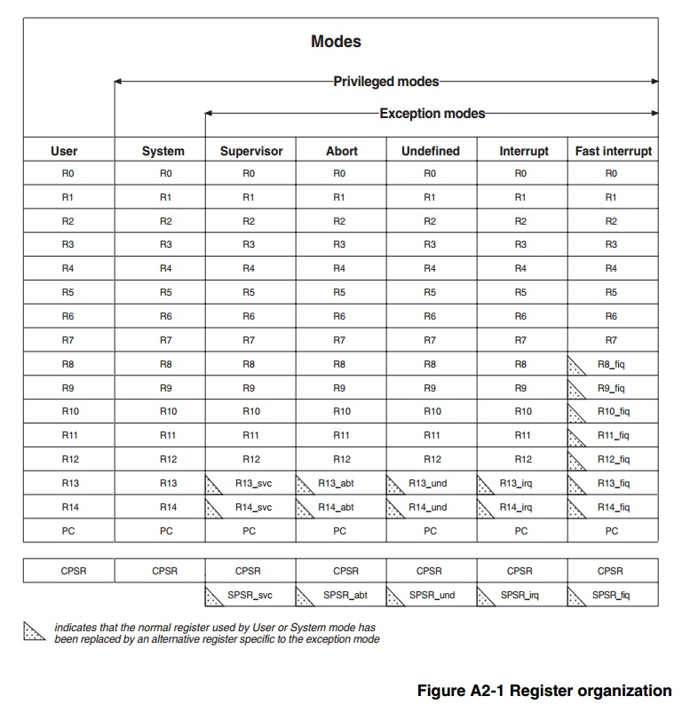

      不分组：R0~R7 & PC- 任何状态下都一样
      分组：R8~R14 - 特殊状态特殊用途

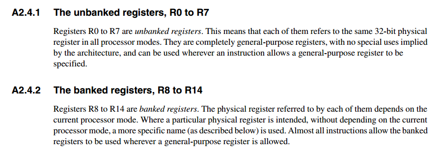

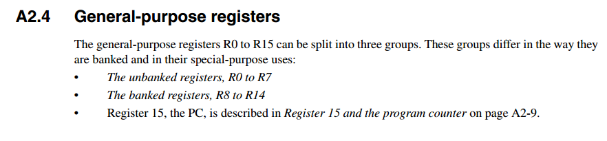

      R13:堆栈指针 - SP
      R14:链接寄存器 - LR
        保存函数返回地址or中断返回，X86返回地址放在堆栈，缓冲区溢出危险。
      R15-PC:

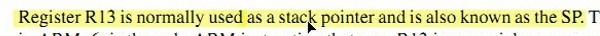

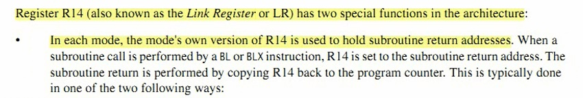

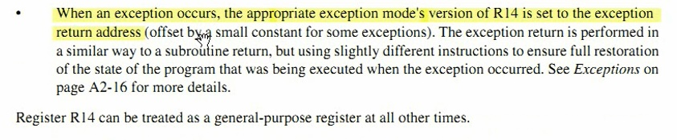

### 程序状态寄存器

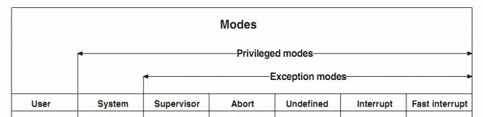

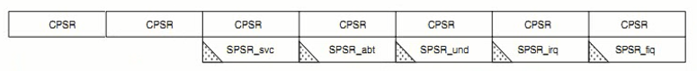

      为什么要在异常模式下才能有两个程序状态寄存器？
        因为中断过程程序状态寄存器也可能变化，为避免干扰程序运行，进入中断之前先保存程序状态。返回时候再恢复。
      CPSR:Current Program Status Register
      SPSR:Save Program Status Register
      CPSR只有一个，SPSR在不同模式下有不同的5个，一共六个

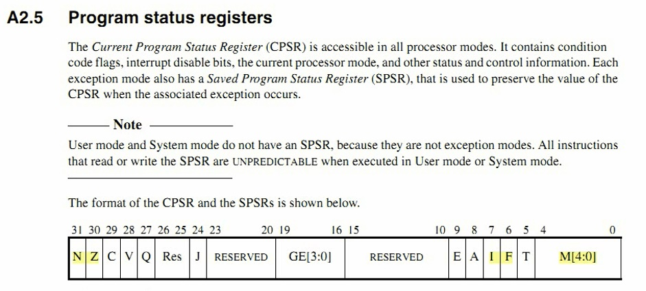

      N:比较数字大小，减法操作，结果为负数则标志为1，否则为0
      Z:a-b = 0的时候
      I:为1时候不能产生IRQ，中断屏蔽
      F:为1时候不能产生FRQ，中断屏蔽
      M:表明处理器不同工作模式

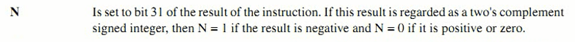

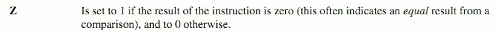

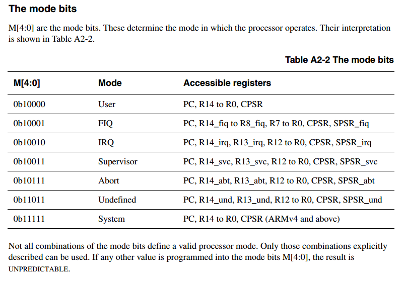

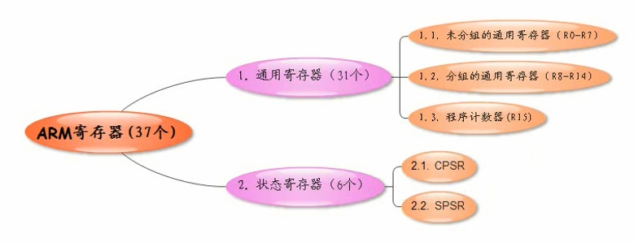
