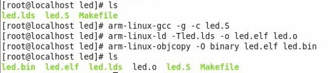
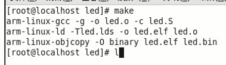
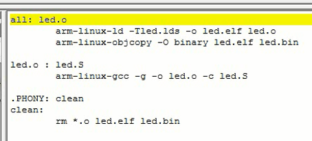
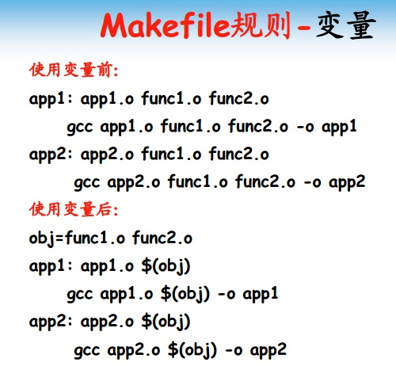
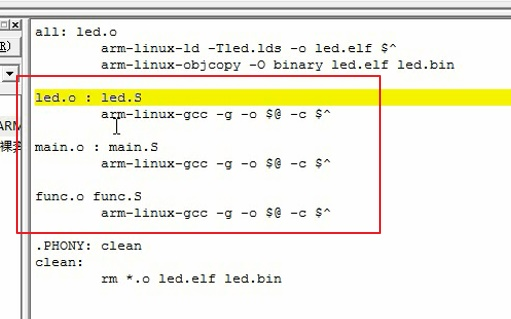

# 第3课-Makefile工程管理

## 课程索引

## 为什么要使用Makefile？

      裸机程序编译成二进制程序，如果其过程涉及千万步骤，必然不方便使用
      最简单的用shell脚本，类似于批处理
      但是Linux又多了一个Makefile系列工具，除了批出来还增加了很多高级用法。
      这些高级用法都只针对于Makefile使用，有特有的Makefile语法
      大大提高开发效率
      说白了，这东西就是方便开发人员偷懒的工具

      因此，该工具成为Linux编程人员不可获取的工具

## Makefile构成

### 规则

      规律：目标+[依赖]+命令
      Makefile就是由一条一条规则组成

      很明显，这个目标是错误的，应该是led.elf

### 伪目标

### 最终目标

      make 目标名字
      如果没有目标名字，默认选择第一个目标

### 变量

      变量也是为了偷懒，少打几个字符，尤其是早起敲键盘特别吃力的年代，少打几个字多活几年

      系统自定义的变量，强记，多用就熟悉了。

### 通用规则

      相同规则合并，比如
          目标和依赖同类型，命令相同便可以用%代替

      任何以.S结尾的都会产生.o的文件

## Makefile使用技巧

### 去掉回显

      # 字符在shell中也是注释，除了第一个
      #!/bin/bash

### 指定Makefile

      默认Makefile和makefile都会被make命令识别，其他需要-f选项指定

