<!-- TOC depthFrom:1 depthTo:6 withLinks:1 updateOnSave:1 orderedList:0 -->

- [第3课-U-Boot工作流程分析](#第3课-u-boot工作流程分析)
	- [课程索引](#课程索引)
	- [Uboot分析](#uboot分析)
	- [S3C2440](#s3c2440)
		- [设置中断向量表](#设置中断向量表)
		- [设定SVC模式](#设定svc模式)
		- [刷新I/D cache](#刷新id-cache)
		- [关闭MMU和Cache](#关闭mmu和cache)
		- [初始化系统时钟，设定串口，初始化Nand](#初始化系统时钟设定串口初始化nand)
		- [代码从启动设备到内存的拷贝](#代码从启动设备到内存的拷贝)
		- [设置堆栈](#设置堆栈)
		- [清除BSS段](#清除bss段)
		- [总结](#总结)
		- [第二阶段 软硬件初始化](#第二阶段-软硬件初始化)
	- [S3C6410](#s3c6410)
		- [程序入口](#程序入口)
		- [第一阶段程序分析](#第一阶段程序分析)
		- [第二阶段程序分析](#第二阶段程序分析)
	- [S5PV210](#s5pv210)
		- [程序入口](#程序入口)
		- [第一阶段程序分析](#第一阶段程序分析)
		- [bootloader2从哪里拷贝到内存哪里？](#bootloader2从哪里拷贝到内存哪里)
		- [总结](#总结)
		- [第二阶段程序分析](#第二阶段程序分析)
		- [总结](#总结)

<!-- /TOC -->
# 第3课-U-Boot工作流程分析

模仿到设计的原则，模仿业界老大，要模仿必先了解它的工作原理

## 课程索引

      Bootloader0：芯片厂商提供好了的，固化不可变
      Bootloader1：BL1 垫脚石
      Bootloader2：BL2 内存SDRAM
      2440、6410启动代码比较接近

## Uboot分析

      每一个开发板在Uboot源码Makefile中都有一个配置文件

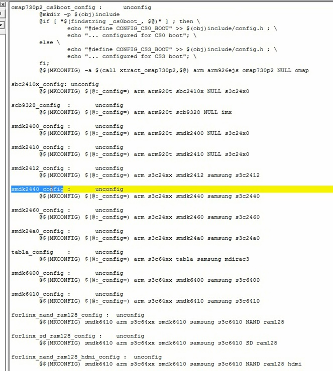

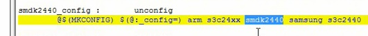

      找到名称，然后在board目录下找到smdk相对于的子目录
      存放的就是开发板相关的文件。
      关注Uboot链接器脚本

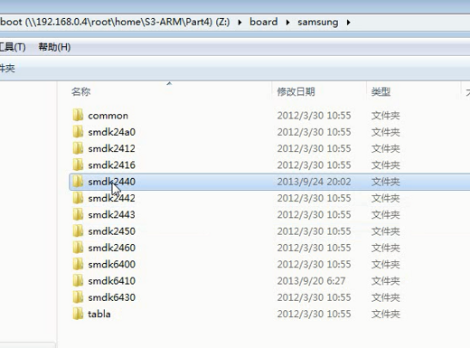

## S3C2440

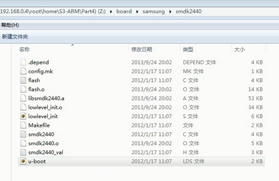

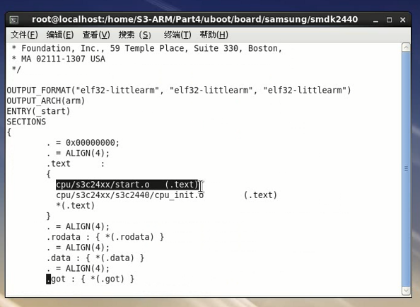

      根据链接器脚本可以知道，代码段首是start.o

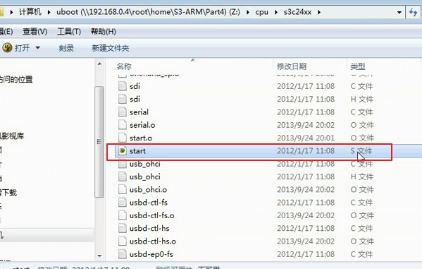

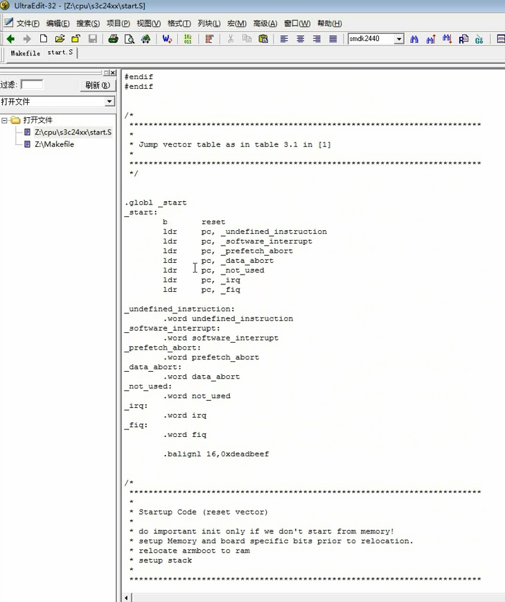

      但是哪一行代码优先运行？Entry表明程序入口

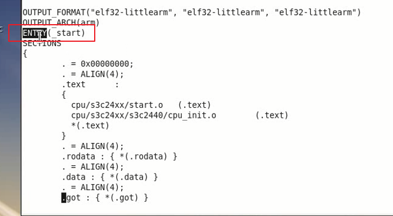

      也就是说，start.o中的Entry优先运行

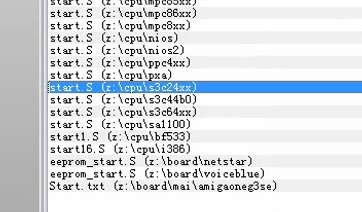

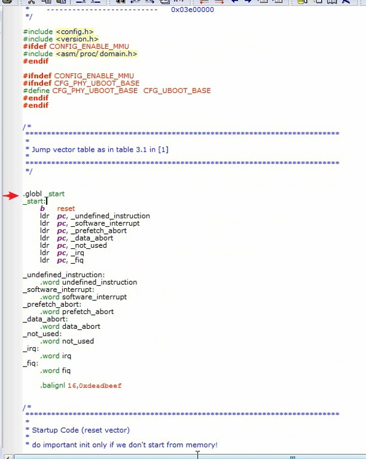

			分析阶段只关心做了什么，不关心具体是怎么实现的。
			注释比较详细，不用担心

### 设置中断向量表

### 设定SVC模式

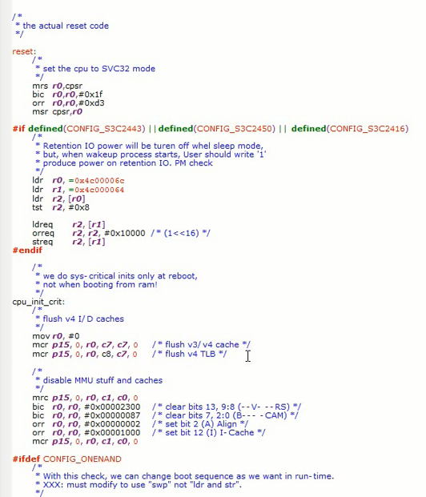

### 刷新I/D cache

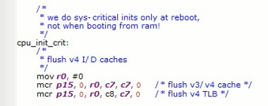

### 关闭MMU和Cache
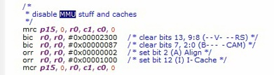

### 初始化系统时钟，设定串口，初始化Nand

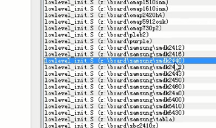

			判断uboot是否在内存中，如果不在进行内存初始化

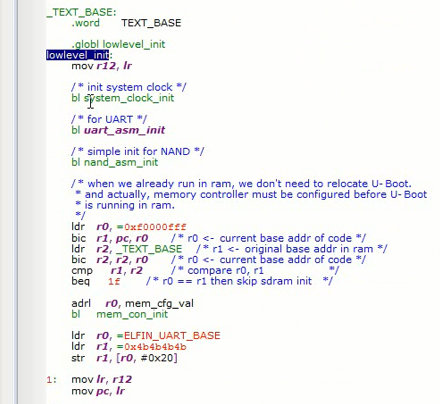

###	代码从启动设备到内存的拷贝

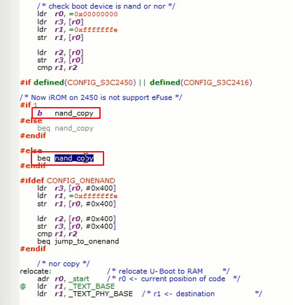

### 设置堆栈

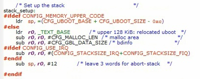

### 清除BSS段

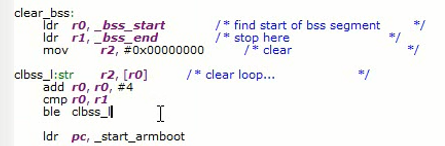

### 总结

1. NandFlash 开头4KB拷贝到垫脚石。start.S
2. CPU从start.S开始执行
3. 把NandFlash剩余代码复制到内存中的固定位置
4. 从垫脚石跳转到bootloader2阶段继续运行

			凭什么说start_armboot在内存中(bootloader2阶段)？以下分析

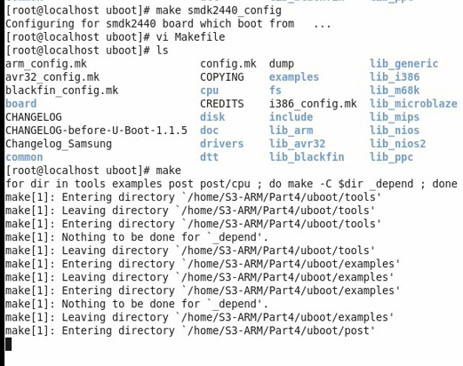

			先配置工程，然后make，会生成链接脚本

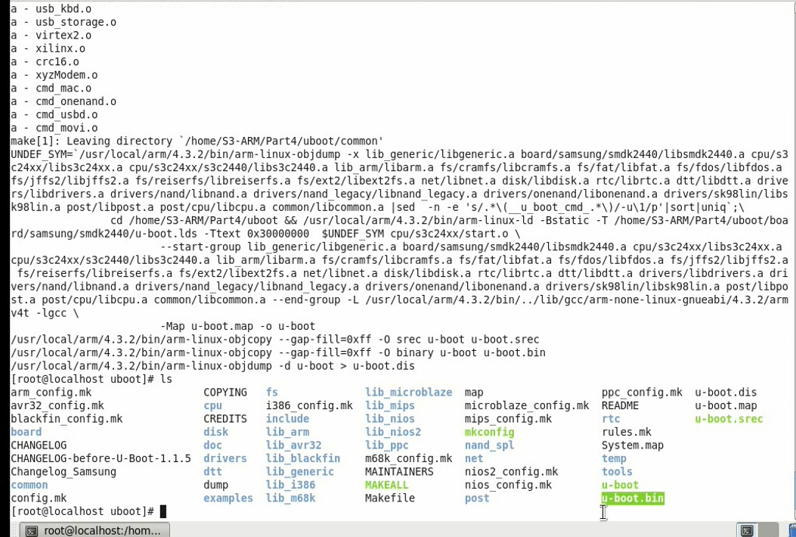

			u-boot是elf格式，u-boot.bin是二进制

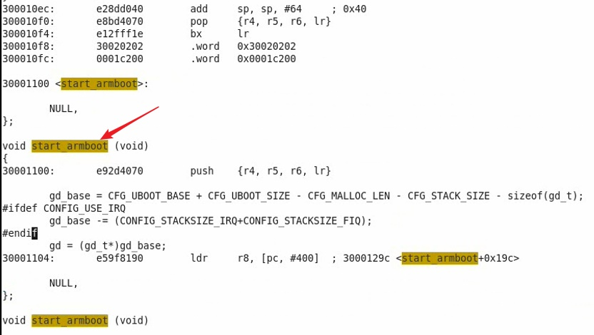

			这个地址确实是内存中，但是怎么来的？？？

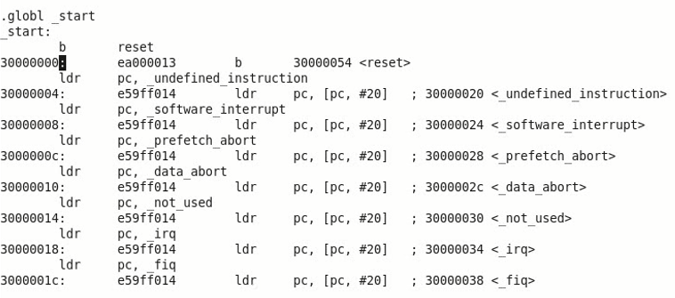

			第一阶段是从垫脚石开始，垫脚石是从0地址开始。看下链接器脚本

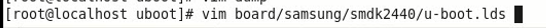

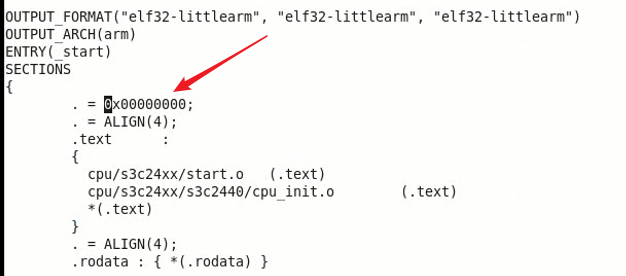

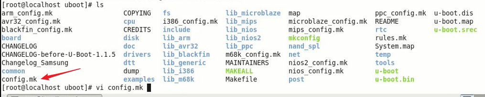

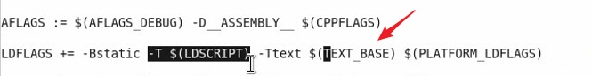

			指定使用链接器脚本，链接器脚本可以指定起始地址，但是-Ttext也可以指定地址。很明显-Ttext优先
			配置是在芯片的config里面
			修改配置文件的地址，妥妥生效

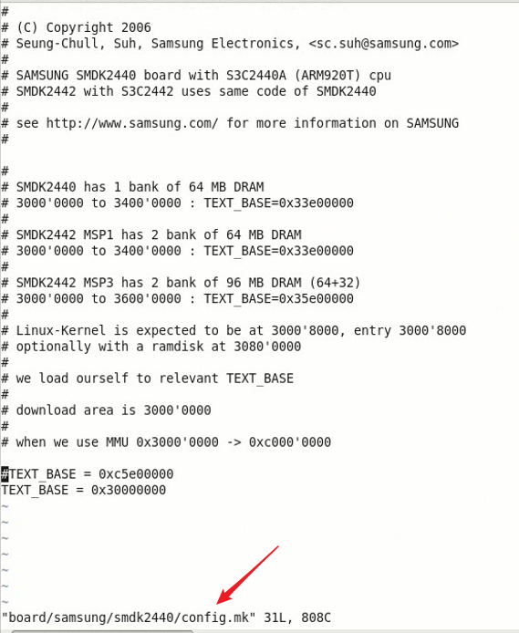

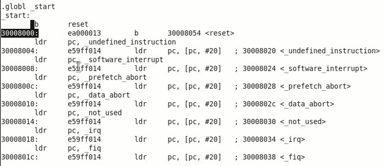

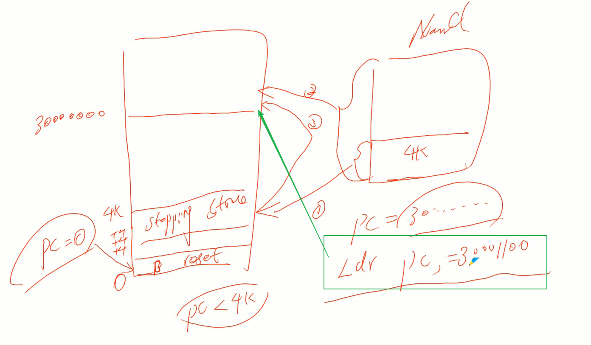

			为什么有些跳转没有跳到内存中，而是还在垫脚石。因为是相对跳转哦
			链接地址不代表PC的值。
			而LDR pc,0x30008000 就是绝对跳转了

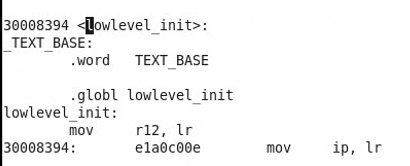

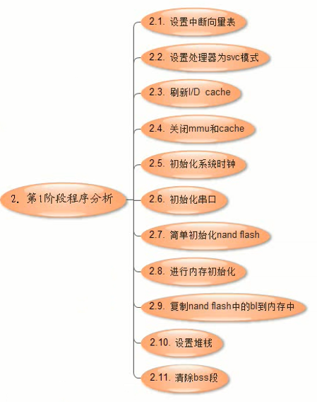

### 第二阶段 软硬件初始化

**初始化一些环境变量**
**第二阶段基本都是start_armboot函数硬件纯软件初始化**

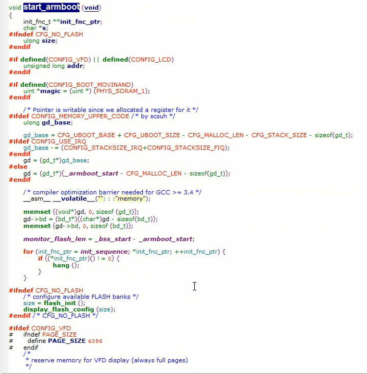

			for循环调用初始化函数

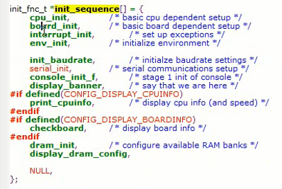

			初始化串口

			LCD初始化

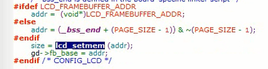

			网卡初始化

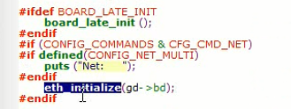

			LED初始化

			执行用户输入的命令

* 总结

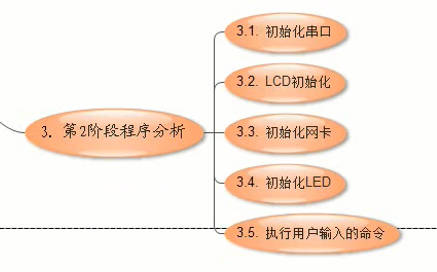

## S3C6410

### 程序入口

			通过Makefile找到程序入口

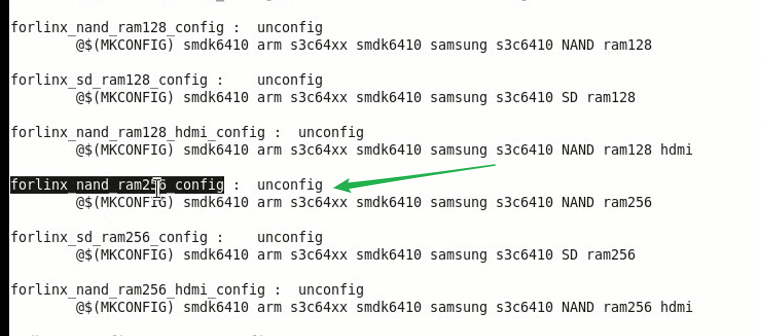

			打开链接器脚本
			段头文件以及程序入口

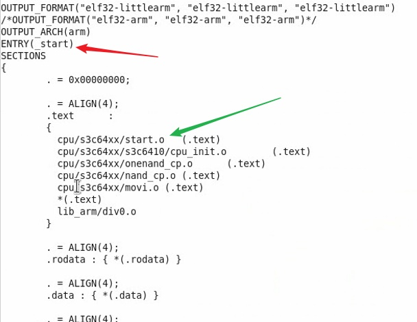

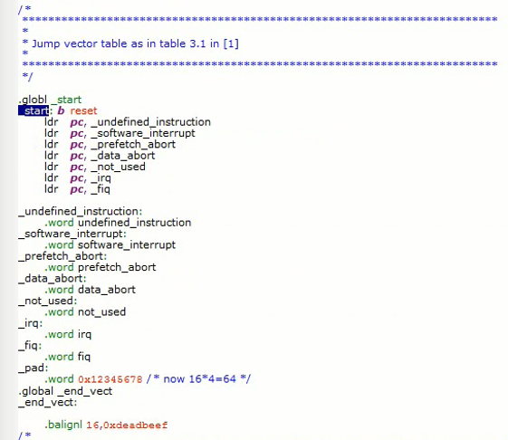

### 第一阶段程序分析

			设置中断向量表

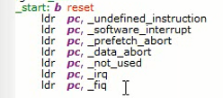

			设置CPU到SVC模式

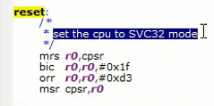

			刷新I/D cache

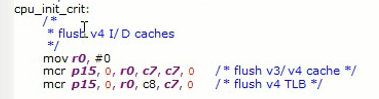

			关闭MMU和Cache

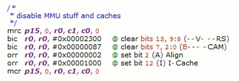

			外围设备基地址进行初始化，6410才有，2440没有

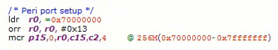

			lowlevel_init主要是点亮LED，帮助程序进行调试

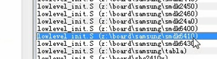

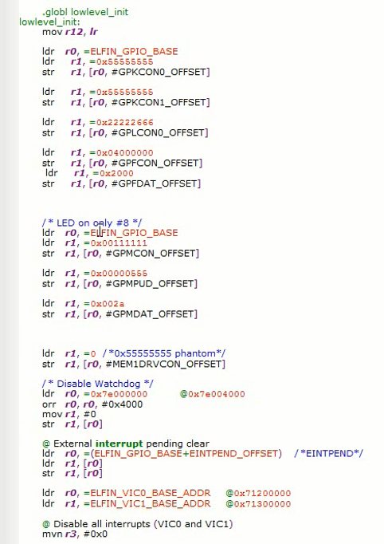

			关闭看门狗

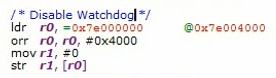

			关闭所有中断

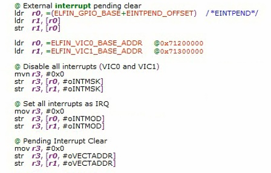

			初始化系统时钟

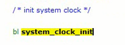

			初始化串口

			初始化NandFlash

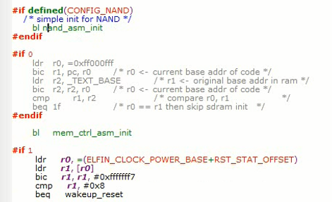

			初始化内存

			拷贝第二阶段到内存中

			堆栈初始化

			清除bss段

			跳转到start_armboot

### 第二阶段程序分析

第二阶段和2440一样

## S5PV210

### 程序入口

启动过程

1. IROM通过映射到0地址处，处理器从0开始执行
2. 首先IROM固话程序把bootloader1复制到IRAM中，16KB，然后执行
3. 执行过程中复制bootloader2，如果booloader2大于80KB拷贝内存，否则放在IRAM垫脚石
4. 然后跳转bootloader2执行

booloader1和bootloader2其实放在同一个bin中。也有划分两个bin文件的

### 第一阶段程序分析

			设置中断向量表

			设置SVC工作模式

			让L1 I/D cache失效、关闭

			关闭MMU和Cache

			lowlevel_init主要是点亮LED

			I/O引脚初始化

			关闭看门狗

			SRAM、SROM初始化

			判断是否在内存中运行

			时钟初始化

			内存才能初始化

			串口初始化

			NandFlash简单初始化

			关闭ABB

			设置堆栈

			把bootloader2拷贝第二阶段到内存中

### bootloader2从哪里拷贝到内存哪里？

			把bootloader2复制到内存中0x23E0000

			跳转到bootloader2
			简单粗暴直接运行函数

### 总结

### 第二阶段程序分析

			入口在哪里？？第二阶段连接器脚本。
			还是从start.S中执行？重复了也
			操作也是重复的

			跳转到boot_init_f。该函数才是210中的boot_init

			该函数没有函数体
			弱函数，如果有同名函数就失效了。
			但是它跟另外一个函数关联起来。实际调用defulat函数

### 总结

