<!-- TOC depthFrom:1 depthTo:6 withLinks:1 updateOnSave:1 orderedList:0 -->

- [第3课-关闭看门狗](#第3课-关闭看门狗)
	- [什么是看门狗？作用](#什么是看门狗作用)
	- [看门狗的种类](#看门狗的种类)
	- [看门狗-工作方式](#看门狗-工作方式)
	- [为什么要关闭看门狗](#为什么要关闭看门狗)
	- [如何关闭看门狗](#如何关闭看门狗)
	- [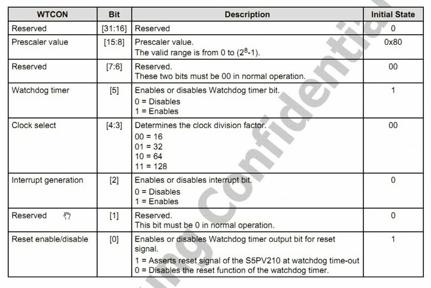](#1526348487271pngimage1526348487271png)
- [define pWTCON 0x7e004000](#define-pwtcon-0x7e004000)

<!-- /TOC -->
# 第3课-关闭看门狗

## 什么是看门狗？作用

      工作在极端环境下的嵌入式产品
      当嵌入式系统进入死机状态，实现系统的重启
      在产品化的嵌入式系统中，为了使系统在异常情况下能自动复位，一般都需要引入看门狗。
      看门狗其实就是一个可以在一定时间内被复位的计数器。当看门狗启动后，计数器开始自动计数，经过一定时间，如果没有被复位，计数器溢出就会对CPU产生一个复位信号使系统重启（俗称“被狗咬”）。系统正常运行时，需要在看门狗允许的时间间隔内对看门狗计数器清零（俗称“喂狗”），不让复位信号产生。如果系统不出问题，程序保证按时“喂狗”，一旦程序跑飞，没有“喂狗”，系统“被咬”复位。
      这就好比你的身边有一只时刻饥饿的狗，你不按时给它肉吃，它就会吃你的肉，你被吃了......挂了，投胎转世，彻底重新做人了。不幸的是来世你还得喂狗-_-!!

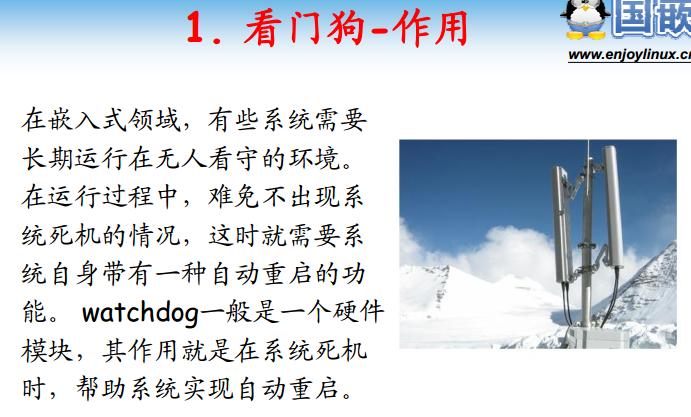

## 看门狗的种类

在现在的嵌入式系统中主要可以分为两种类型的看门狗：
A. CPU内部自带的看门狗：此类看门狗一般是将一个芯片中的定时器来作为看门狗，通过程序的初始化，写入初值，设定溢出时间，并启动定时器。程序按时对定时器赋初值（或复位），以免被咬。这种看门狗是可以被禁用的（只要停止这个定时器即可），好比对那只要咬你的狗来个“葵花点穴手”。大部分CPU都内置看门狗，硬件原理可参考各芯片数据手册。

* 优点：可以通过程序改变溢出时间；可以随时禁用
* 缺点：需要初始化；如果程序在初始化、启动完成前跑飞或在禁用后跑飞，看门狗就无法复位系统，这样看门狗的作用就没有了，系统恢复能力降低。

B. 独立的看门狗芯片：这种看门狗主要有一个用于喂狗的引脚（一般与CPU的GPIO相连）和一个复位引脚（与系统的RESET引脚相连），如果没有在一定时间内改变喂狗脚的电平，复位引脚就会改变状态复位CPU。此类看门狗一上电就开始工作，无法禁用。现在常用的芯片有：CAT705/CAT706、IMP706等等，溢出时间在1.6秒左右。 硬件原理可以参考各芯片数据手册和《基于Linux的嵌入式系统全程喂狗策略》。

* 优点：无须配置，上电即用。无法禁用，系统必须按时喂狗，系统恢复能力高。
* 缺点：无法灵活配置溢出时间，无法禁用，灵活性降低。


## 看门狗-工作方式

      硬件定时器的作用
      在计时结束之前喂狗，超时没有喂狗就要被狗咬


      看门狗原理图，基本类似

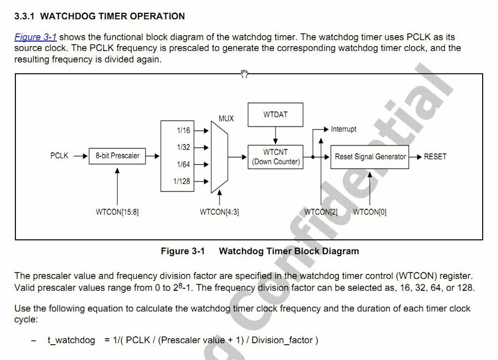

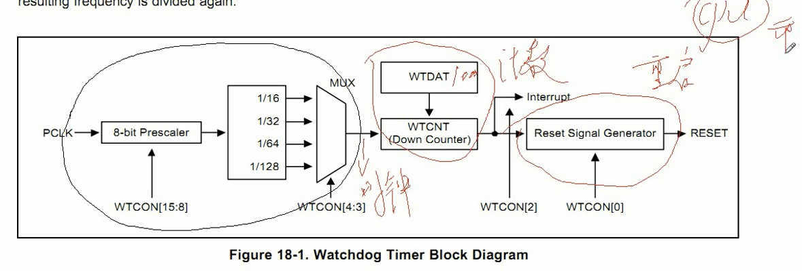

## 为什么要关闭看门狗

在bootloader下的使用

如果是CPU内置的看门狗，一般在这阶段可以禁用，所有没什么特殊的操作。喂狗麻烦
但是如果是独立的看门狗芯片就必须喂了。或者为了保险，你在bootloader中就启动了看门狗，也得喂了。

bootloader有很多，基本原理都是一样的，喂狗的过程也基本一样，在这里以uboot为例讲解如何喂狗。
u-boot的运行分为以下几个阶段：

1. 最早的简单初始化，代码重定位的自拷贝阶段
2. 系统详细初始化阶段
3. 控制台阶段（如果使用了自动启动，则跳过）
4. OS内核拷贝（可能带有解压过程），跳入操作系统

## 如何关闭看门狗

      通过看门狗控制寄存器WTCON（Watch Timer Control）。
      把第0位设置为0,关闭看门狗
      把第2位设置为0,关闭中断
      三个平台对比，类似，都是通过寄存器开关看门狗

      2440看门狗

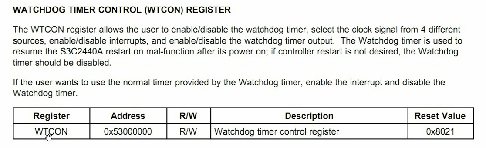

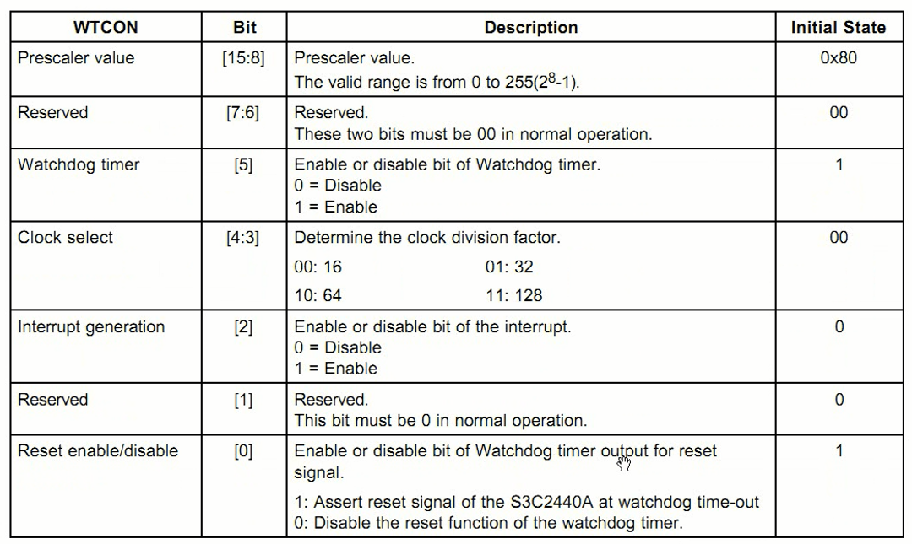

      6410看门狗

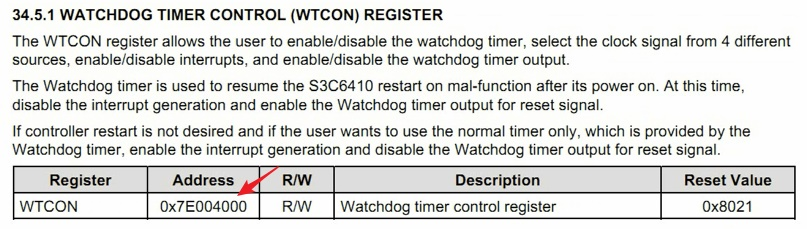

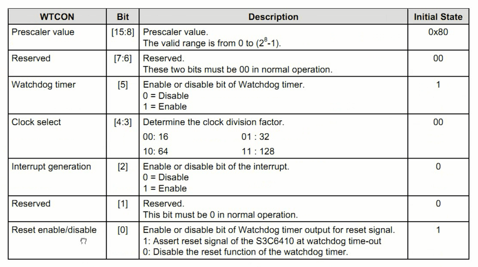

      210看门狗

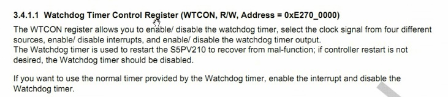

##

 看门狗代码

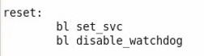

      定义一个宏，保存寄存器地址

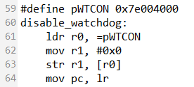

```
@****************************
@File:start.S
@
@成都国嵌嵌入式培训中心
@****************************

.text
.global	_start
_start:
		b	reset
		ldr	pc, _undefined_instruction
		ldr	pc, _software_interrupt
		ldr	pc, _prefetch_abort
		ldr	pc, _data_abort
		ldr	pc, _not_used
		ldr	pc, _irq
		ldr	pc, _fiq

_undefined_instruction: .word undefined_instruction
_software_interrupt:	.word software_interrupt
_prefetch_abort:	.word prefetch_abort
_data_abort:		.word data_abort
_not_used:		.word not_used
_irq:			.word irq
_fiq:			.word fiq

undefined_instruction:
		nop

software_interrupt:
		nop

prefetch_abort:
		nop

data_abort:
		nop

not_used:
		nop

irq:
		nop

fiq:
		nop

reset:
		bl set_svc
		bl disable_watchdog

set_svc:
		mrs r0, cpsr
		bic r0, r0, #0x1f
		orr r0, r0, #0xd3
		msr cpsr, r0
		mov pc, lr

#define pWTCON 0x7e004000
disable_watchdog:
		ldr r0, =pWTCON
		mov r1, #0x0
		str r1, [r0]
		mov pc, lr

```

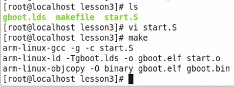 
