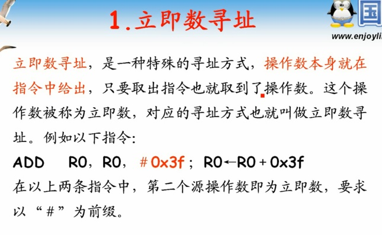
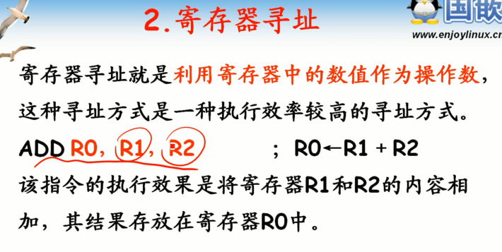
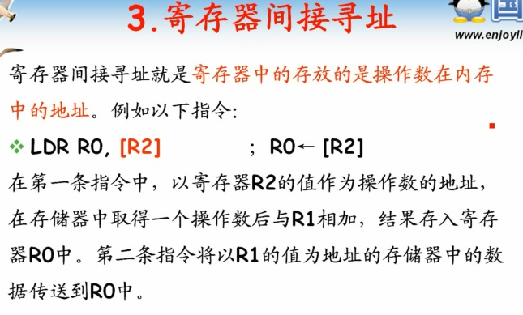

# 第4课-ARM寻址方式

## 为嘛要寻址方式？

      处理器根据指令中给出来的信息找到操作数的方式
      如何找到指令的操作数？

### 立即数寻址

      操作数本身就包含在指令中，而不是给出操作数所在的地址信息
      ADD R0,R0,#0X3F ;
      立即数必须以#开头

### 寄存器寻址

      操作数数值存放在寄存器当中

### 寄存器间接寻址

      寄存器存放的是操作数所在的内存地址

### 基址变址寻址

      基址：基址寄存器，寄存器
      变址：偏移量，立即数
      寄存器的地址+立即数的值 = 操作数在内存中的地址

### 相对寻址

      相对近跳转：跳转终点站地址 - pc值 + pc指向指令地址
      将在专题三和汇编指令结合起来

