<!-- TOC depthFrom:1 depthTo:6 withLinks:1 updateOnSave:1 orderedList:0 -->

- [第4课-Bootloader架构设计](#第4课-bootloader架构设计)
	- [安装亿图 - 思维导图](#安装亿图-思维导图)
	- [设计自己的bootloader](#设计自己的bootloader)
	- [归类初始化工作](#归类初始化工作)
	- [第一阶段](#第一阶段)
	- [第二阶段](#第二阶段)

<!-- /TOC -->

# 第4课-Bootloader架构设计

## 安装亿图 - 思维导图

      自行下载，万能谷歌

## 设计自己的bootloader

      起个响亮的名字先yboot？

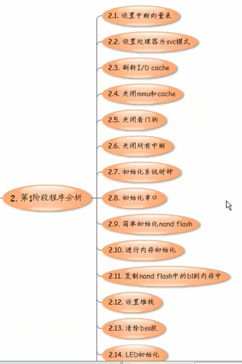

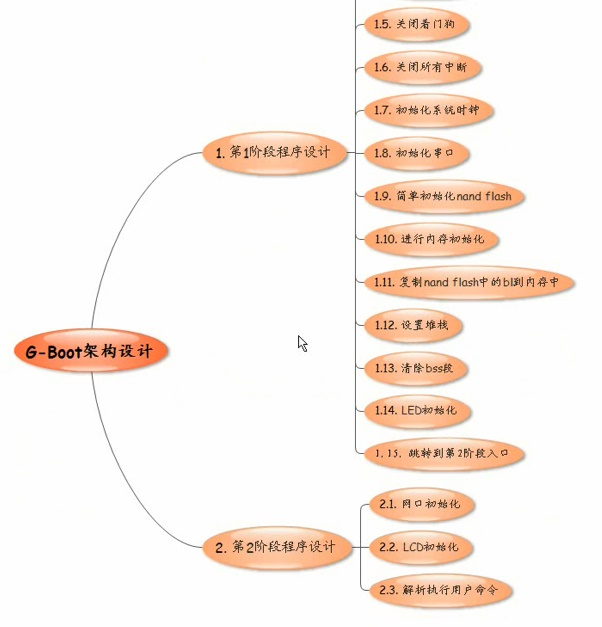

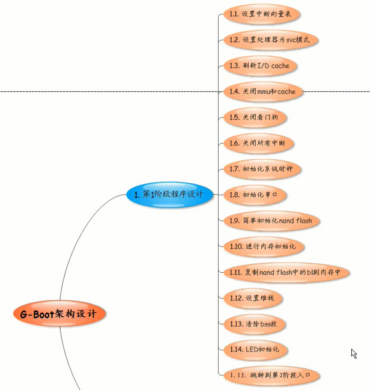

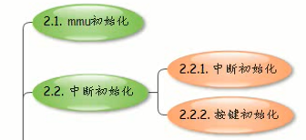

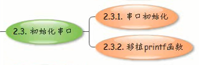

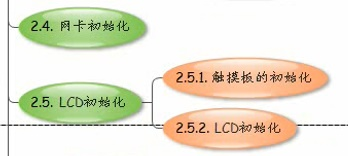

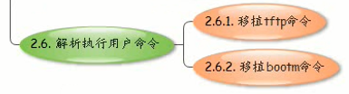

## 归类初始化工作

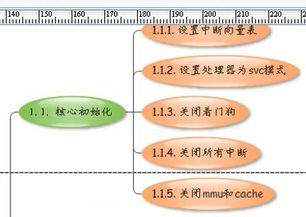

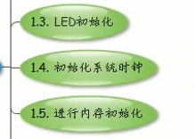

## 第一阶段

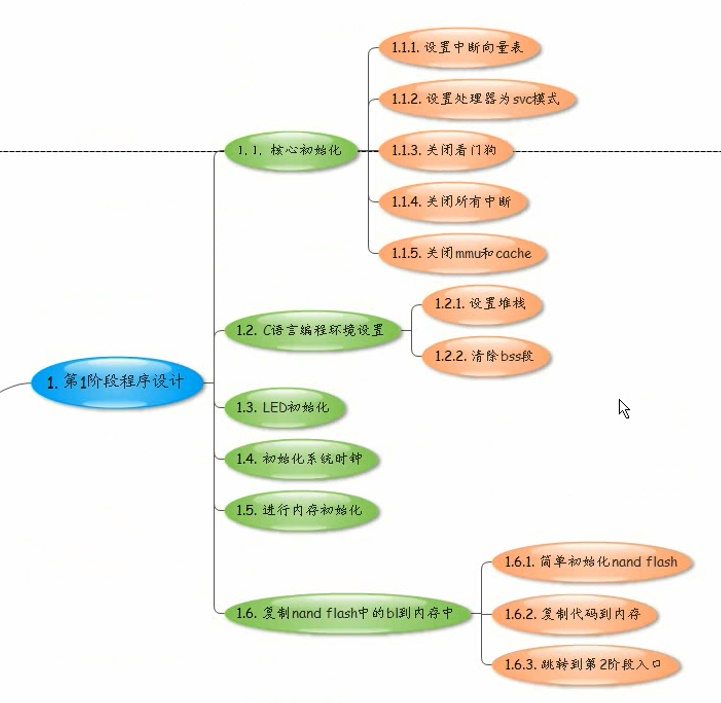

## 第二阶段

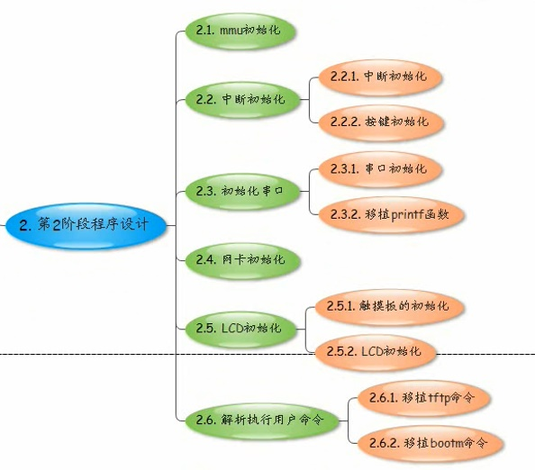

## 6410特有

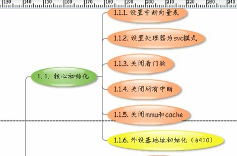

## 210特有

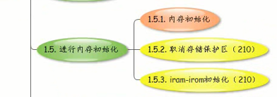

## 总结

**编码之前必须要有一个整体架构，培养架构能力**
