<!-- TOC depthFrom:1 depthTo:6 withLinks:1 updateOnSave:1 orderedList:0 -->

- [第4课-关闭中断](#第4课-关闭中断)
	- [中断屏蔽寄存器](#中断屏蔽寄存器)
		- [2440屏蔽中断 - 芯片手册](#2440屏蔽中断-芯片手册)
		- [2440关闭中断-代码](#2440关闭中断-代码)
		- [6410屏蔽中断 - 芯片手册](#6410屏蔽中断-芯片手册)
		- [6410关闭中断-代码](#6410关闭中断-代码)
		- [210屏蔽中断 - 芯片手册](#210屏蔽中断-芯片手册)
		- [210关闭中断-代码](#210关闭中断-代码)

<!-- /TOC -->

# 第4课-关闭中断

1. CPSR寄存器关闭中断，在设置SVC的时候附带关闭了中断。
2. 中断屏蔽寄存器设置，全1，屏蔽所有中断

## 中断屏蔽寄存器

### 2440屏蔽中断 - 芯片手册
        中断请求状态记录到SRCPND
        通过MASK屏蔽寄存器，是否屏蔽信号？

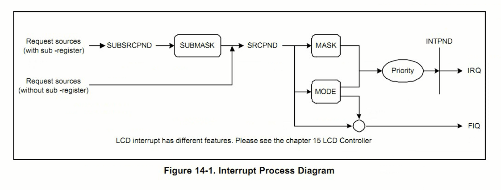

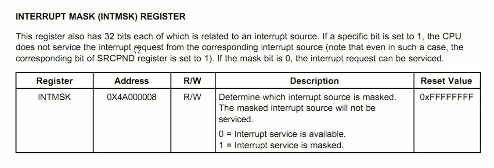

### 2440关闭中断-代码

      往中断屏蔽寄存器写入全1

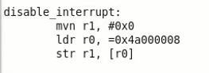

### 6410屏蔽中断 - 芯片手册
        采用中断向量，多数由硬件完成中断操作
        中断向量分成两组
        中断请求状态记录到SRCPND
        通过MASK屏蔽寄存器，是否屏蔽信号？

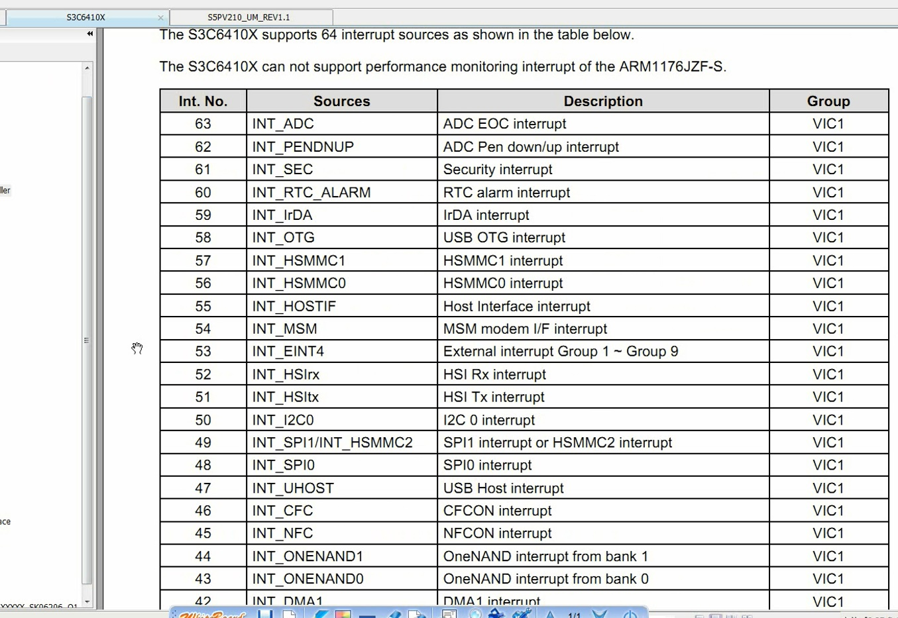

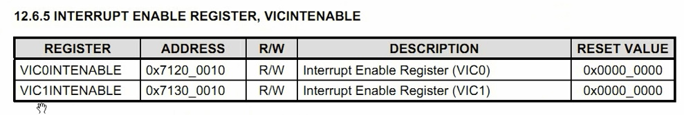

      使能中断和屏蔽中断分别用两个寄存器

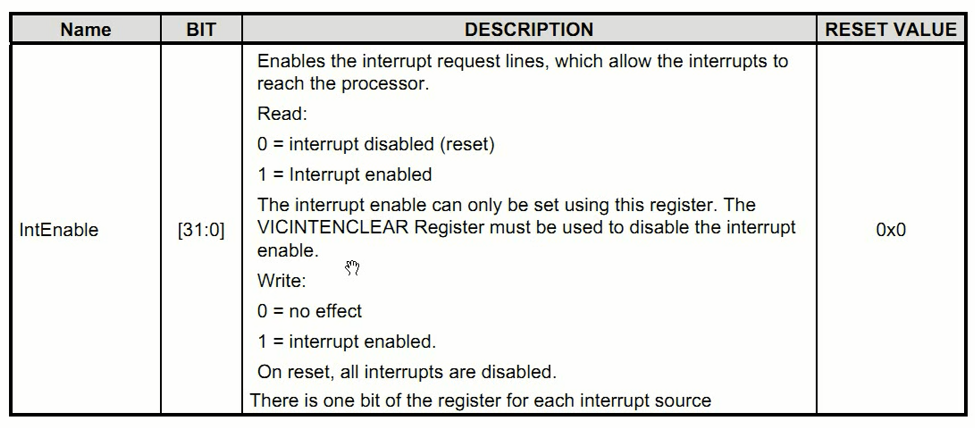

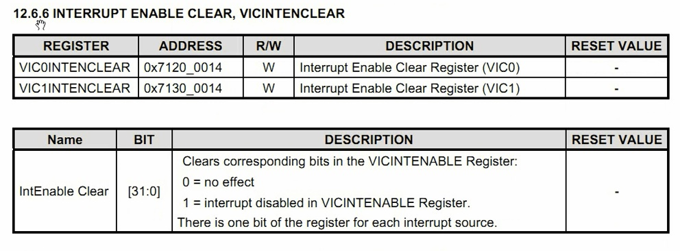

### 6410关闭中断-代码

      往两个中断屏蔽寄存器写入全1

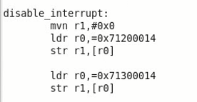

### 210屏蔽中断 - 芯片手册

      210和6410类似，都是用向量中断
      使能中断寄存器和屏蔽中断寄存器分开
      210支持更多类型的中断
      clear寄存器变成4个，也就是要置1四个寄存器

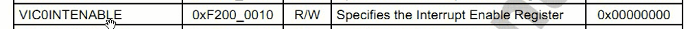

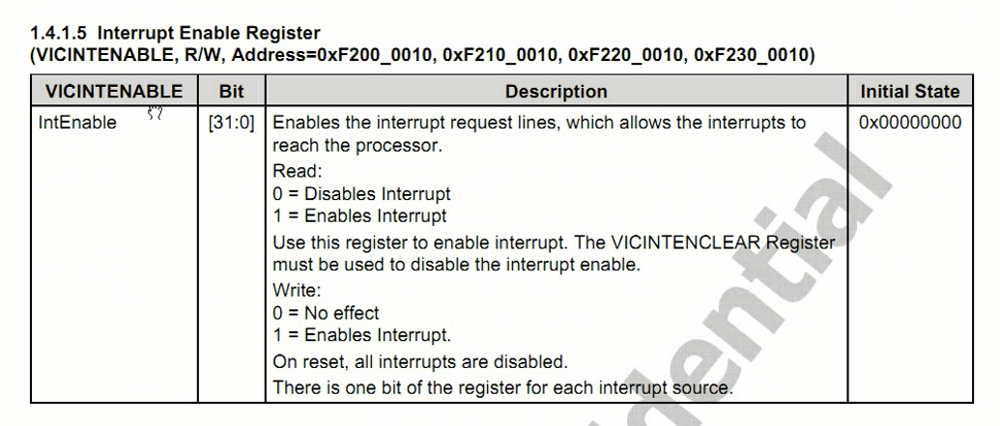

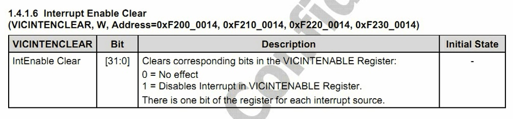

      四组中断屏蔽寄存器的地址

### 210关闭中断-代码

      往四个中断屏蔽寄存器写入全1

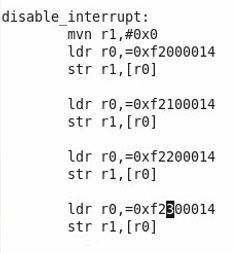
