# 第4课-协处理器访问指令

## 课程索引

## 什么是协处理器

      主刀医生和助手的关系
      CP15协处理器 CoProcesser
      ARM系统的重要组成部分

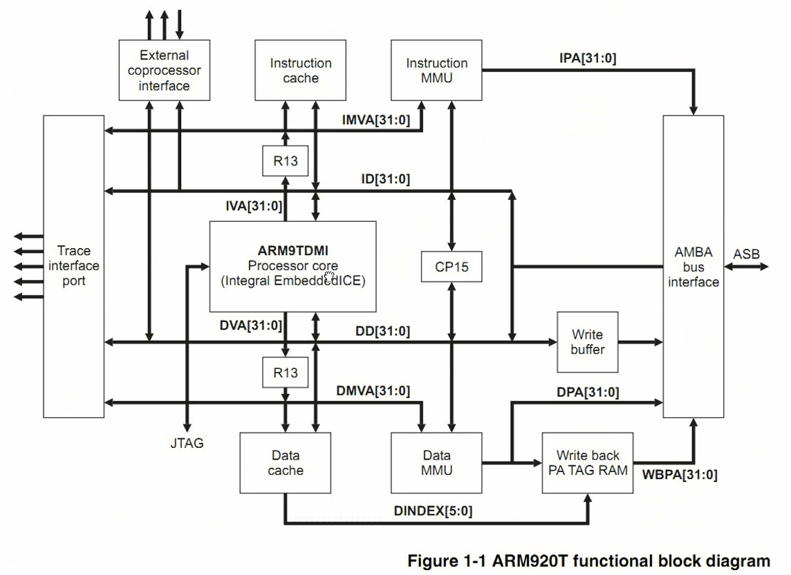

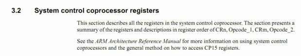

      协助处理，减轻负担，提供性能
      ARM最多支持16个
      协处理器，完成系统控制

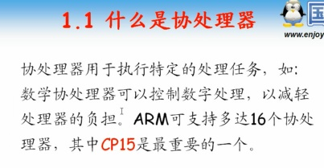

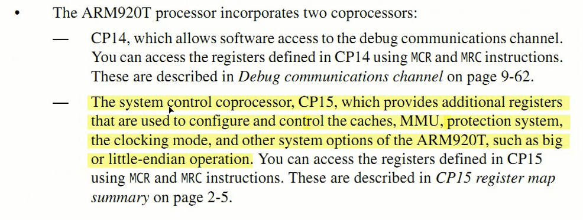

## 协处理器访问

      通过访问协处理器的处理器打到访问控制的目的
      CP15提供了16组寄存器

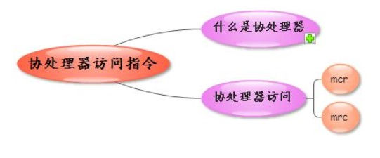

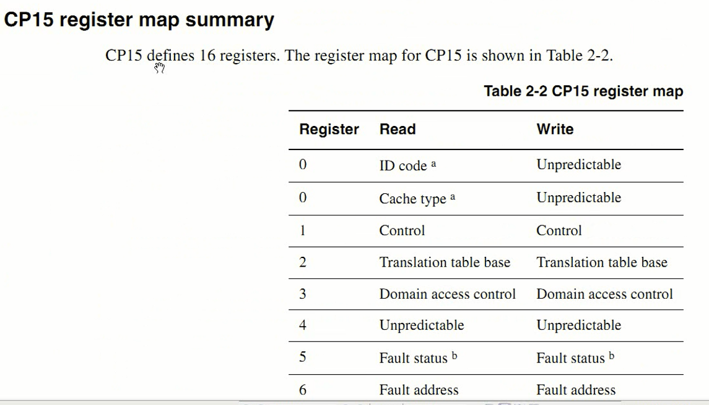

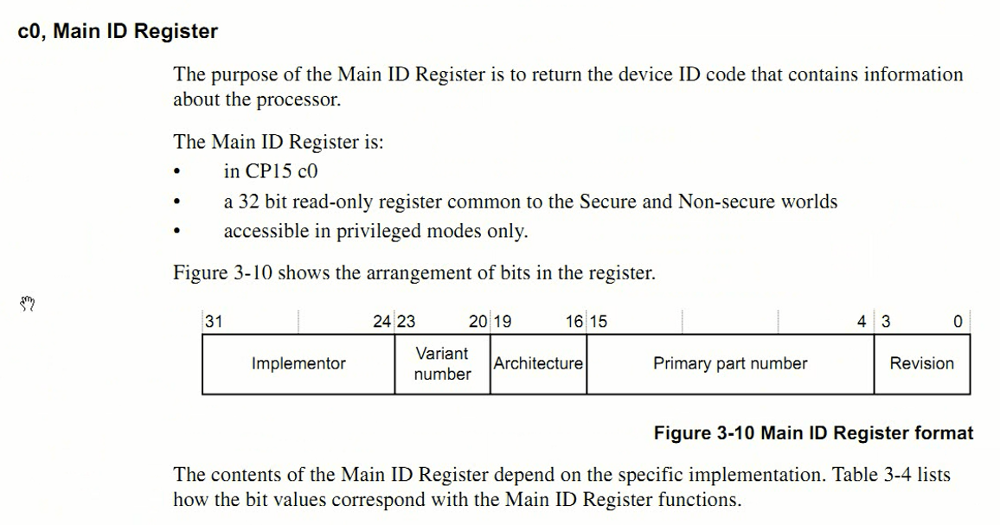

### 协处理器访问指令-mcr

      成对出现，
      r - 协处理器寄存器
      c - 通用寄存器
      cr = >   通用寄存器=协处理器寄存器

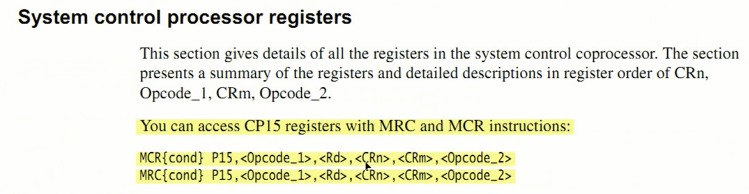

      访问Main id寄存器。只读寄存器。其值固定，根据手册校验其值。

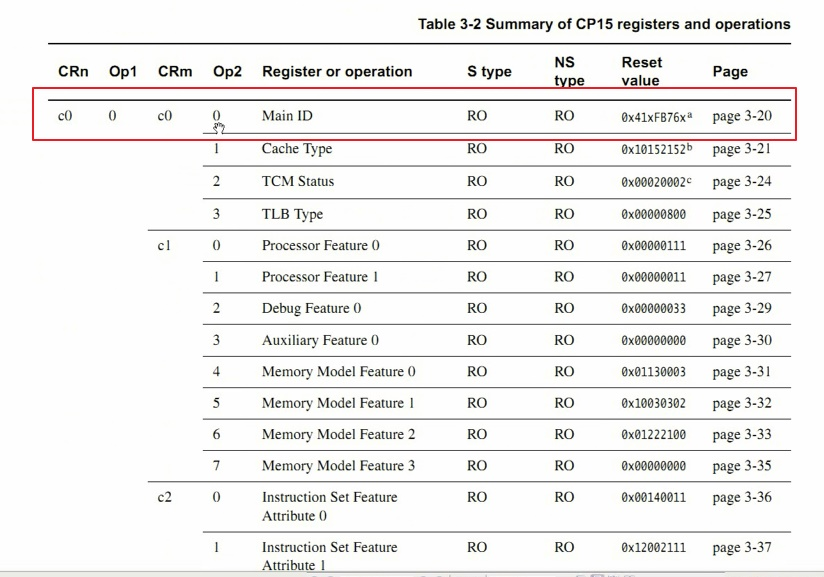

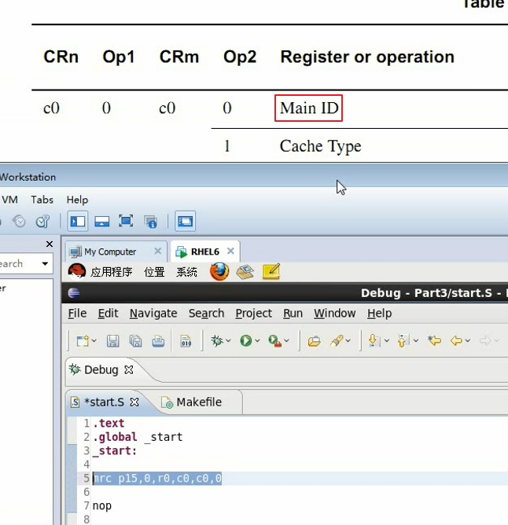

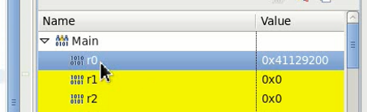

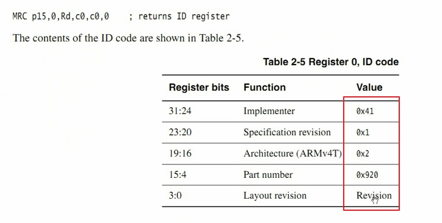

### 协处理器访问指令-mrc

      成对出现，
      r - 协处理器寄存器
      c - 通用寄存器
      cr = >   协处理器寄存器=通用寄存器
      根据手册提供的表格读写寄存器即可。
      访问emmmu的时候就要用到访问协处理器
