# 第4课-链接器脚本

## 课程索引

      内核驱动，uboot学习中会大量接触链接器脚本

## 链接器脚本的作用

      感受一波实验，点亮led灯实验

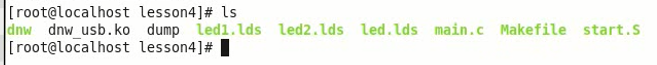

      把程序切分成两个文件，一个是main.c,一个是start.S

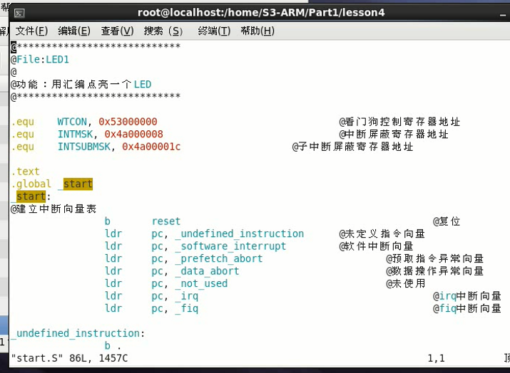

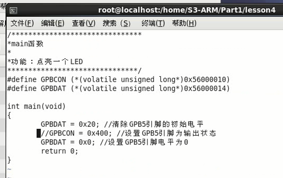

      start.S中调用main函数

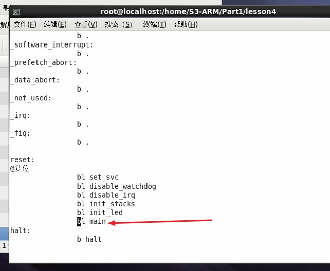

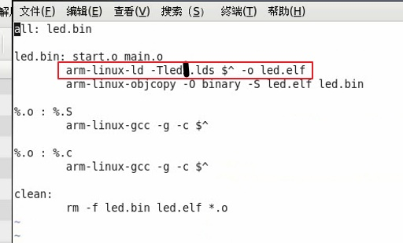

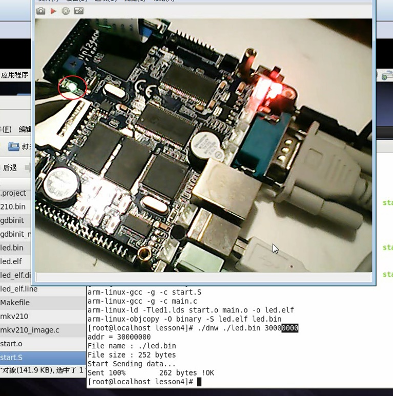

      虽然没有改程序代码，仅仅使用不同的链接器脚本，程序效果不同

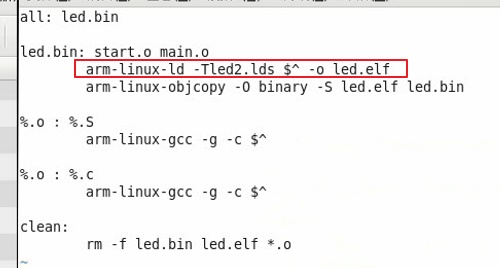

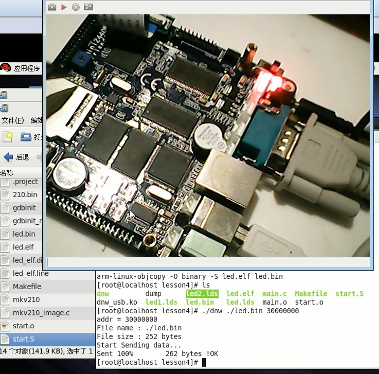

      链接器脚本对程序的生成有至关重要的作用->神奇作用

## 链接器脚本的构成

### 链接器脚本-段

      可执行程序，方便CPU识别，编译器分成了代码段数据段，根据不同的段属性划分
      BP、SP一向跟着SS段
      EIP一向CS段
      链接器脚本一般是lds文件扩展名(Linux虽然没有扩展名，只为人眼识别)

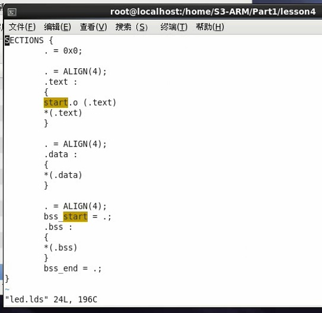

      链接器脚本最重要的就是段信息

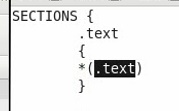

      * 表示所有文件的相关段，比如 *(.text)所有文件代码段 *(.data)所有文件数据段

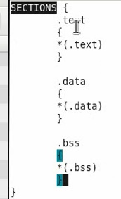

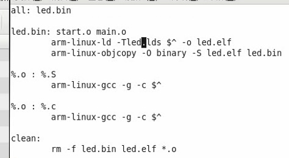

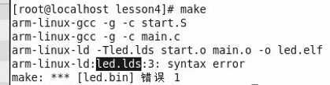

      有错误，每个段的段名之后应该有冒号

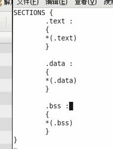

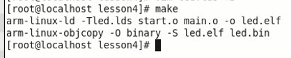

### 起始链接地址

      . 表示当前位置

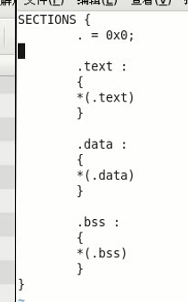

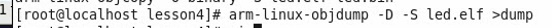

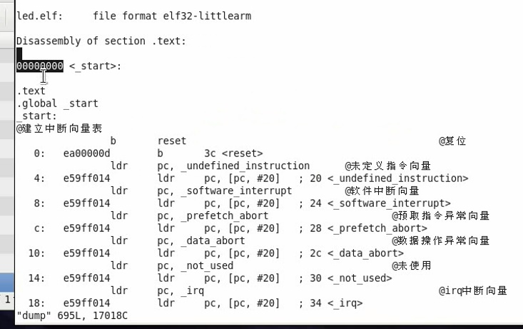

      起始地址为0x000，修改成0x30008000
      这个地址对程序有什么影响呢？视频留下伏笔，以后再讲。。好奇哟~
      . 表示当前位置，相当于vstart，也就是当前代码入口OEP地址

      这里面.data、.text、.bss段名是固定的哦，没有为嘛，其实就是CPU体系结构中
      段划分，CPU也划分段，并且可以从硬件上保护段的安全访问。而括号中的段，其实就是程序员划分的
      ，程序员都是爱咋浪咋浪的，如果规矩一点命名，一般人能看懂，不规矩的，fuck段都出来了

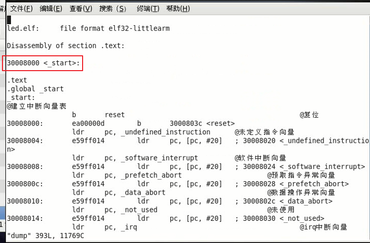

### 对齐

      为什么要对齐呢？用现实中常见的一个图
      譬如超市货架，为嘛要对齐？乱七八糟不好么，就是为了方便商家维护，方便客户使用
      内存中对齐一样，方便系统管理，方便程序存取
      如何字节对齐呢？地址能够被对齐的字整除
          0%4=0...0 ok
          1%4=0...1 no
          2%4=0...2 no
          3%4=0...3 no
          4%4=1...0 ok

      ARM处理器访问的时候四字节对齐，x86不也四字节对其么。。x86_64就8字节对齐
      各个段都要通过关键字ALIGN对齐

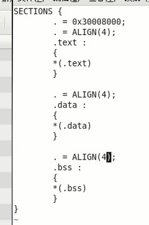

### 变量

      bss_start是自定义的变量，赋值为该段开始的地址
      bss_end也是自定义变量，赋值为该段结束地址
      这些变量可以在程序中用到，典型的用来计算bss段长度

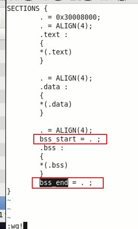

### 代码段首文件

      开头因链接脚本不同对程序产生很大影响的例子，神奇之处在哪里呢？
      在代码段的头文件位置
      程序包含多个文件，那么哪一个文件排在代码段的首位置？因为在前的先执行，没毛病。
      必须保证程序链接的时候main函数在开头执行，链接器脚本指定即可。
      清晰明了的在代码段中添加头位置代码段

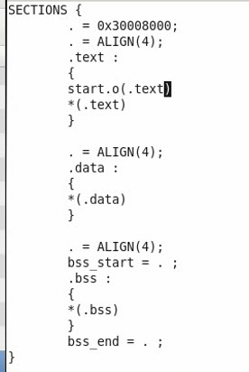

      而没有执行效果的那个链接器脚本是由于，把main.o设置成段首。
      start.S进行了CPU初始化工作，然后才进行main。如果位置颠倒了，没有效果很正常

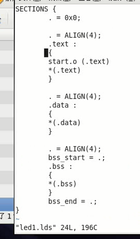

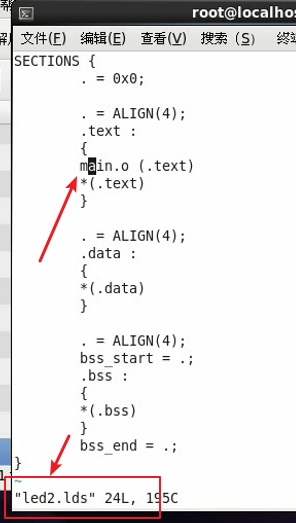

## 回顾

链接器脚本至关重要的作用在于其决定了程序的入口地址，入口所在代码段的指定。
