# 第5课-Eclipse集成开发环境

## 为什么要用到集成开发环境？

裸机开发过程中，程序的编写和运行结果不一致的时候肯定要进行调试，为了解决调试问题。
在线调试是Eclipse非常有用的功能。它还集成了编译的功能。它既可以编译也可以调试。
所以叫集成开发环境。

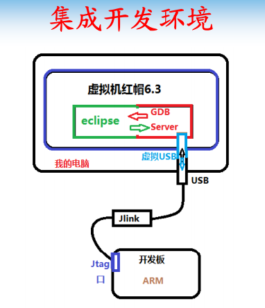

      两个硬件
          Jtag接口
          Jlink线
      三个软件
          Eclipse集成开发环境
          GDB Server
          Jlink软件
      Eclipse使用Gdb Server，通过Jlink调试开发板

## 准备工作-1 格式化NandFlash

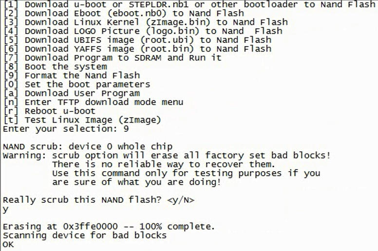

      NandFlash格式化，避免造成干扰

## 准备工作2-硬件连接

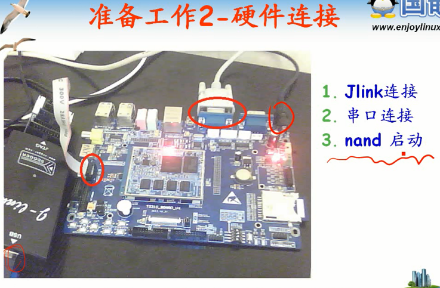

      没有这个调试器，尴尬~~淘宝买买买买~~

## 安装Gdb Server

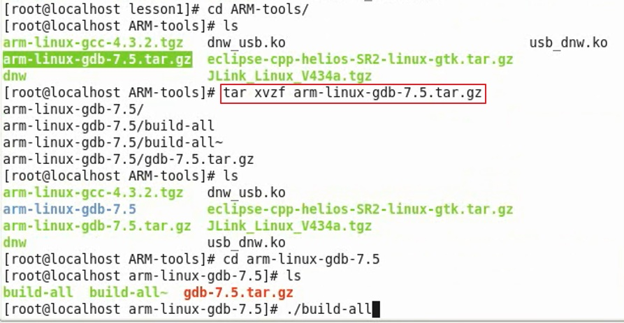

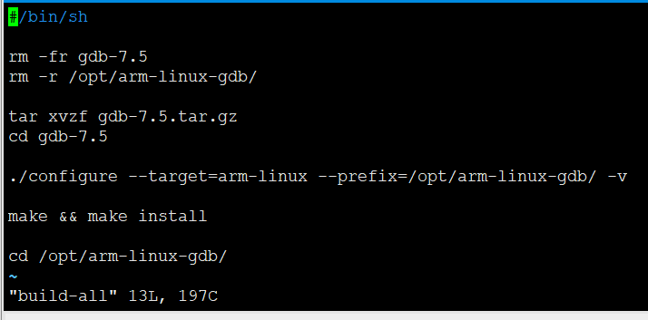

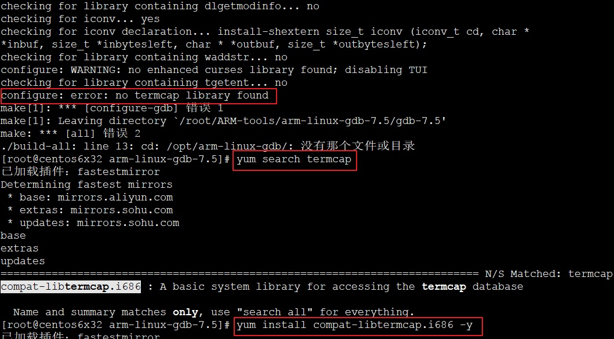

      还有依赖错误，自行解决。编译好的程序放在opt下/opt/arm-linux-gdb/
      添加到环境变量 ~/.bashrc
      更具版本需要，工具链中也有gdb，选哪个，那个放在最前。环境变量是根据路径匹配第一个。
      直接就可以运行arm-linux-gdb

## 安装Jlink

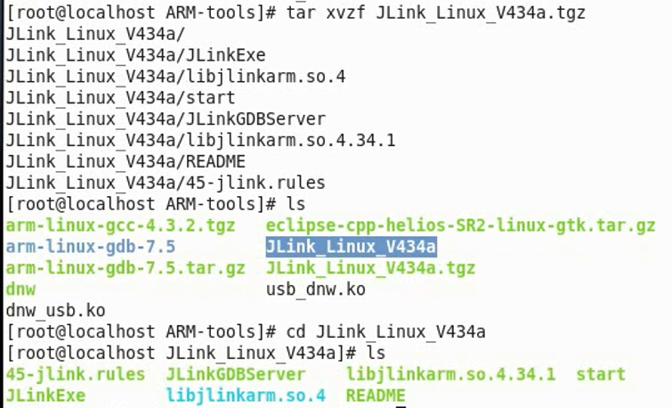

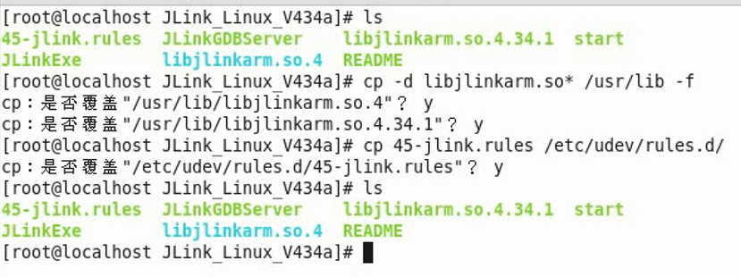

      Jlink引入虚拟机，运行JLinkGDBServer，运行顺利的话

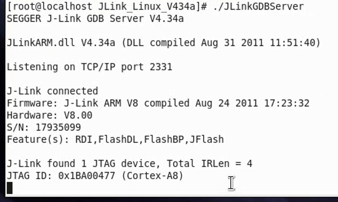

## 安装Eclipse

      绿色古董版Eclipse

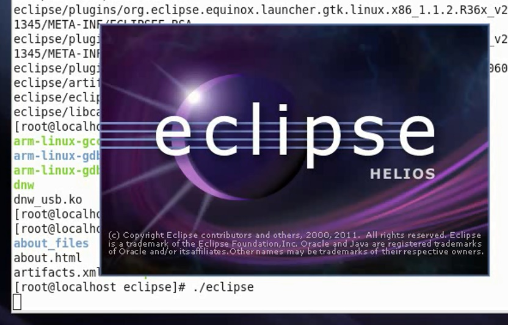

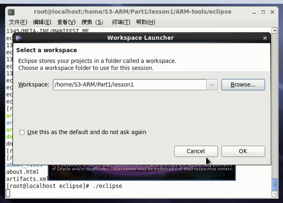

      第一次启动会突然莫名其妙JJ掉，不怕，再启动一次就OK了

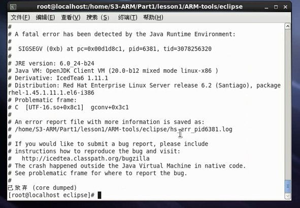

### Eclipse安装CDT插件

      首先保证网络正常

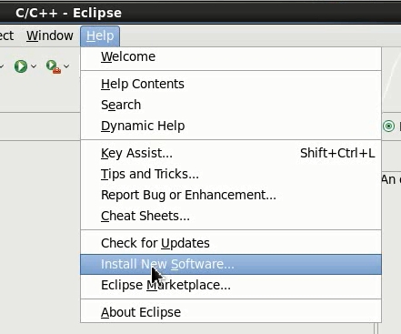

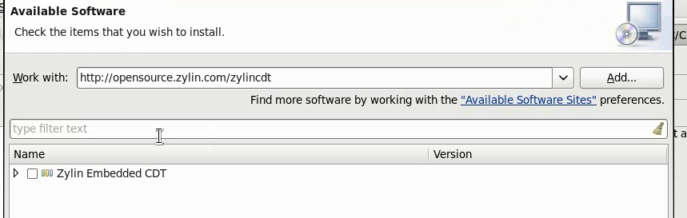

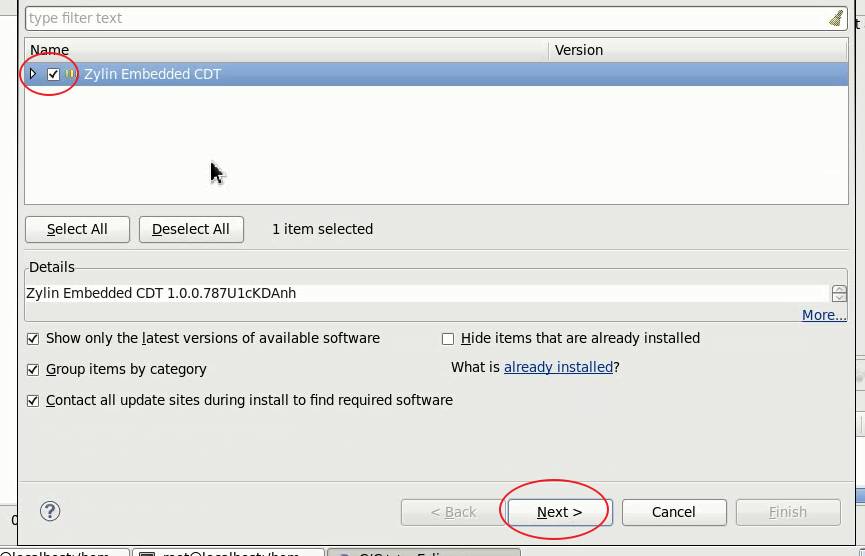

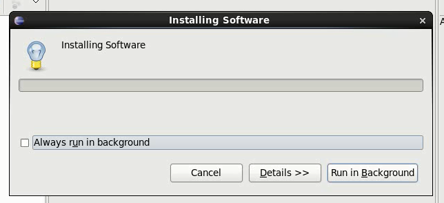

## 开发环境测试

      先建立一个目录

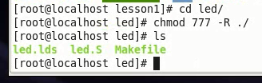

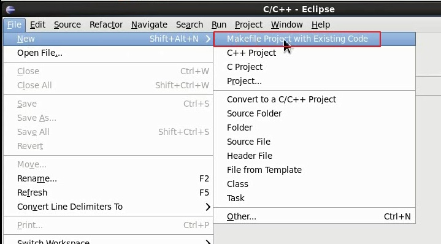

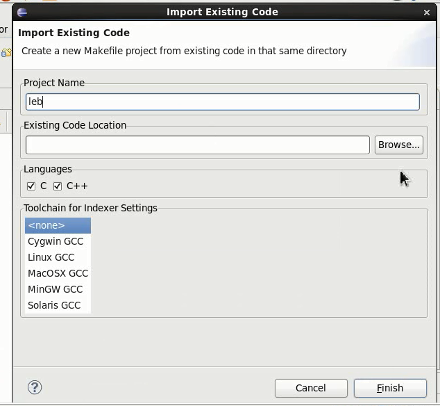

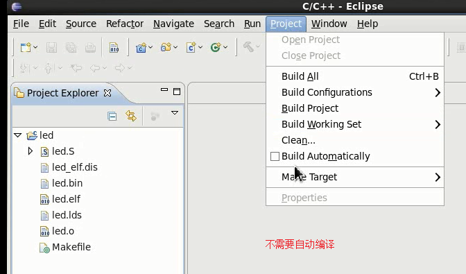

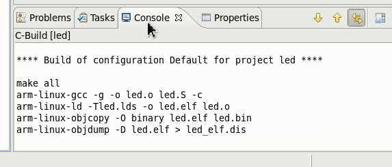

      Eclipse也是调用工程中的Makefile进行编译。
      还需要配置调试

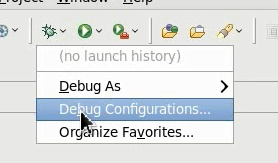

      选中要调试的程序

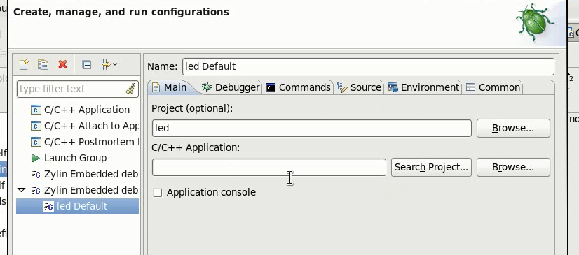

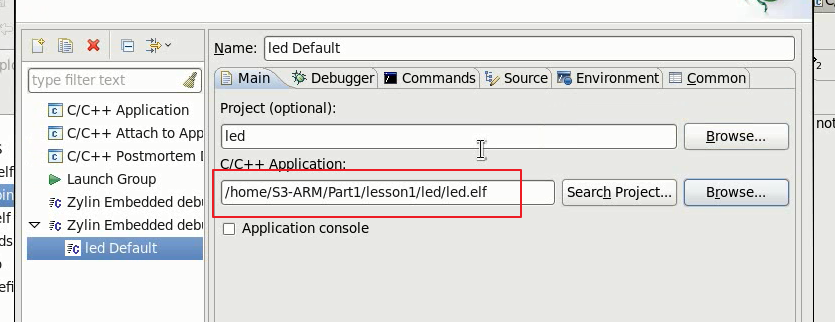

      初始化命令

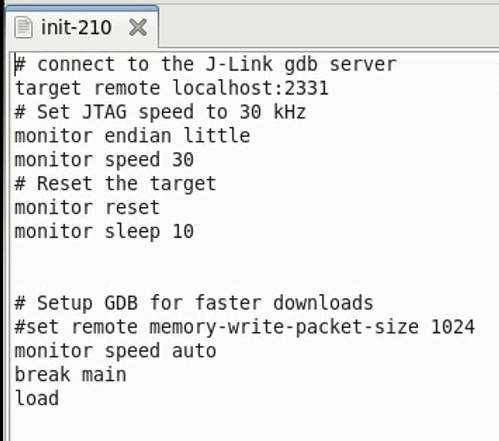

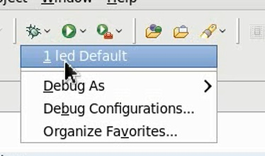

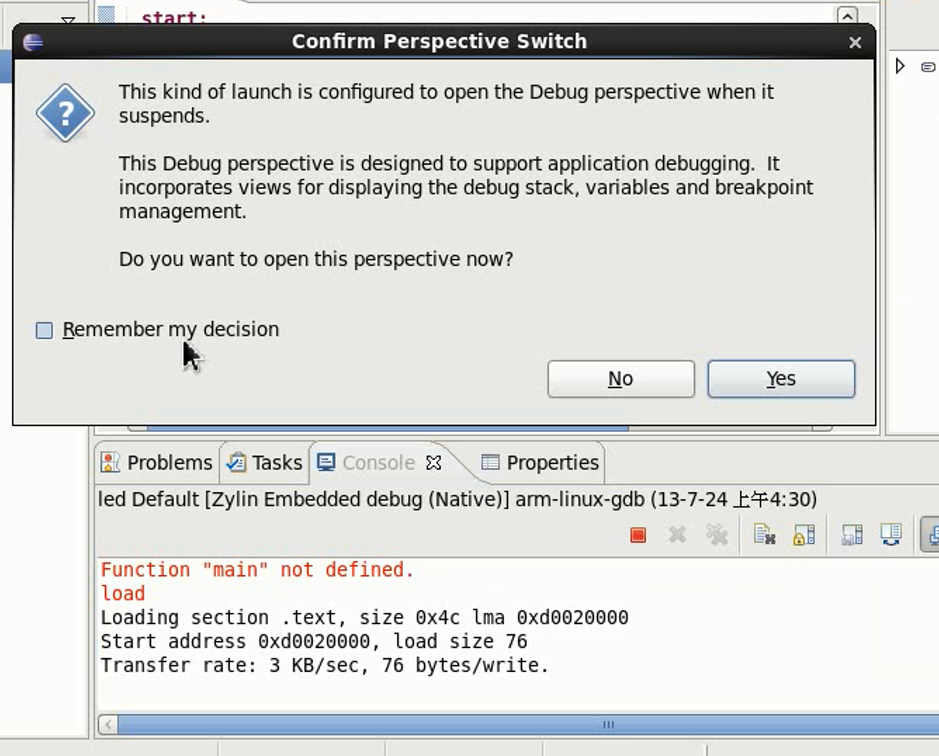

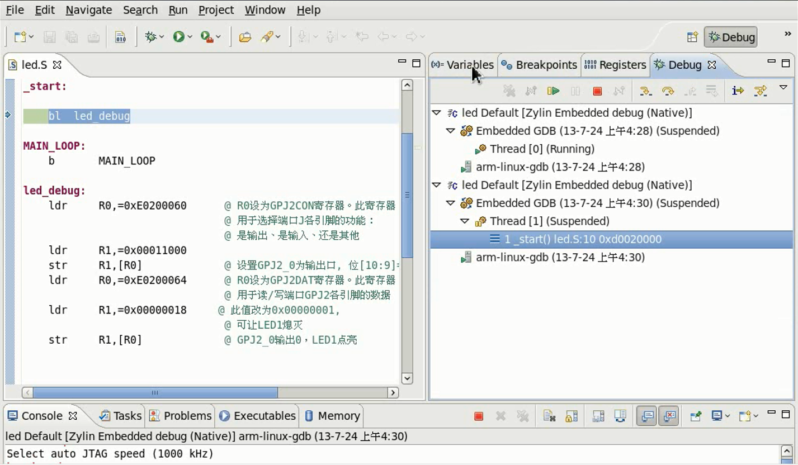

      改成十六进制显示

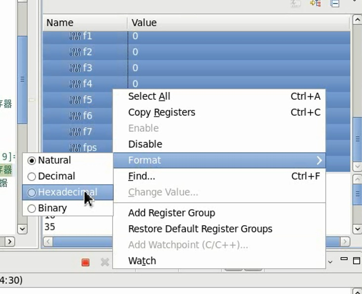
