<!-- TOC depthFrom:1 depthTo:6 withLinks:1 updateOnSave:1 orderedList:0 -->

- [第5课-关闭mmu和Cache](#第5课-关闭mmu和cache)
	- [ARM存储体系](#arm存储体系)
	- [Cache](#cache)
	- [虚拟地址](#虚拟地址)
	- [MMU作用](#mmu作用)
	- [关闭Cache和MMU - 代码书写](#关闭cache和mmu-代码书写)
		- [2440/6410/210 代码](#24406410210-代码)
- [define pWTCON 0x7e004000](#define-pwtcon-0x7e004000)

<!-- /TOC -->

# 第5课-关闭mmu和Cache

## ARM存储体系

      处理器内存寄存器 - 存储快，数量少
      紧耦合存储器
      辅助存储器 - SD、Flash

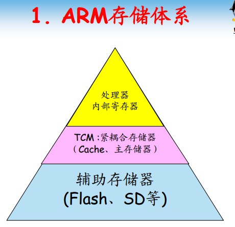

## Cache

      为了缓解速率不匹配问题
      cache存储辅助存储器的拷贝
      对用户来说是透明的
      对程序员来说，按照Cache块大小分配数据，对齐数据，可以更高效。

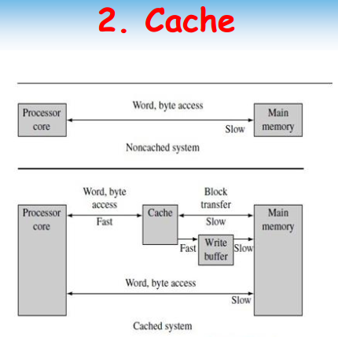

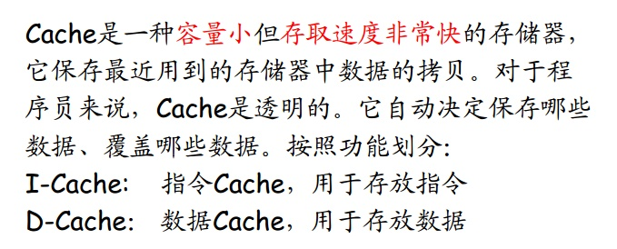

      不同处理器Cache大小不一

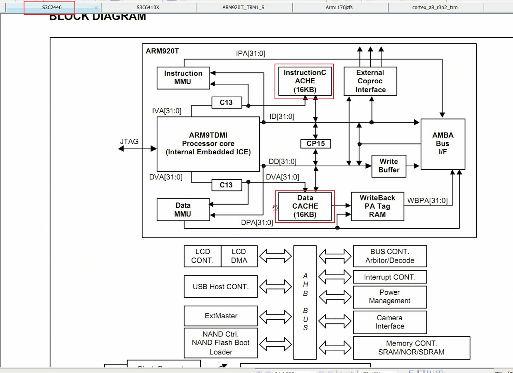

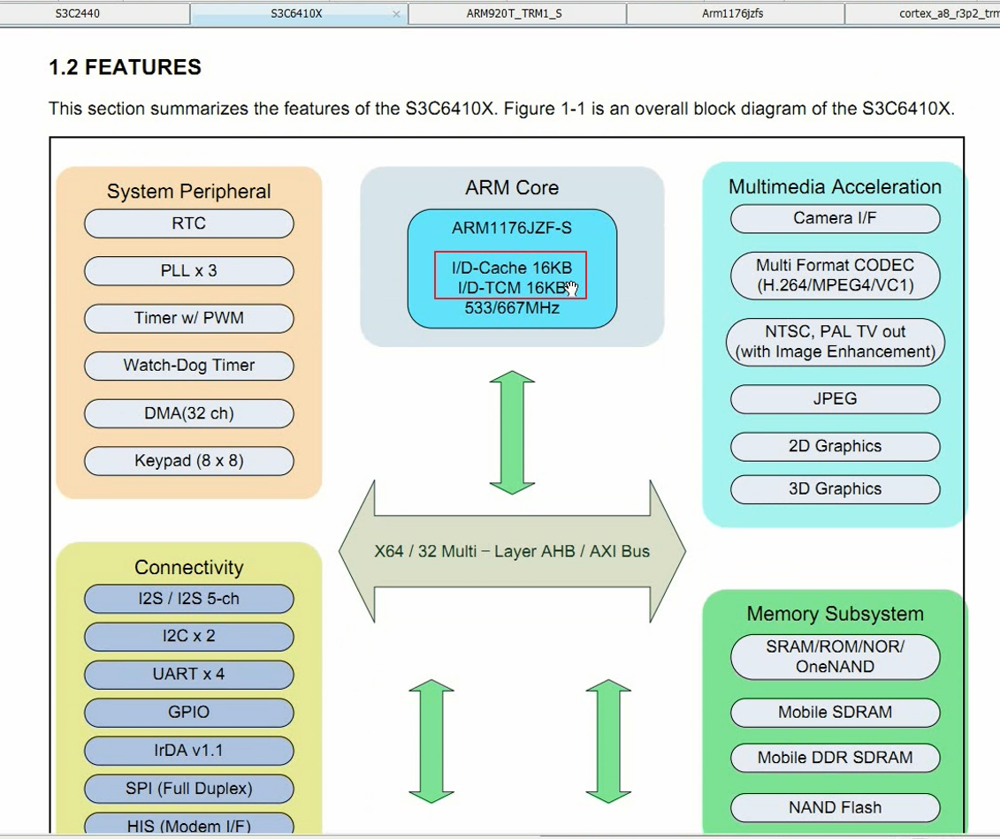

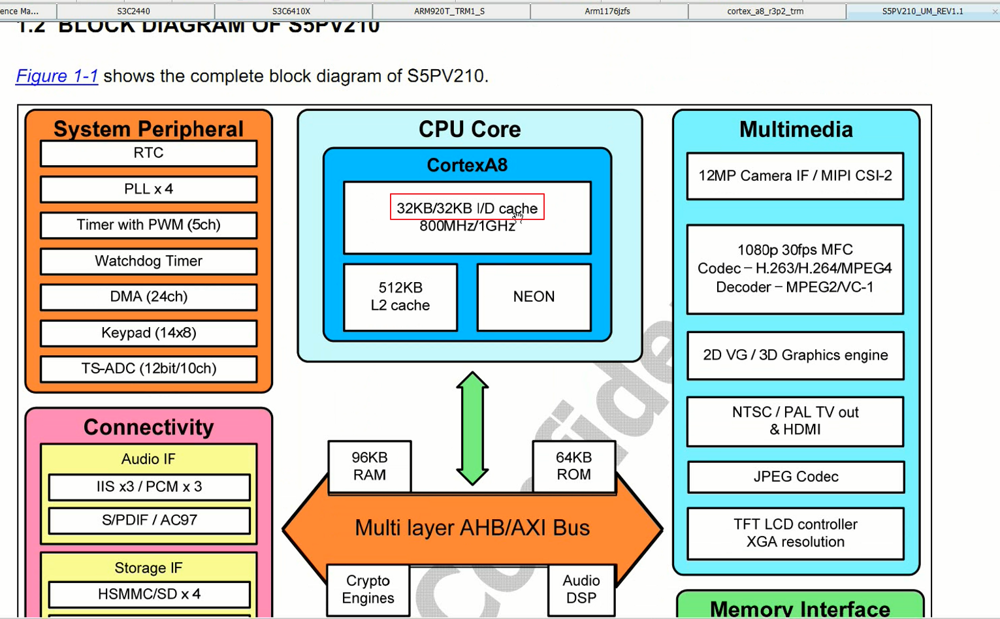

## 虚拟地址

      这两讲的很浅显
      无非就是通过页表使用内存，
      用户程序更具页表访问物理内存，
      用户程序地址空间编程线性地址空间或者虚拟地址空间。这点在X86体系结构更清晰
      虚拟地址不仅解决的地址冲突，还解决的多程序载入，提高内存利用率，让程序拥有更大的地址空间

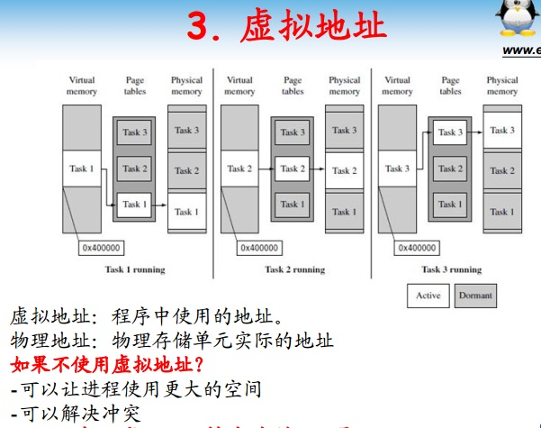

## MMU作用

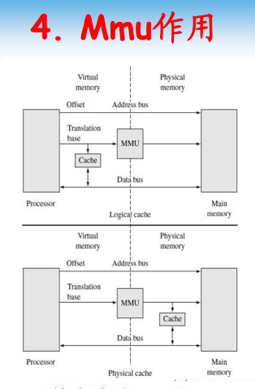

      在ARM11之后和之前有个转变

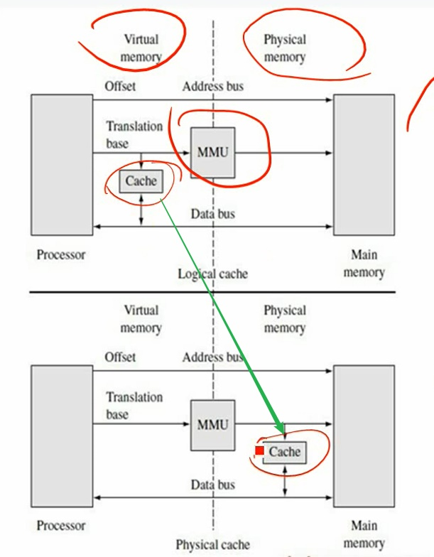


## 关闭Cache和MMU - 代码书写

      前期初始化先关闭，避免初始化过于复杂
      MMU都是协处理器CP15控制的


1. 使ICache Dcache失效
2. 关闭ICache Dcache
3. 关闭MMU

### 2440/6410/210 代码

      都用的CP15寄存器，代码一样

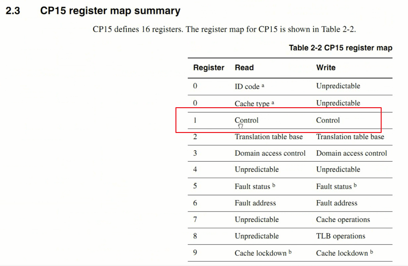

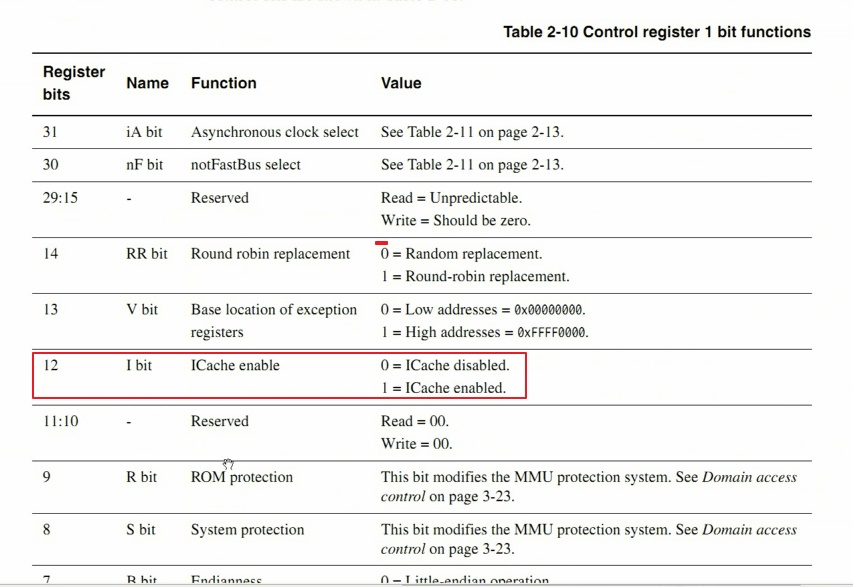

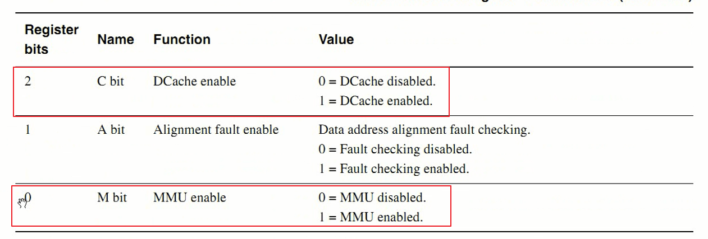

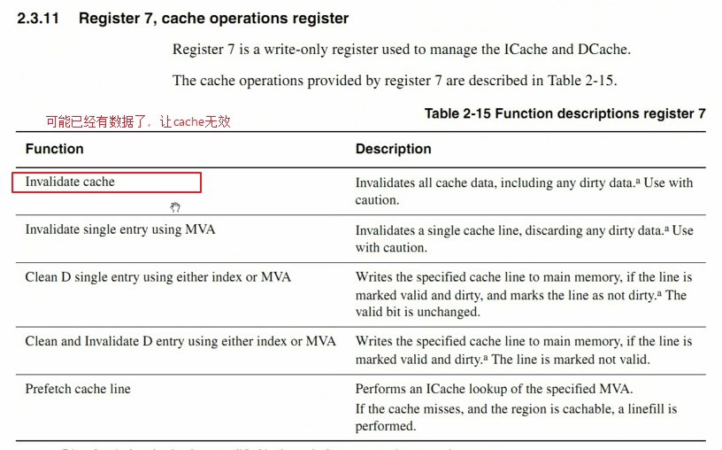

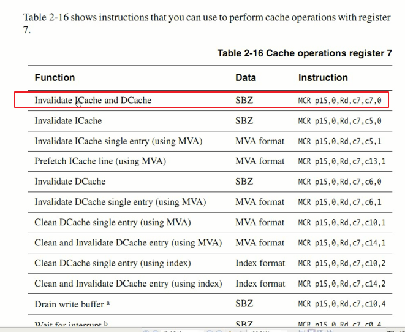

      失效I/D Cache，指令都给出来了
      Data Cache必须关掉，因为内核加载可能出错。I Cache可以保留

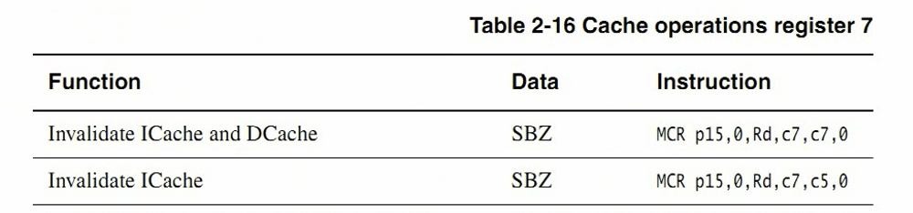

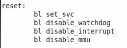

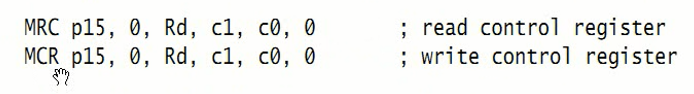

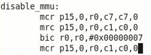


```
.text
.global _start
_start:
	b reset
	ldr pc, _undifined_instruction
	ldr pc, _software_interrupt
	ldr pc, _prefetch_abort
	ldr pc, _data_abort
	ldr pc, _not_used
	ldr pc, _irq
	ldr pc, _fiq


_undifined_instruction: .word undifined_instruction
_software_interrupt: .word software_interrupt
_prefetch_abort: .word prefetch_abort
_data_abort: .word data_abort
_not_used: .word not_used
_irq: .word irq
_fiq: .word reset

undifined_instruction:
	nop

software_interrupt:
	nop

prefetch_abort:
	nop

data_abort:
	nop

not_used:
	nop

irq:
	nop

fiq:
	nop

reset:
	bl set_svc
	bl disable_watchdog
	bl disable_interrupt
	bl disable_mmu

set_svc:
	mrs r0, cpsr
	bic r0, r0,#0x1f
	orr r0, r0,#0xd3
	msr cpsr, r0
	mov pc, lr

#define pWTCON 0x7e004000
disable_watchdog:
	ldr r0, =pWTCON
	mov r1, #0x0
	str r1, [r0]
	mov pc, lr

disable_interrupt:
	mvn r1,#0x0
	ldr r0,=0x71200014
	str r1,[r0]

	ldr r0,=0x71300014
	str r1,[r0]
	mov pc, lr

disable_mmu:
	mcr p15,0,r0,c7,c7,0
	mrc p15,0,r0,c1,c0,0
	bic r0, r0, #0x00000007
	mcr p15,0,r0,c1,c0,0
	mov pc, lr

```

      mov pc,lr
      调用跳转至后必须要返回，返回地址存在lr
