<!-- TOC depthFrom:1 depthTo:6 withLinks:1 updateOnSave:1 orderedList:0 -->

- [第10课-Linux内核链表深度剖析](#第10课-linux内核链表深度剖析)
	- [课程索引](#课程索引)
	- [链表简介](#链表简介)
	- [链表对比](#链表对比)
	- [内核链表相关函数](#内核链表相关函数)
	- [内核链表实例](#内核链表实例)
		- [内核链表数据域定义](#内核链表数据域定义)
		- [内核链表创建](#内核链表创建)
		- [内核链表插入操作](#内核链表插入操作)
		- [内核链表遍历操作](#内核链表遍历操作)
		- [删除内核链表](#删除内核链表)
		- [植入内核模块](#植入内核模块)
	- [链表实现源码分析](#链表实现源码分析)
		- [链表初始化](#链表初始化)
		- [链表插入](#链表插入)
		- [链表移植](#链表移植)
	- [总结](#总结)

<!-- /TOC -->
# 第10课-Linux内核链表深度剖析

## 课程索引

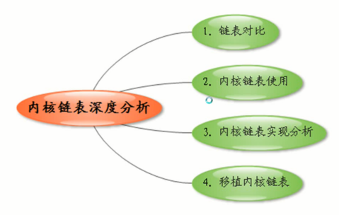

## 链表简介

      链表最基本的元素是节点。
      包含数据域和指针域

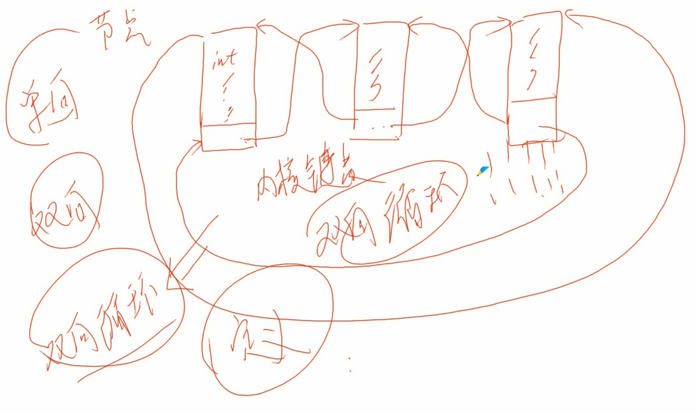

## 链表对比

      传统链表与Linux链表区别
      传统链表：
        * 指针域是指向下一个节点的数据域
        * 节点数据必须一致
      Linux链表
        * 节点存在数据中
        * 指针域是指向下一个节点的节点域
        * 节点数据可不一致

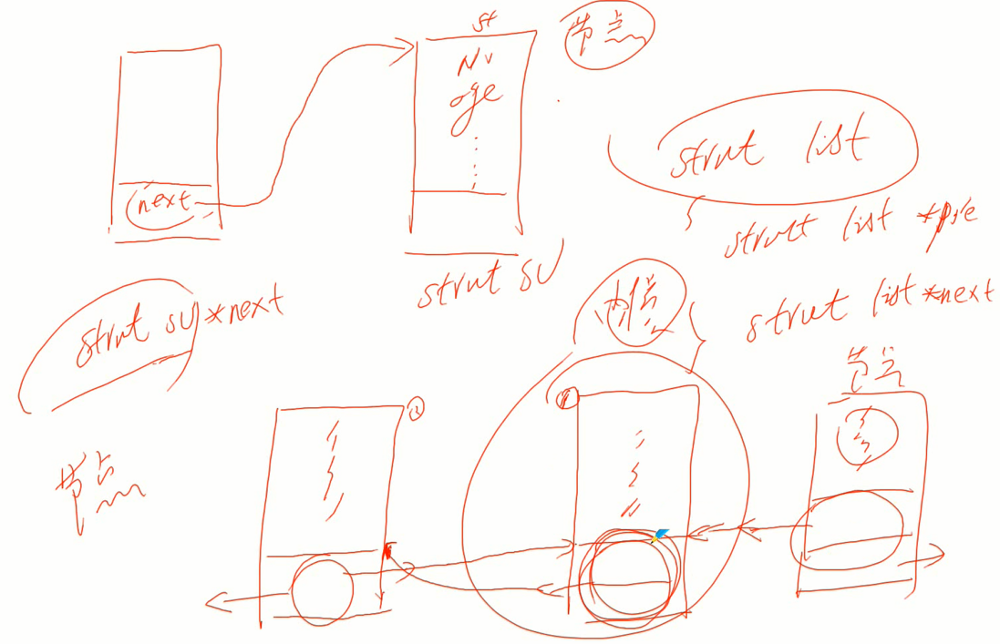

## 内核链表相关函数

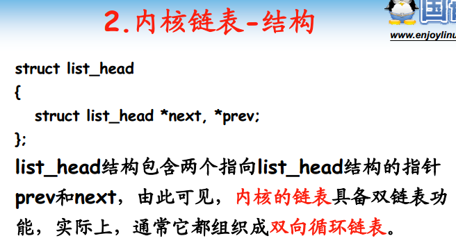

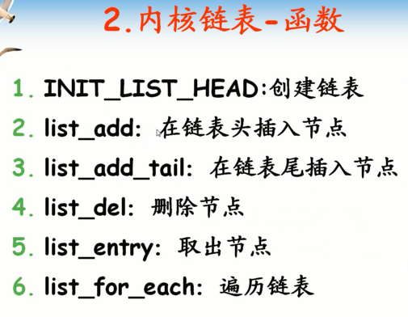

## 内核链表实例

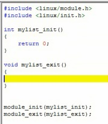

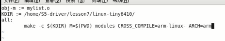

      -c 错误，应该是-C
      -C 指定包含该目录编译

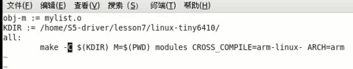

      用内核链表保存学生信息

### 内核链表数据域定义

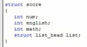

      学生编号
      英语成绩
      数学成绩

### 内核链表创建

      INIT_LIST_HEAD

      是个内联函数，初始化链表头。要求一个指针

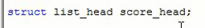

### 内核链表插入操作

      支持尾插入，头插入

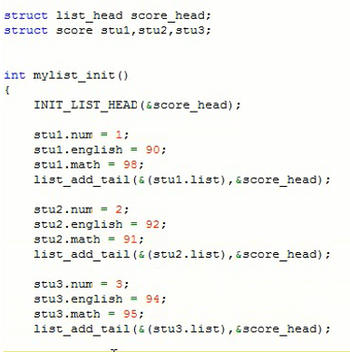

### 内核链表遍历操作

      list_for_each

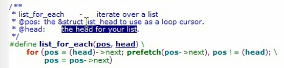

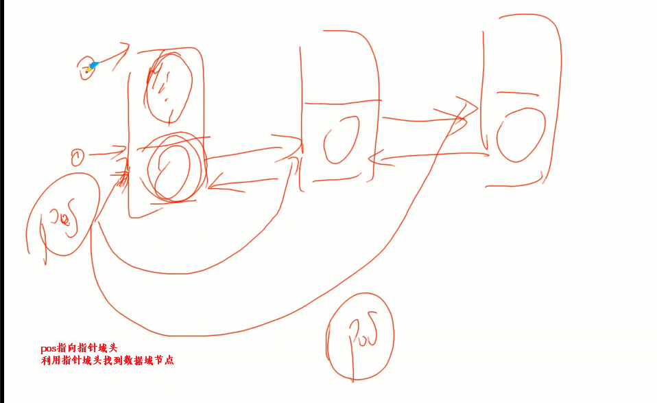

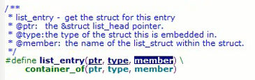

      list_for_entry(ptr,type,member)
        ptr:指向list_head的指针
        type:数据域结构类型
        member:指针域对应的类型

### 删除内核链表

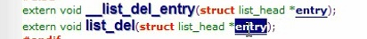

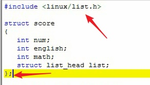

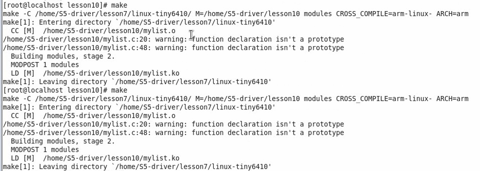

### 植入内核模块

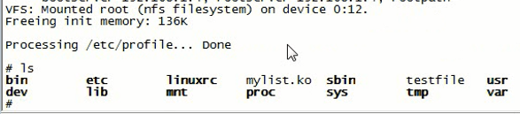

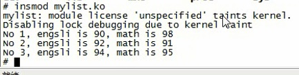

## 链表实现源码分析

### 链表初始化

### 链表插入

      头插法

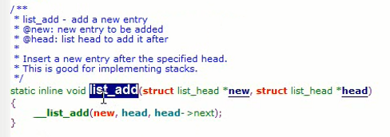

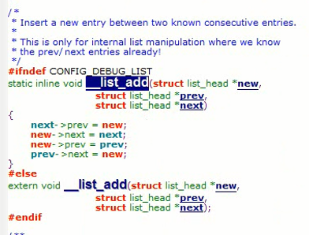

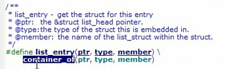

      非常精妙的一个地方

### 链表移植

      内核中的代码实现直接拷贝过来

## 总结

      归功于Linux内核源码中提供的list操作，使得代码很简洁。
