# 第11课-Linux进程管理

## 课程索引

## 进程要素

### 进程与程序

      程序是死的，进程是活的

### 进程4要素

      通过PCB控制进程

      通过有无用户空间区分用户进程和内核进程

### 进程状态

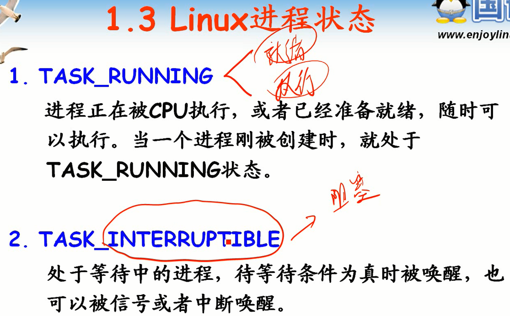

      就绪和执行都是TASK_RUNNING

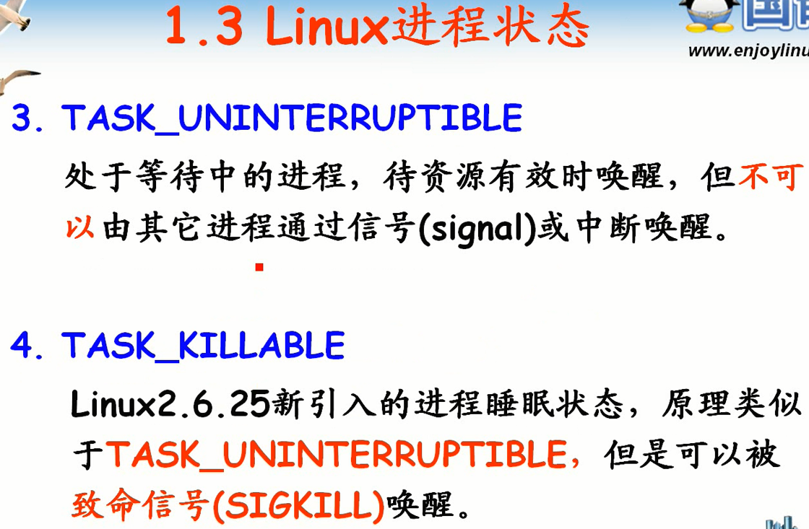

      不可以被打断，就算发送唤醒信号也没有用。

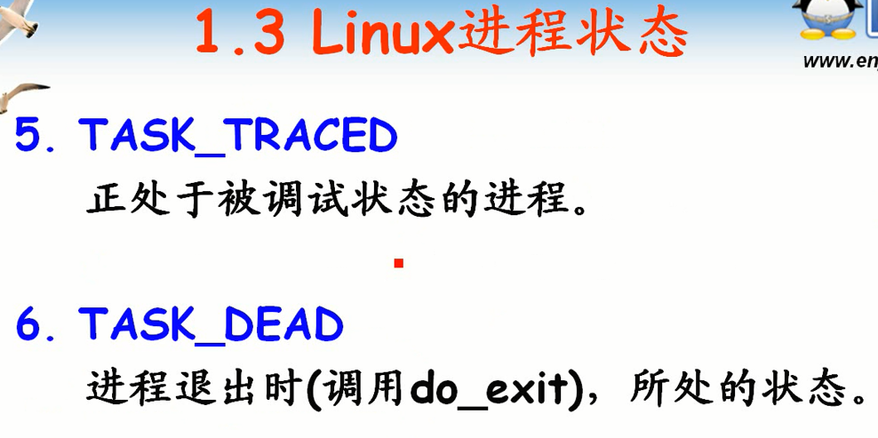

      不止六种状态

### 进程描述结构

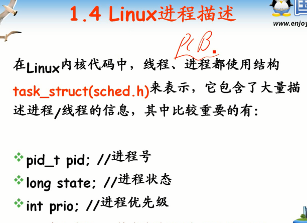

      task_struct 就是 PCB

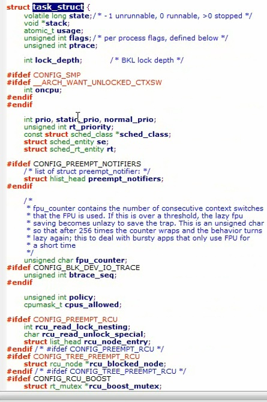

## Linux进程调度

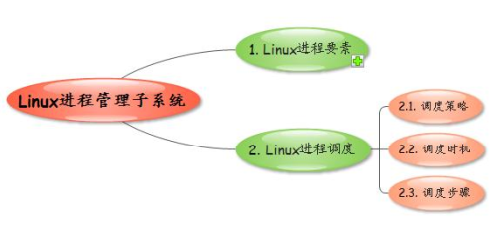

### 什么是调度

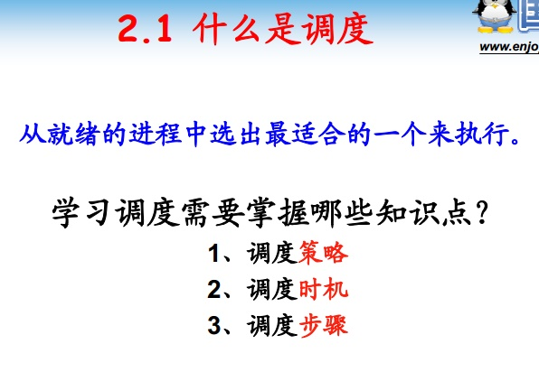

### 调度策略

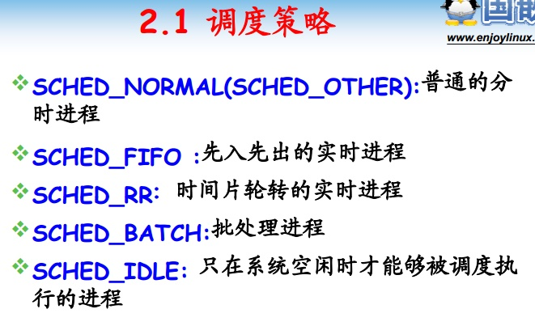

### 调度时机

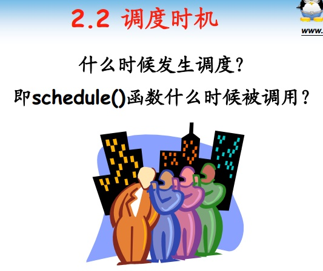

      自定义成阻塞态，阻塞是自发的操作，自己阻塞自己。

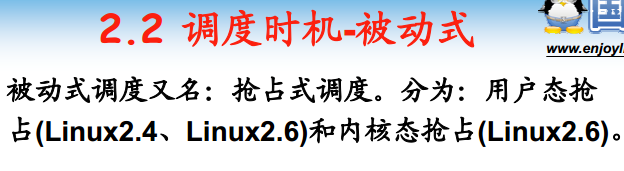

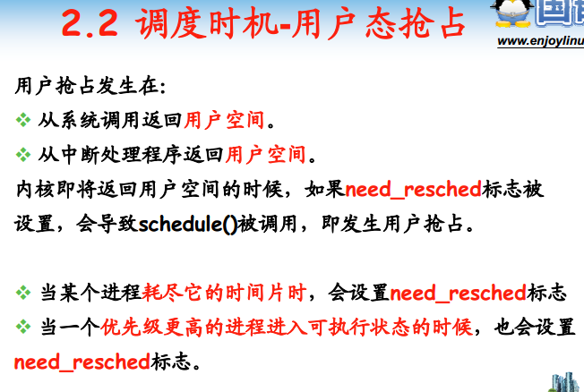

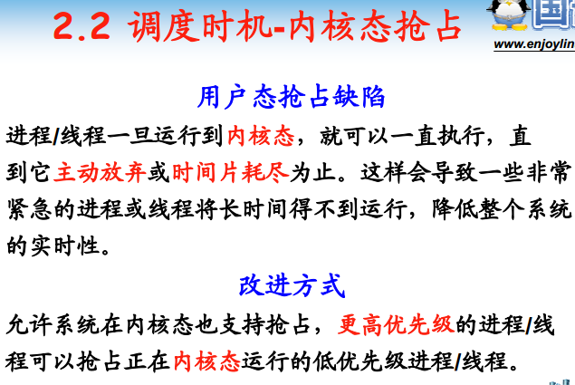

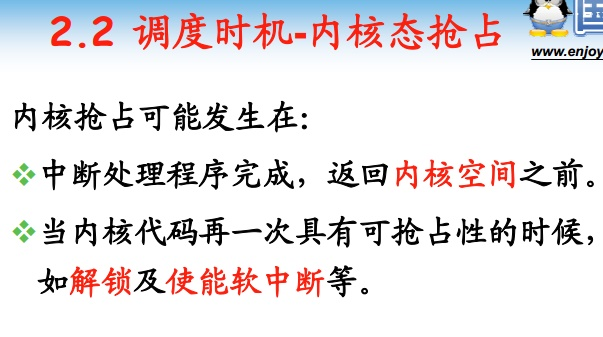

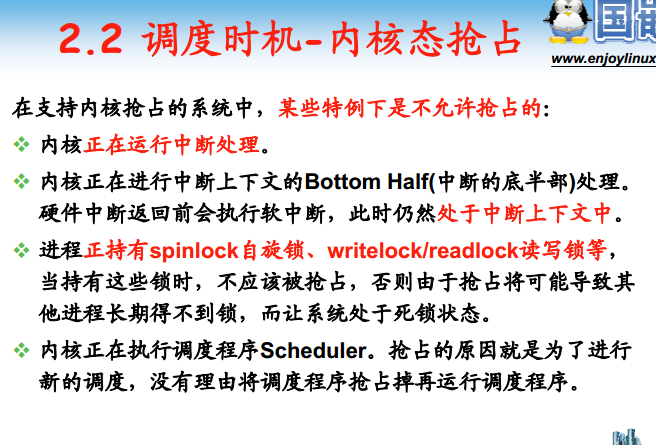

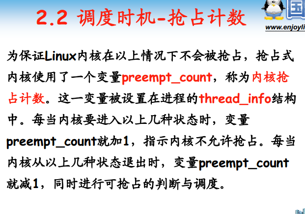

### 调度步骤

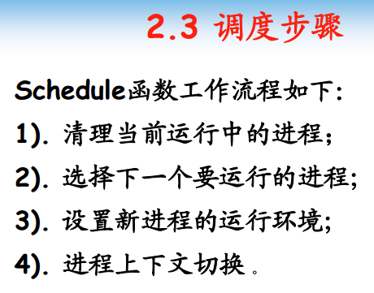

## 总结
