<!-- TOC depthFrom:1 depthTo:6 withLinks:1 updateOnSave:1 orderedList:0 -->

- [第12课-设备驱动概述](#第12课-设备驱动概述)
	- [课程索引](#课程索引)
	- [驱动模型](#驱动模型)
	- [驱动分类](#驱动分类)
		- [字符设备](#字符设备)
		- [块设备](#块设备)
		- [网络接口](#网络接口)
		- [其他设备](#其他设备)
	- [设备使用](#设备使用)
	- [驱动程序学习方法](#驱动程序学习方法)
	- [总结](#总结)

<!-- /TOC -->

# 第12课-设备驱动概述

## 课程索引

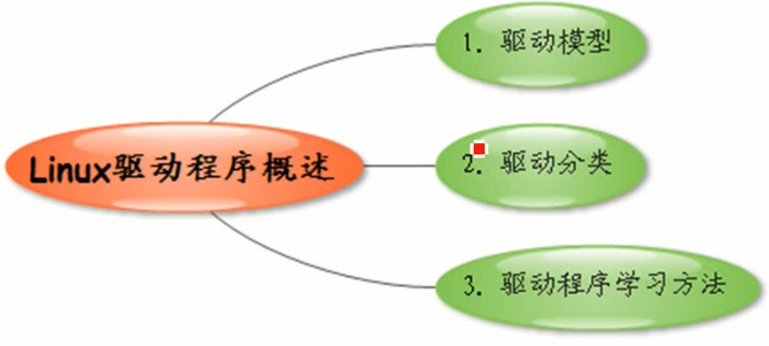

## 驱动模型

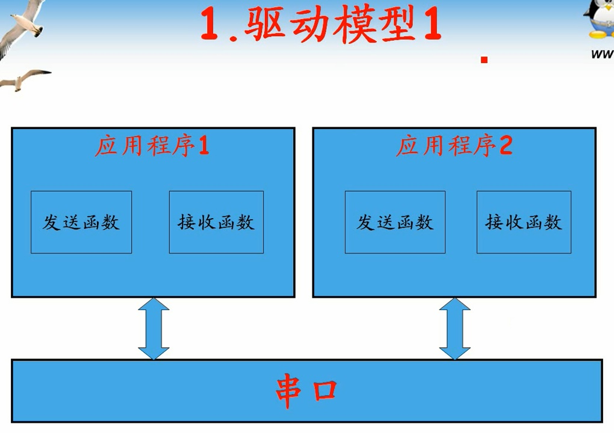

      没有实现通用对外接口，每个程序需要自己实现。

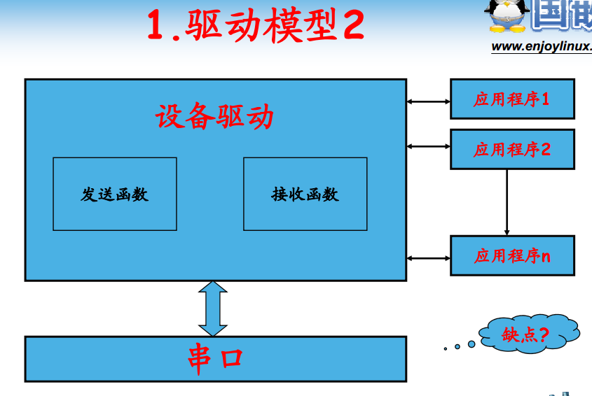

      提取公共部分，对外提供POSIX接口。解决模型1重复造轮子的问题。
      缺点在于，没有一个规范！！如果不是按照POSIX标准开发。

## 驱动分类

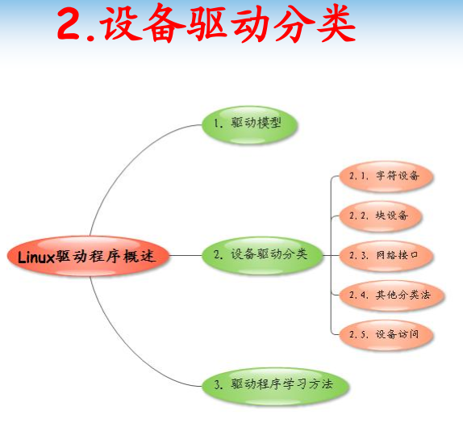

### 字符设备

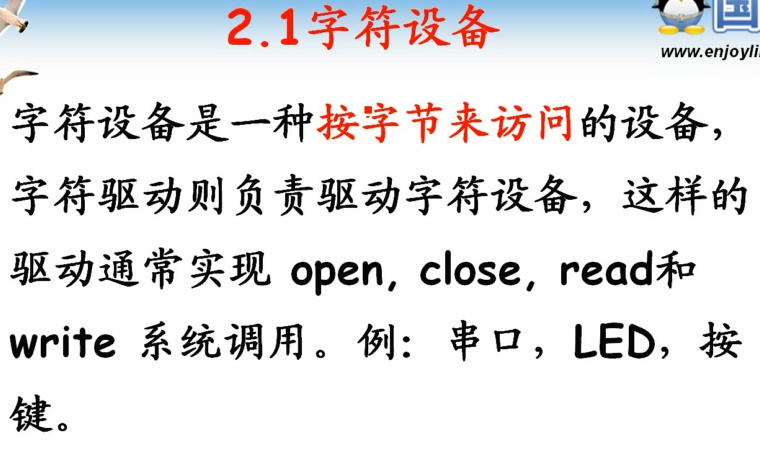

      只能按照字节访问。

### 块设备

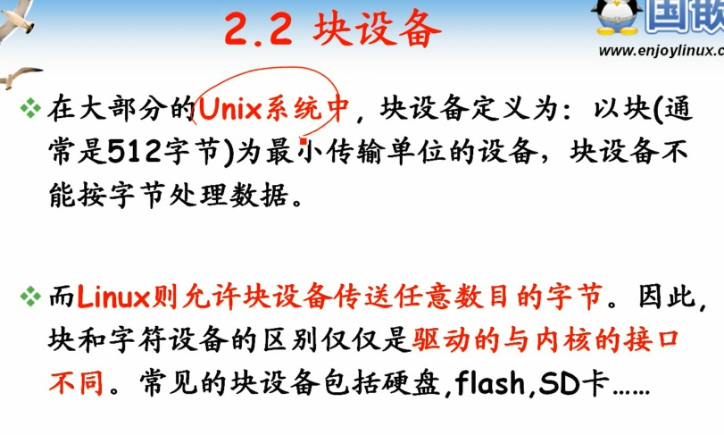

      块设备也可以以字符或者字节形式进行访问。
      仅仅在于驱动在于内部接口或者说模型不一样而已。
      一般块设备就是存储类设备。串口设备LED，按键都是字符设备。

### 网络接口

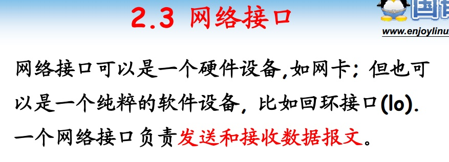

### 其他设备

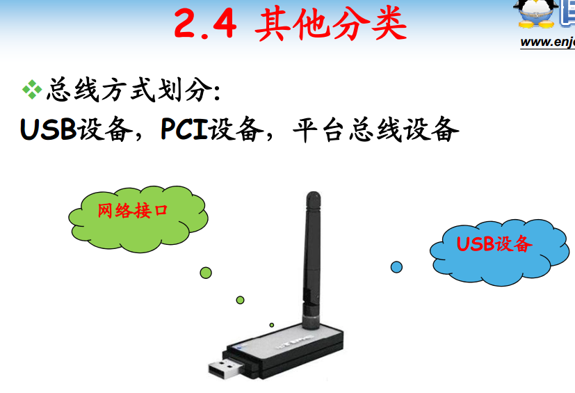

      平台总线：虚拟总线，方便移植。
      一个设备按照功能划分可以属于多种类型设备。

## 设备使用

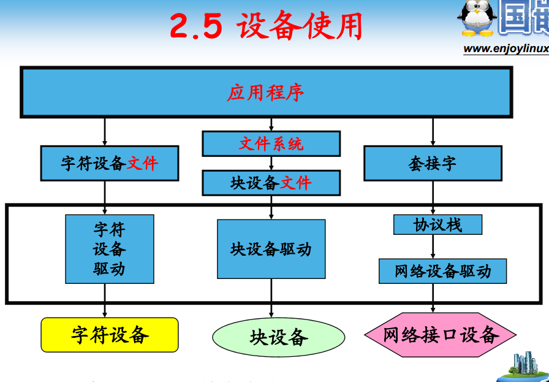

      多数对应文件，read、write、open、close、ioctl等

## 驱动程序学习方法

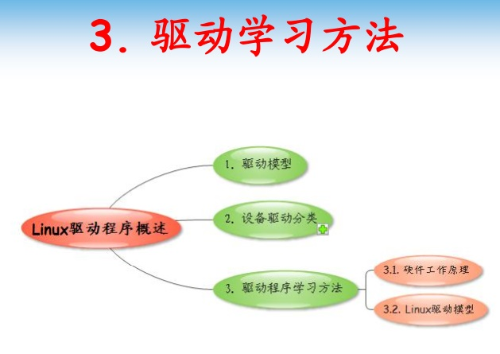

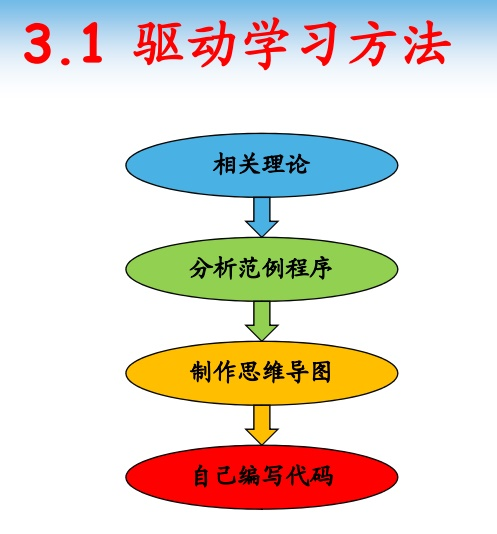

      Linux驱动模型做出了很多规定，但是没有具体实现。
      自己写的驱动应该符合模型，酱紫更便于移植
      初期不建议阅读内核代码，初期强调怎么用，而不是怎么实现。
      因为内核代码过于庞大。

## 总结
