<!-- TOC depthFrom:1 depthTo:6 withLinks:1 updateOnSave:1 orderedList:0 -->

- [第14课-字符驱动编程模型](#第14课-字符驱动编程模型)
	- [课程索引](#课程索引)
	- [编译/安装驱动程序](#编译安装驱动程序)
	- [字符设备文件](#字符设备文件)
		- [创建字符设备文件](#创建字符设备文件)
		- [访问字符设备](#访问字符设备)
	- [字符设备驱动源码](#字符设备驱动源码)
	- [用户态程序源码](#用户态程序源码)
	- [总结](#总结)

<!-- /TOC -->

# 第14课-字符驱动编程模型

## 课程索引

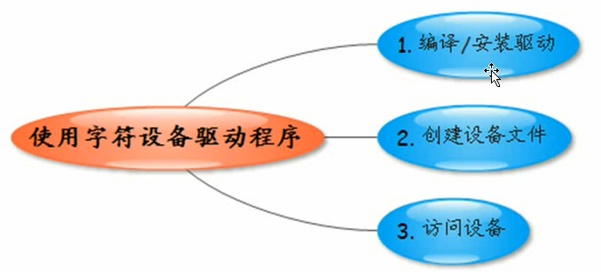

## 编译/安装驱动程序

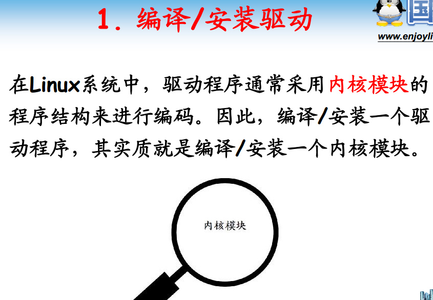

      编译安装驱动变成编译安装内核模块


      先拿来用一波，使用提供的代码编译安装运行耍。

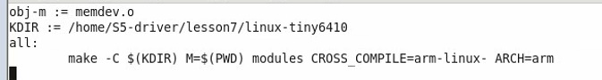

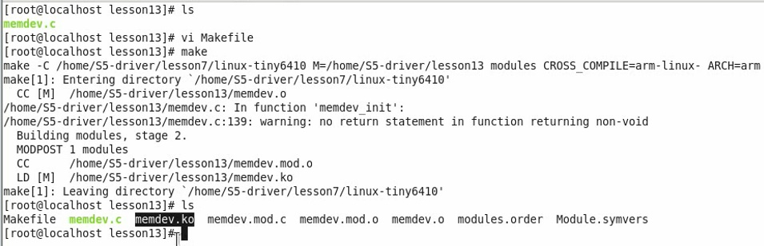

      拷贝到开发板NFS目录

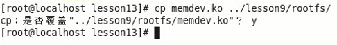

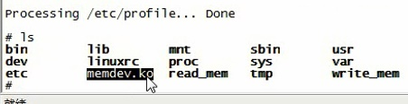

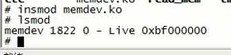

## 字符设备文件

      用户程序访问字符设备，其实就是访问字符设备文件。
      对设备的操作 = 最文件操作。

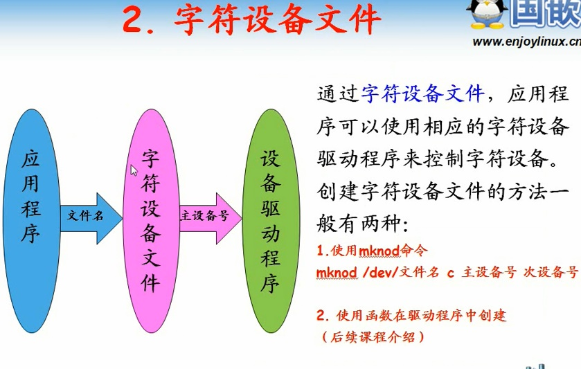

### 创建字符设备文件

      mknod /dev/文件名 c - 字符设备 主设备号 次设备号
      字符设备文件需要与设备驱动程序管理。
      凭什么说字符设备A与设备驱动B管理？
      字符设备文件对应一个主设备号。
      设备驱动程序也对应设备编号。
      /dev/文件名可以随意取，只要不与/dev/目录下文件重名

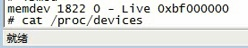

      如何查看设备驱动程序编号

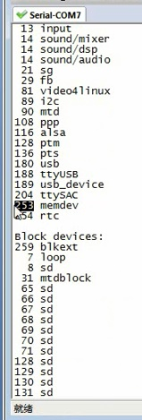

      查找到设备驱动编号253
      次设备号取非负数即可。

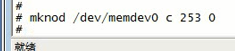

      完成字符设备创建

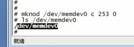

### 访问字符设备

      有了字符设备文件以及字符设备驱动，然后就是应用程序了
      这里提供的字符设备操作的其实是个虚拟软件设备
      定义一个数组，一个数组有一个整型数，可以模拟一个寄存器，
      操作硬件其实就是操作数组。当然这里只是个模拟，架构与真实设备其实大同小异

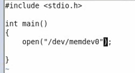

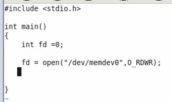

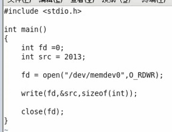

      编译报错，需要头文件

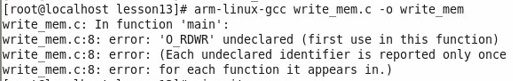

      使用man命令查看函数依赖的头文件

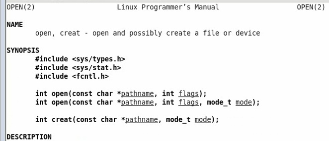

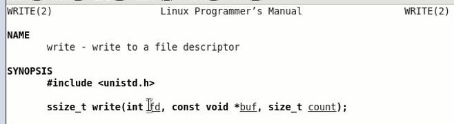

      添加四个依赖的头文件

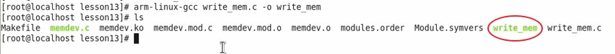

      放到开发板运行

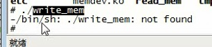

      为嘛报错？？！！！
      因为应用程序依赖的库找不到
      检查一波依赖

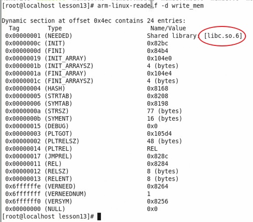

      但是开发板没有这个库

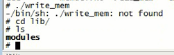

      一种办法，库拷贝到开发板
      另一种办法，静态编译

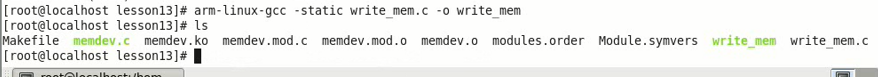

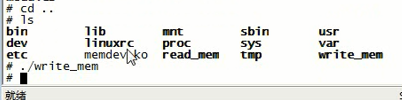

      运行成功。继续编写读数组程序。

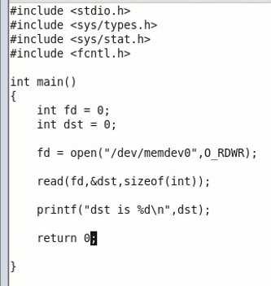

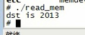


## 字符设备驱动源码

```
\#include <linux/module.h>
\#include <linux/fs.h>
\#include <linux/init.h>
\#include <linux/cdev.h>
\#include <asm/uaccess.h>


int dev1_registers[5];
int dev2_registers[5];

struct cdev cdev;
dev_t devno;

/*文件打开函数*/
int mem_open(struct inode *inode, struct file *filp)
{

    /*获取次设备号*/
    int num = MINOR(inode->i_rdev);

    if (num==0)
        filp->private_data = dev1_registers;
    else if(num == 1)
        filp->private_data = dev2_registers;
    else
        return -ENODEV;  //无效的次设备号

    return 0;
}

/*文件释放函数*/
int mem_release(struct inode *inode, struct file *filp)
{
  return 0;
}

/*读函数*/
static ssize_t mem_read(struct file *filp, char __user *buf, size_t size, loff_t *ppos)
{
  unsigned long p =  *ppos;
  unsigned int count = size;
  int ret = 0;
  int *register_addr = filp->private_data; /*获取设备的寄存器基地址*/

  /*判断读位置是否有效*/
  if (p >= 5*sizeof(int))
    return 0;
  if (count > 5*sizeof(int) - p)
    count = 5*sizeof(int) - p;

  /*读数据到用户空间*/
  if (copy_to_user(buf, register_addr+p, count))
  {
    ret = -EFAULT;
  }
  else
  {
    *ppos += count;
    ret = count;
  }

  return ret;
}

/*写函数*/
static ssize_t mem_write(struct file *filp, const char __user *buf, size_t size, loff_t *ppos)
{
  unsigned long p =  *ppos;
  unsigned int count = size;
  int ret = 0;
  int *register_addr = filp->private_data; /*获取设备的寄存器地址*/

  /*分析和获取有效的写长度*/
  if (p >= 5*sizeof(int))
    return 0;
  if (count > 5*sizeof(int) - p)
    count = 5*sizeof(int) - p;

  /*从用户空间写入数据*/
  if (copy_from_user(register_addr + p, buf, count))
    ret = -EFAULT;
  else
  {
    *ppos += count;
    ret = count;
  }

  return ret;
}

/* seek文件定位函数 */
static loff_t mem_llseek(struct file *filp, loff_t offset, int whence)
{
    loff_t newpos;

    switch(whence) {
      case SEEK_SET:
        newpos = offset;
        break;

      case SEEK_CUR:
        newpos = filp->f_pos + offset;
        break;

      case SEEK_END:
        newpos = 5*sizeof(int)-1 + offset;
        break;

      default:
        return -EINVAL;
    }
    if ((newpos<0) || (newpos>5*sizeof(int)))
    	return -EINVAL;

    filp->f_pos = newpos;
    return newpos;

}

/*文件操作结构体*/
static const struct file_operations mem_fops =
{
  .llseek = mem_llseek,
  .read = mem_read,
  .write = mem_write,
  .open = mem_open,
  .release = mem_release,
};

/*设备驱动模块加载函数*/
static int memdev_init(void)
{
  /*初始化cdev结构*/
  cdev_init(&cdev, &mem_fops);

  /* 注册字符设备 */
  alloc_chrdev_region(&devno, 0, 2, "memdev");
  cdev_add(&cdev, devno, 2);
}

/*模块卸载函数*/
static void memdev_exit(void)
{
  cdev_del(&cdev);   /*注销设备*/
  unregister_chrdev_region(devno, 2); /*释放设备号*/
}

MODULE_LICENSE("GPL");

module_init(memdev_init);
module_exit(memdev_exit);

```

## 用户态程序源码

write-mem.c

```
\#include <stdio.h>
\#include <sys/types.h>
\#include <sys/stat.h>
\#include <fcntl.h>

int main()
{
	int fd = 0;
	int src = 2013;

	/*打开设备文件*/
	fd = open("/dev/memdev0",O_RDWR);

	/*写入数据*/
	write(fd, &src, sizeof(int));

	/*关闭设备*/
	close(fd);

	return 0;

}

```
read-mem.c
```
\#include <stdio.h>
\#include <sys/types.h>
\#include <sys/stat.h>
\#include <fcntl.h>

int main()
{
	int fd = 0;
	int dst = 0;

	/*打开设备文件*/
	fd = open("/dev/memdev0",O_RDWR);

	/*写入数据*/
	read(fd, &dst, sizeof(int));

	printf("dst is %d\n",dst);

	/*关闭设备*/
	close(fd);

	return 0;

}

```

## 总结


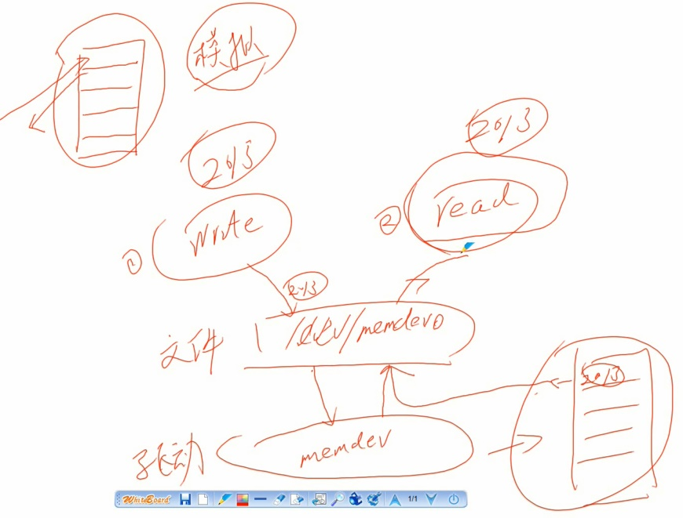
