<!-- TOC depthFrom:1 depthTo:6 withLinks:1 updateOnSave:1 orderedList:0 -->

- [第15课-自己动手写驱动](#第15课-自己动手写驱动)
	- [编程索引](#编程索引)
	- [驱动初始化](#驱动初始化)
		- [简单内核模块模板](#简单内核模块模板)
		- [静态分配cdev](#静态分配cdev)
		- [cdev_init 初始化cdev](#cdevinit-初始化cdev)
		- [注册cdev_add](#注册cdevadd)
	- [分配设备号](#分配设备号)
	- [硬件初始化](#硬件初始化)
	- [实现设备操作](#实现设备操作)
		- [拷贝操作函数原型](#拷贝操作函数原型)
		- [open](#open)
		- [close](#close)
		- [read](#read)
		- [write](#write)
		- [lseek](#lseek)
	- [驱动注销](#驱动注销)
	- [头文件包含](#头文件包含)
	- [运行测试](#运行测试)
	- [总结](#总结)

<!-- /TOC -->

# 第15课-自己动手写驱动

## 编程索引

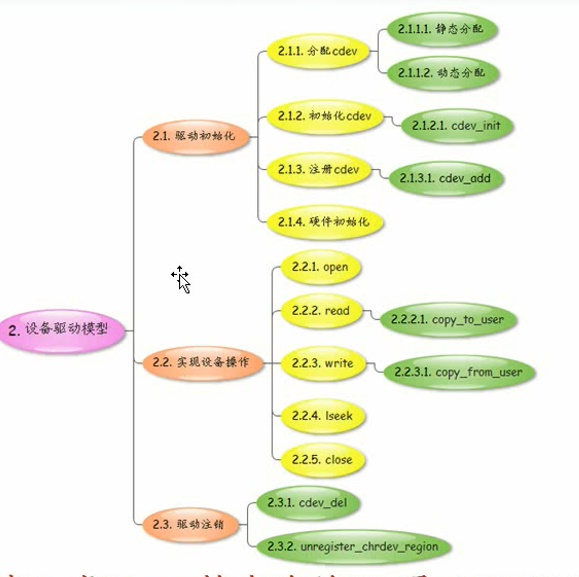

## 驱动初始化

###简单内核模块模板

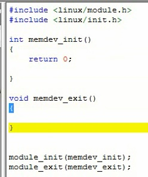

### 静态分配cdev

      驱动初始化放在模块初始化中，静态分配、动态分配cdev
      采用静态分配，定义一个全局变量

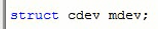

### cdev_init 初始化cdev
      初始化cdev，拷贝函数原型，修改一下。
      定义文件操作集

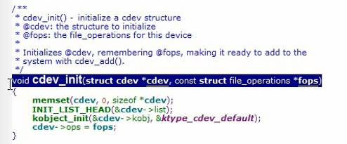

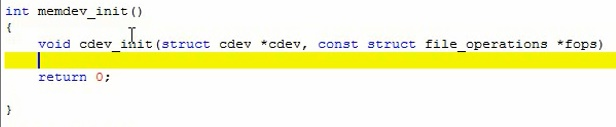

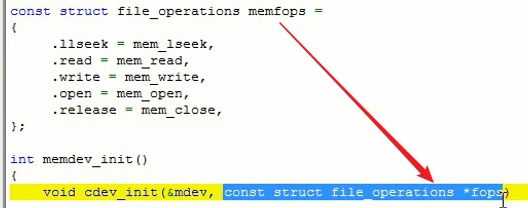

### 注册cdev_add

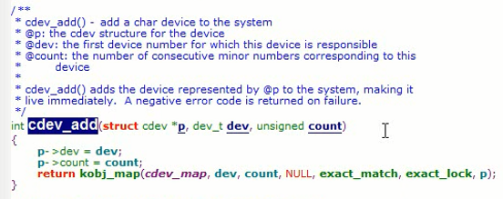

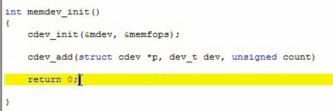

      准备好三个参数

## 分配设备号

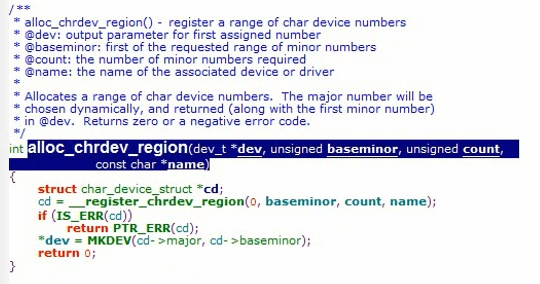

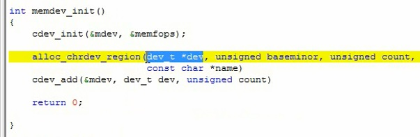

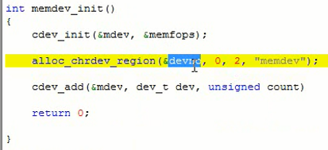

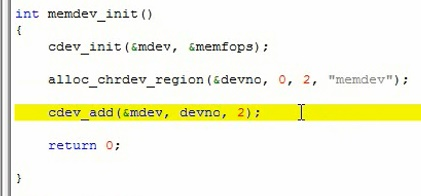

      设备数量定义为2

## 硬件初始化

      虚拟设备无须硬件初始化。

## 实现设备操作

### 拷贝操作函数原型

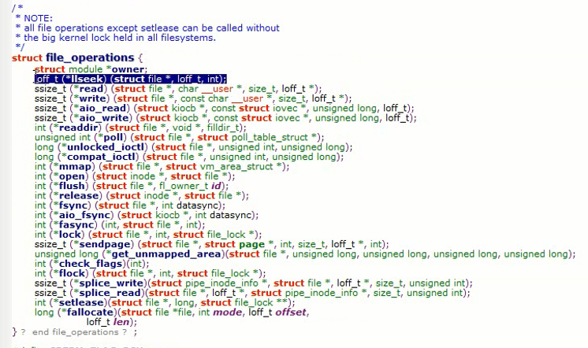

      从内核源码拷贝一波函数原型

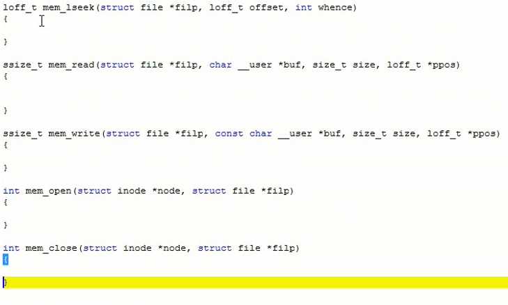

### open

      1.硬件打开
      2.次设备号获取

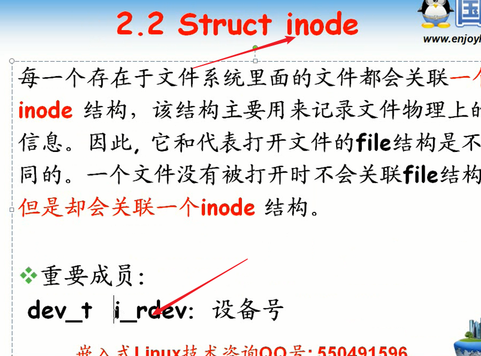

      从inode提取次设备号。判断哪一个设备，获取设备基地址

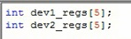

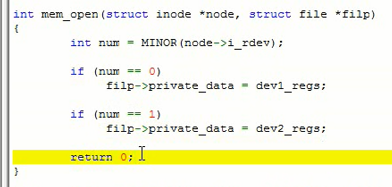

### close

      close用的就是release
      玩的虚拟设备，直接return就是

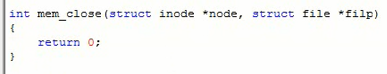

### read

      获取设备基地址，然后从private_data取出
      记得还要加上偏移

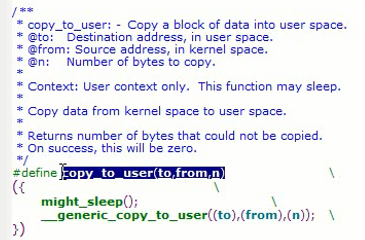

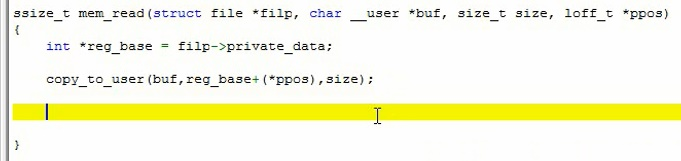

      没有写参数检查。。。

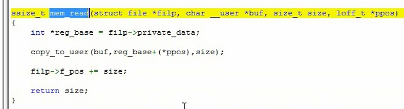

### write

      写和读非常类似，拷贝过来改改

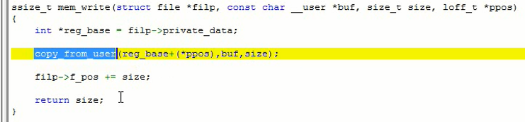

### lseek

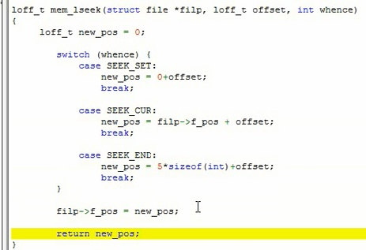

## 驱动注销

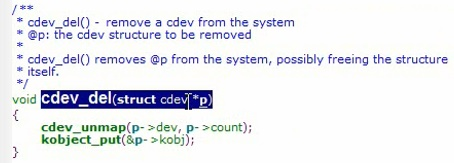

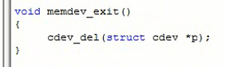

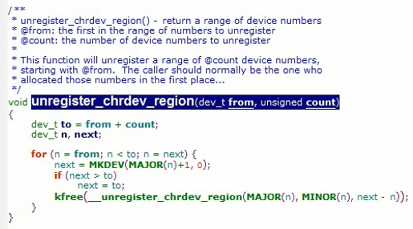

## 头文件包含

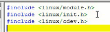

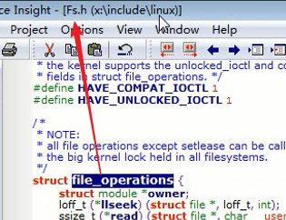

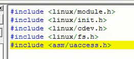

## 运行测试

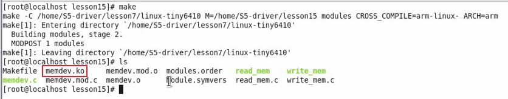

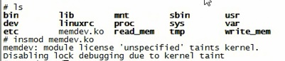

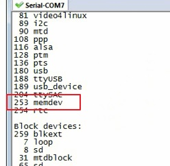

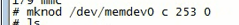

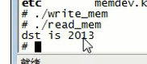

## 总结
