<!-- TOC depthFrom:1 depthTo:6 withLinks:1 updateOnSave:1 orderedList:0 -->

- [第16课-驱动访问大揭秘](#第16课-驱动访问大揭秘)
	- [驱动访问模型](#驱动访问模型)
	- [read系统调用分析](#read系统调用分析)
	- [系统调用入口](#系统调用入口)
	- [系统调用表](#系统调用表)
	- [总结](#总结)

<!-- /TOC -->

# 第16课-驱动访问大揭秘

## 驱动访问模型

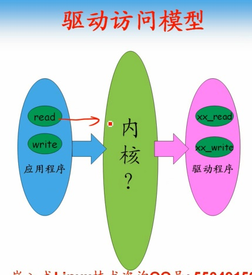

## read系统调用分析

      read如何找到内核驱动中的read操作？

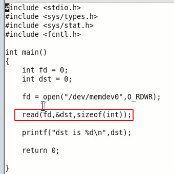

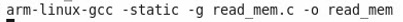

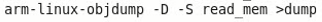

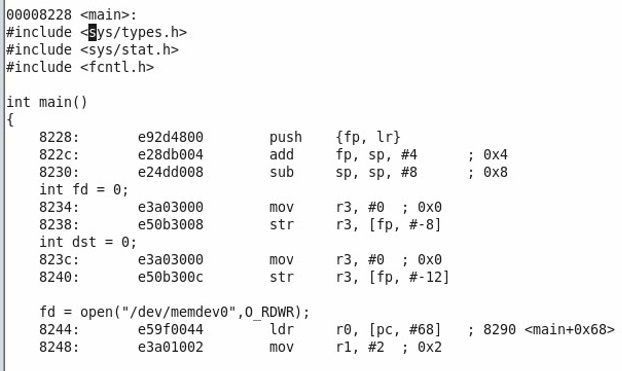

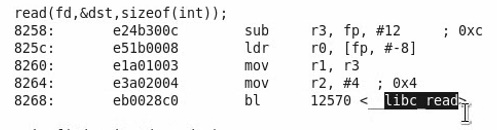

      调用_libc_read

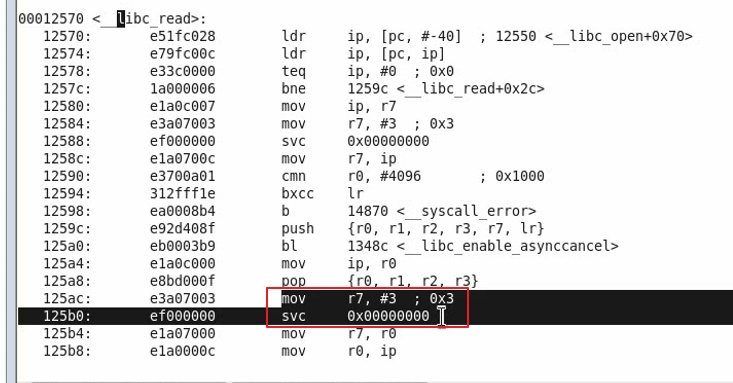

      3传递给r7，然后调用svc，系统调用指令。进入内核态。
      入口固定，进入内核后获取参数3表明调用第三个系统调用read
      根据3参数查表，函数地址表，调用sys_read函数，

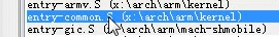

## 系统调用入口

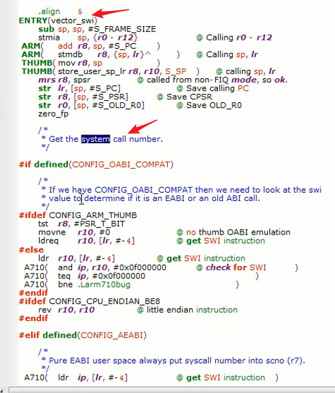

## 系统调用表

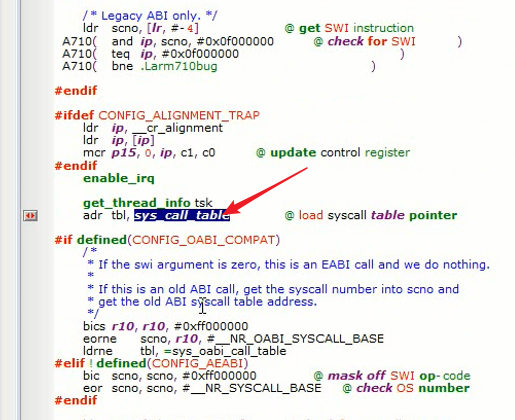

      全局搜索一波

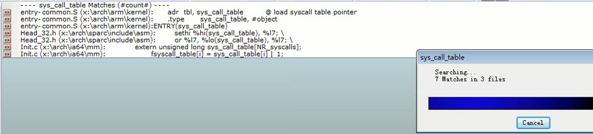

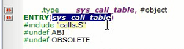

      包含了calls.S

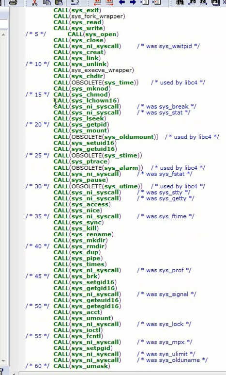

## 总结
