# 第17课-字符设备控制

## 课程索引

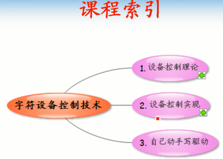

      其实就是讲ioctl相关函数

## 设备控制理论

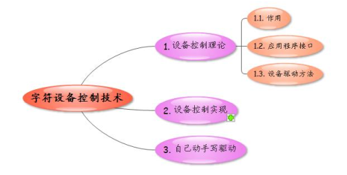

### 控制理论-作用

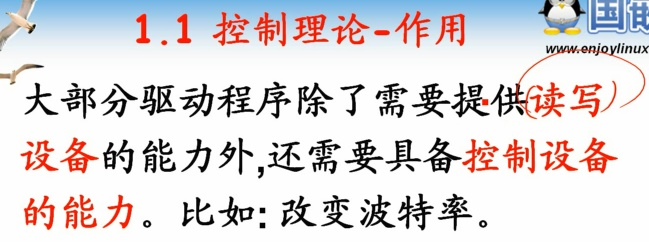

### 设备控制-应用函数

      读取设备用read
      写入数据用write
      控制设备用ioctl

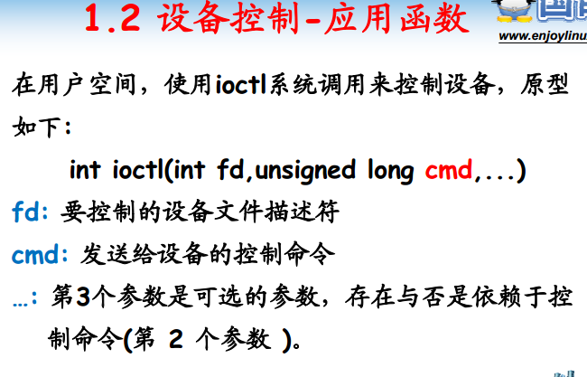

      省略号参数取决于cmd命令
      其实就是可变参数的形式。

### 设备控制-驱动函数

      版本不同，调用函数不同，这。。。兼容性完美！

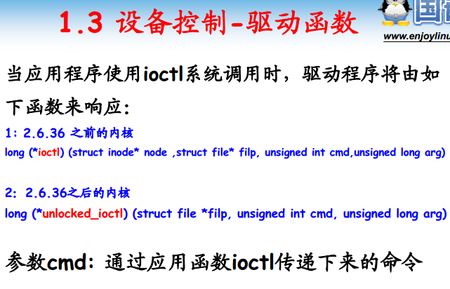

## 设备控制实现

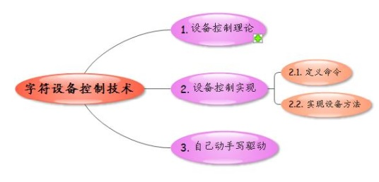

### 控制实现-定义命令

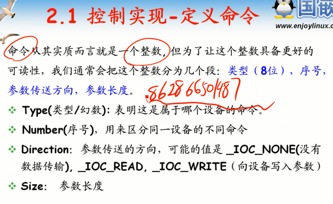

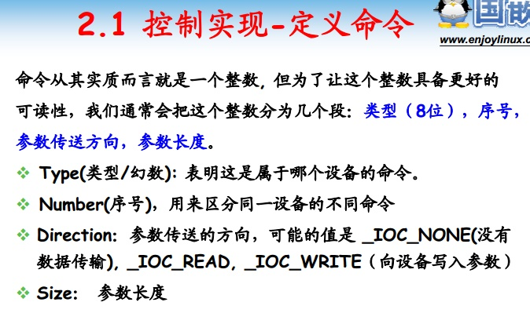

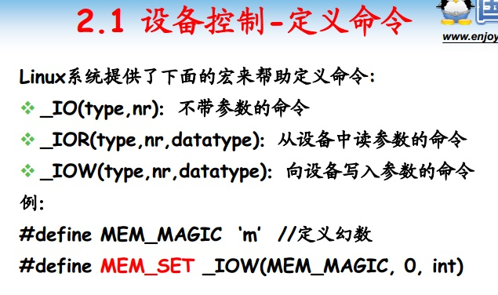

### 设备控制-实现操作

      switch编程模型，根据不同命令执行不同操作。

## 自动动手写驱动

      两个命令：
      1.重启设备
      2.参数设定
      命令一般放在头文件中。定义幻数

### 定义命令

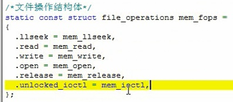

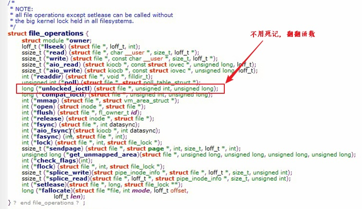

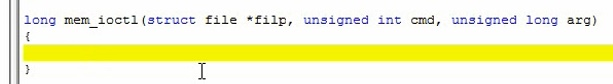

### 设备ioctl实现

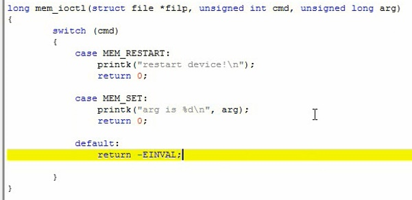

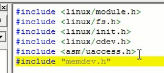

### 应用程序编写

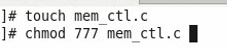

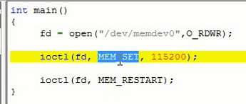

      ioctl有没有第三个参数取决于第二个参数。
      包含头文件，man一下就知道了

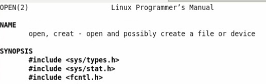

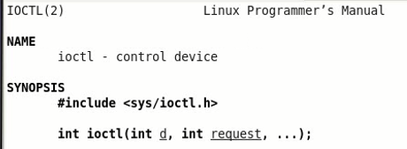

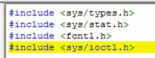

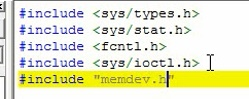

      静态编译

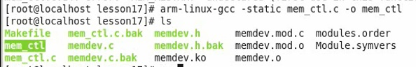

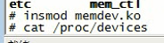

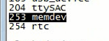

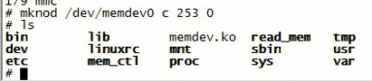

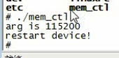

## 总结
