<!-- TOC depthFrom:1 depthTo:6 withLinks:1 updateOnSave:1 orderedList:0 -->

- [第18课-LED驱动程序设计](#第18课-led驱动程序设计)
	- [课程索引](#课程索引)
	- [LED驱动](#led驱动)
		- [内核驱动模板](#内核驱动模板)
		- [Makefile编写](#makefile编写)
		- [字符设备驱动框架](#字符设备驱动框架)
		- [LED驱动-字符设备open实现](#led驱动-字符设备open实现)
		- [LED驱动-字符设备ioctl实现](#led驱动-字符设备ioctl实现)
	- [源码](#源码)
		- [LED驱动源码](#led驱动源码)
		- [应用程序源码](#应用程序源码)
	- [总结](#总结)

<!-- /TOC -->

# 第18课-LED驱动程序设计

## 课程索引

      点亮开发板的LED。
      编写LED驱动 == 字符设备驱动程序
      步骤：
        1.编写内核模块模板
        2.字符驱动框架
        3.设备操作集选取
        4.设备操作函数实现 open，ioctl

## LED驱动

### 内核驱动模板

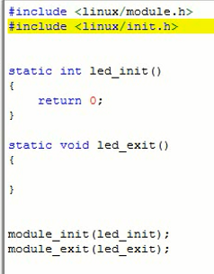

### Makefile编写

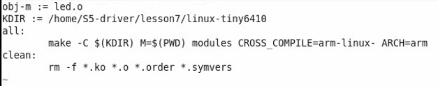

### 字符设备驱动框架

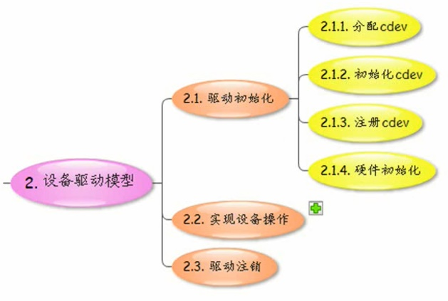


      采用静态分配cdev

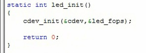


### LED驱动-字符设备open实现

      配置GPIO - open
      控制 - ioctl

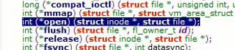

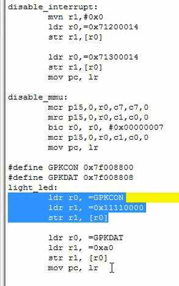

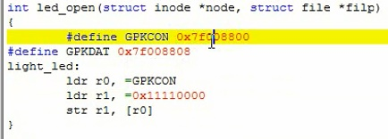

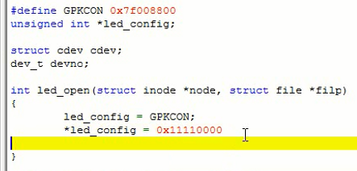

      但是在Linux上不能直接使用物理地址，需要转换成虚拟地址。
      如何转换？使用ioremap()函数

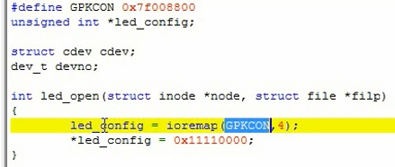

      写入也不能直接写，有专门函数writel()

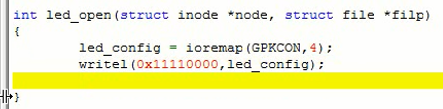

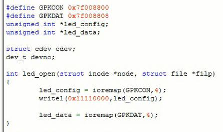


### LED驱动-字符设备ioctl实现


## 源码

### LED驱动源码

```
\#include <linux/module.h>
\#include <linux/init.h>
\#include <linux/cdev.h>
\#include <linux/fs.h>
\#include <linux/io.h>
\#include "led.h"

\#define LEDCON 0x7f008800
\#define LEDDAT 0x7f008808
unsigned int *led_config;
unsigned int *led_data;

struct cdev cdev;
dev_t devno;

int led_open(struct inode *node, struct file *filp)
{
	led_config = ioremap(LEDCON,4);
	writel(0x11110000,led_config);

	led_data = ioremap(LEDDAT,4);

	return 0;
}

long led_ioctl(struct file *filp, unsigned int cmd, unsigned long arg)
{
	switch (cmd)
	{
	    case LED_ON:
	        writel(0x00,led_data);
	        return 0;

	    case LED_OFF:
	        writel(0xff,led_data);
	        return 0;

	    default:
	    	return -EINVAL;
	}
}

static struct file_operations led_fops =
{
    .open = led_open,
    .unlocked_ioctl = led_ioctl,
};

static int led_init()
{
    cdev_init(&cdev,&led_fops);

    alloc_chrdev_region(&devno, 0 , 1 , "myled");
    cdev_add(&cdev, devno, 1);

    return 0;
}

static void led_exit()
{
	cdev_del(&cdev);
	unregister_chrdev_region(devno,1);
}


module_init(led_init);
module_exit(led_exit);

```

### 应用程序源码

```
\#include <sys/types.h>
\#include <sys/stat.h>
\#include <fcntl.h>
\#include <sys/ioctl.h>
\#include "led.h"

int main(int argc, char *argv[])
{
     int fd;
     int cmd;

     if (argc <2 )
     {
         printf("please enter the second para!\n");
         return 0;
     }

     cmd = atoi(argv[1]);

     fd = open("/dev/myled",O_RDWR);

     if (cmd == 1)
         ioctl(fd,LED_ON);
     else
         ioctl(fd,LED_OFF);


     return 0;
}
```

## 总结
