<!-- TOC depthFrom:1 depthTo:6 withLinks:1 updateOnSave:1 orderedList:0 -->

- [第19课-硬件访问技术](#第19课-硬件访问技术)
	- [课程索引](#课程索引)
	- [硬件访问实质](#硬件访问实质)
	- [访问流程](#访问流程)
	- [地址映射](#地址映射)
		- [动态映射ioremap](#动态映射ioremap)
		- [静态映射](#静态映射)
			- [映射关系map_desc](#映射关系mapdesc)
			- [S3C系列map_desc数组](#s3c系列mapdesc数组)
	- [使用静态映射改写LED驱动](#使用静态映射改写led驱动)
	- [寄存器读写相关函数](#寄存器读写相关函数)
	- [总结](#总结)

<!-- /TOC -->
# 第19课-硬件访问技术

## 课程索引

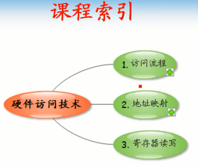

## 硬件访问实质

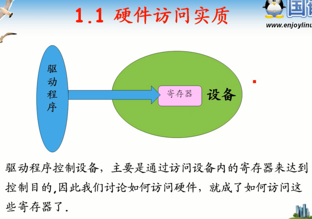

      通过内部寄存器达到访问目的。
      访问硬件==访问寄存器

## 访问流程

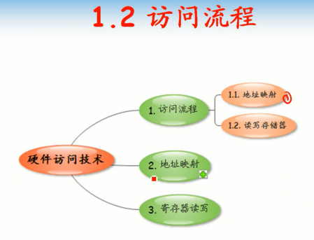

## 地址映射

      内存管理子系统中，非常重要的原则，不管是内核程序还是应用程序
      使用的地址必须是虚拟地址。
      但是芯片手册等都是直接告诉物理地址，那该如何使用？
      必须要经过转换，物理地址转换为虚拟地址才可以用。这个过程就是地址映射。
      两种方式地址映射，
      1.动态映射
      2.静态映射。

### 动态映射ioremap

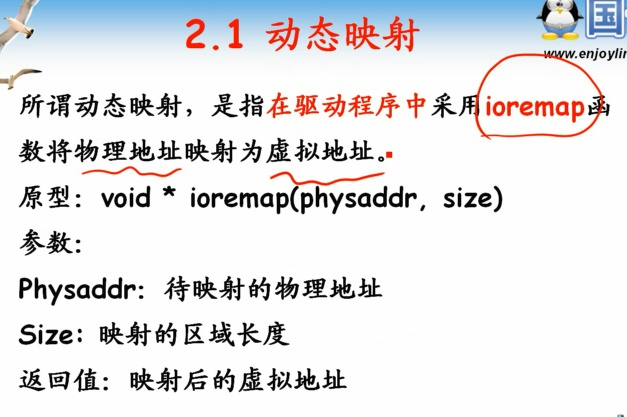

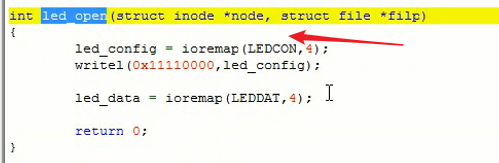

### 静态映射

#### 映射关系map_desc

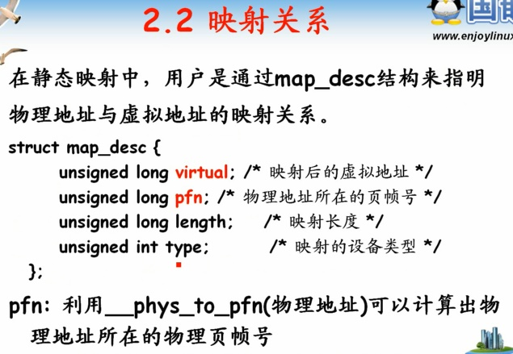

      物理地址所在的页帧号，因为是按照页来操作的。

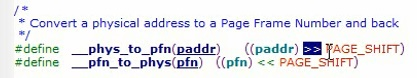

      物理地址到页帧号的转换_phys_to_pfn

#### S3C系列map_desc数组

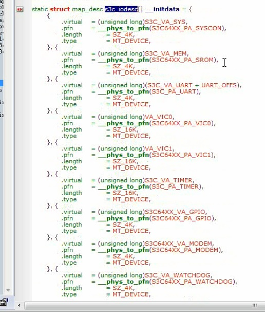

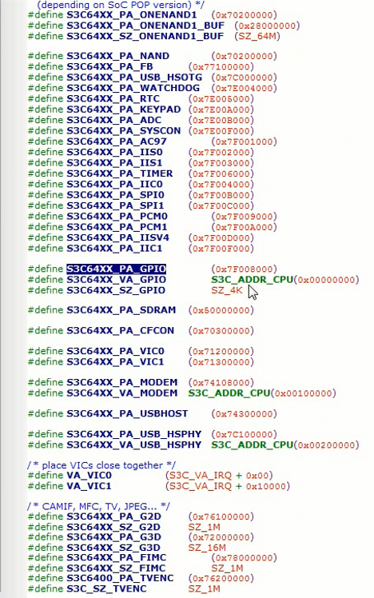

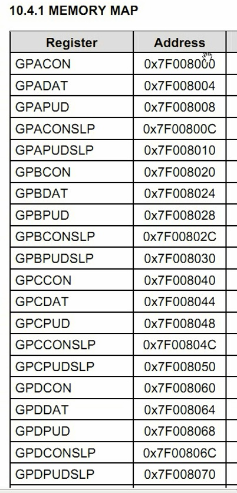

      内核启动时完成相关映射

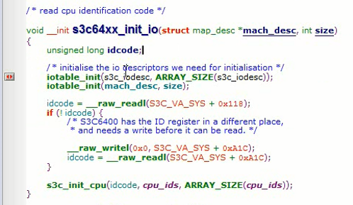

## 使用静态映射改写LED驱动

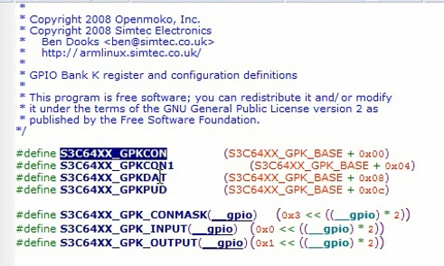

      获取到GPIO配置虚拟地址

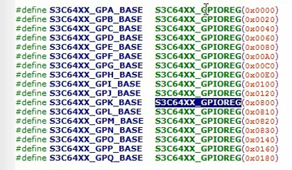

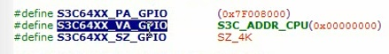

      直接使用该宏

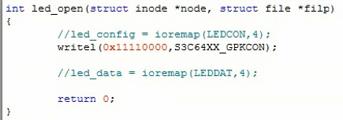

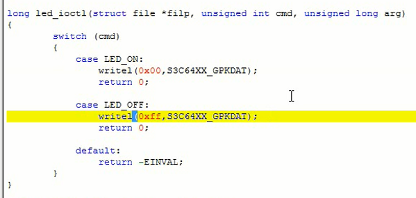

      头文件去哪里找？内核里面相关的直接拷贝

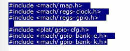

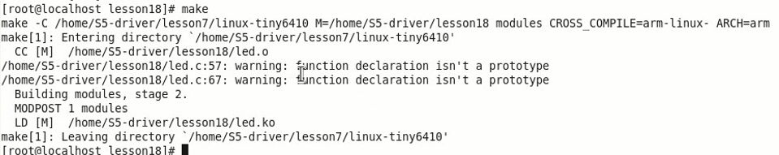

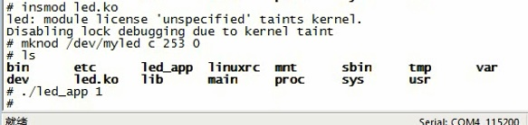

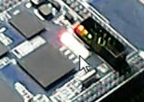

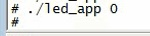

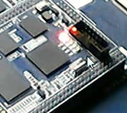

## 寄存器读写相关函数

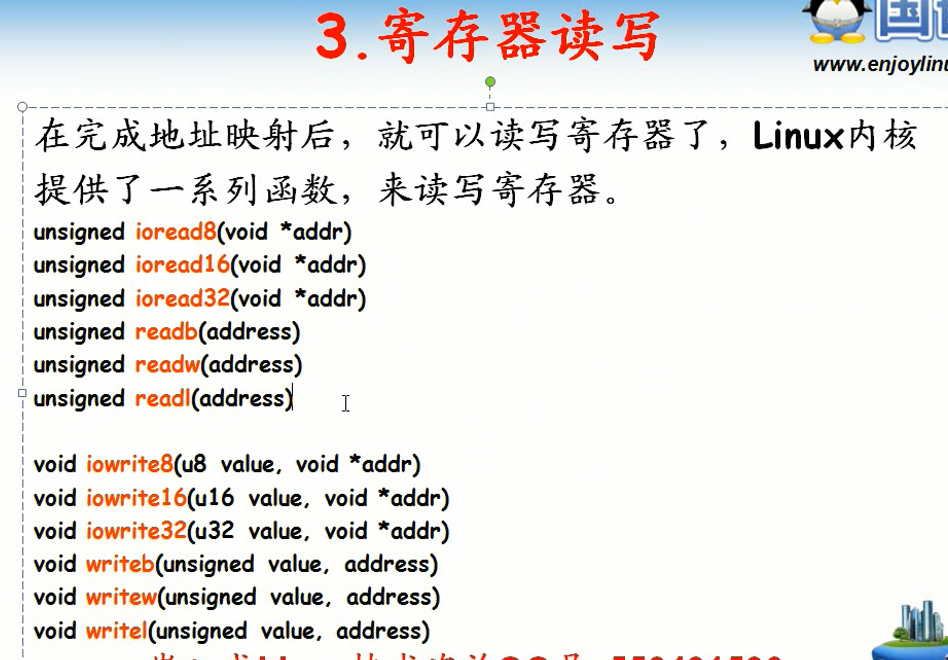

## 总结

      静态映射，动态映射哪个合适？？
