<!-- TOC depthFrom:1 depthTo:6 withLinks:1 updateOnSave:1 orderedList:0 -->

- [第1课-课程规划与学习方法](#第1课-课程规划与学习方法)
	- [课程索引](#课程索引)
	- [思想问题](#思想问题)
		- [思想-盲从](#思想-盲从)
		- [思想-恐惧/退缩](#思想-恐惧退缩)
		- [为什么要学习内核](#为什么要学习内核)
	- [学习方法](#学习方法)
		- [四步学习法](#四步学习法)
	- [课程大纲](#课程大纲)
	- [总结](#总结)

<!-- /TOC -->

# 第1课-课程规划与学习方法

## 课程索引

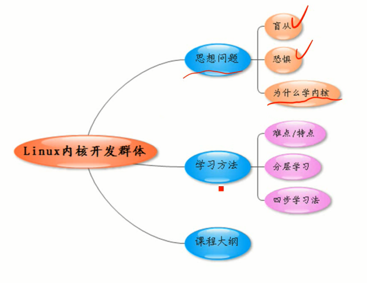

## 思想问题

### 思想-盲从

### 思想-恐惧/退缩

      复杂度可想而知

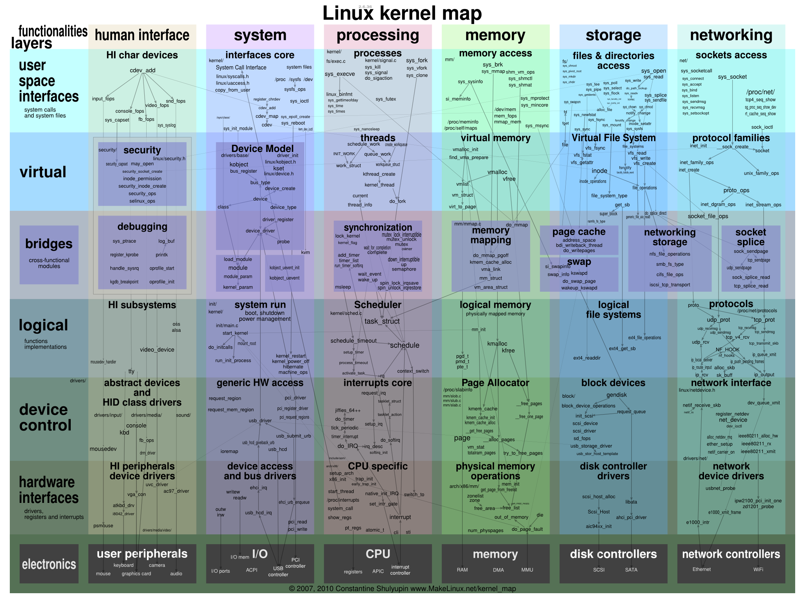

### 为什么要学习内核

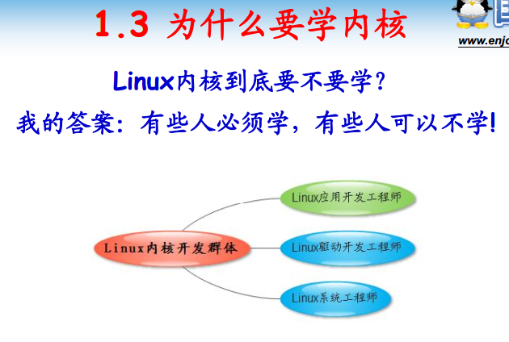

## 学习方法

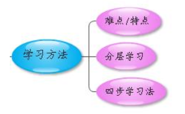

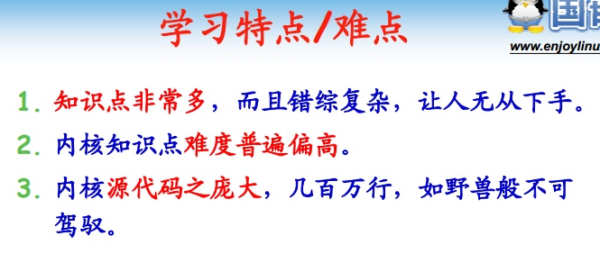

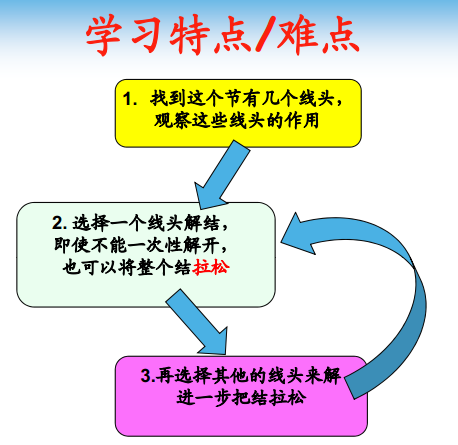

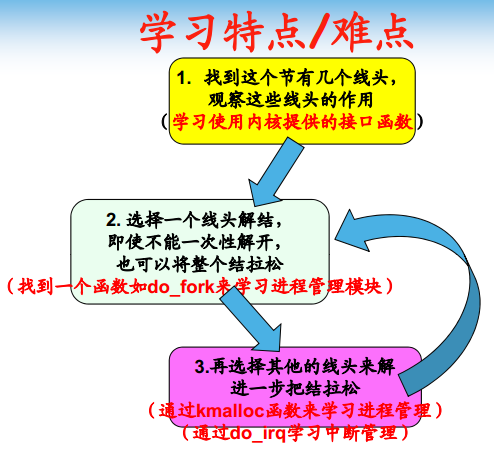

      使用内核提供的相关函数

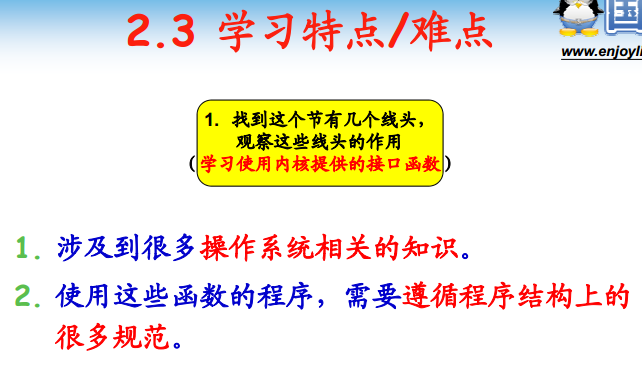

### 四步学习法

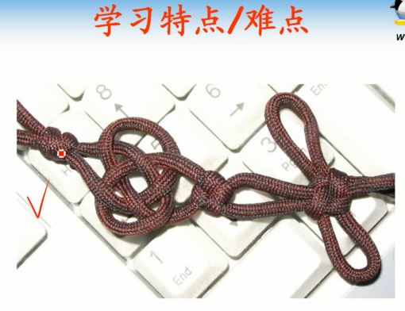

      好比打结的一波绳子，如何解开这个绳子？
      1.首先找线头，有多少个线头？线头牵扯到绳子的那些部分？
      2.找到一个线头，然后试图通过这个线头解开这个绳子。好的情况，坏的情况。

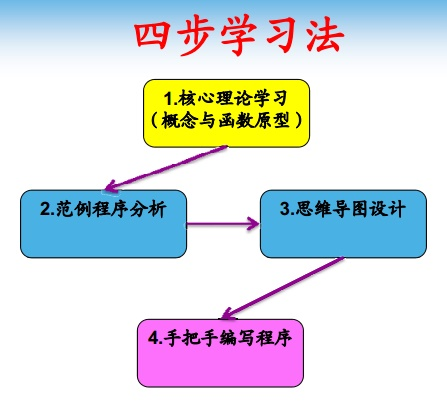

      分阶段学习Linux内核
      找线头 - 函数
      顺藤摸瓜
      尽可能解开，拉松

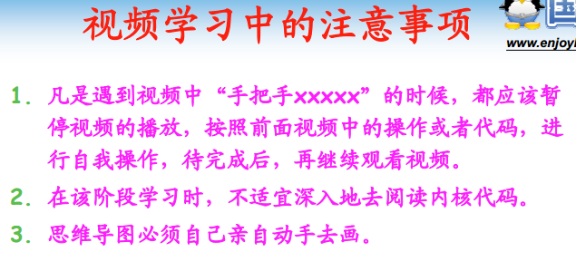

## 课程大纲

## 总结
