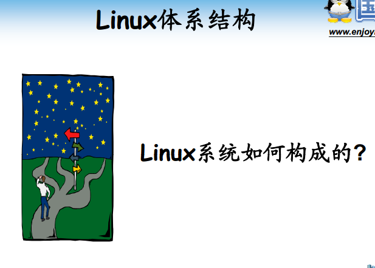
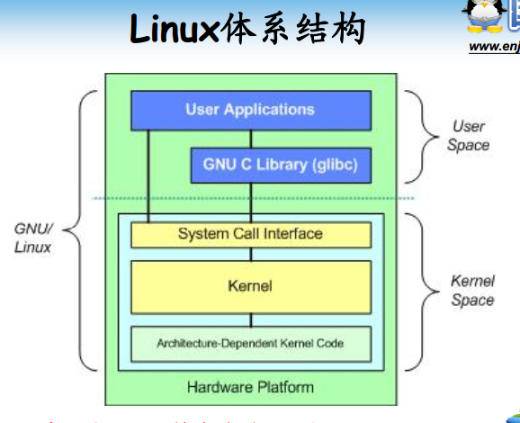
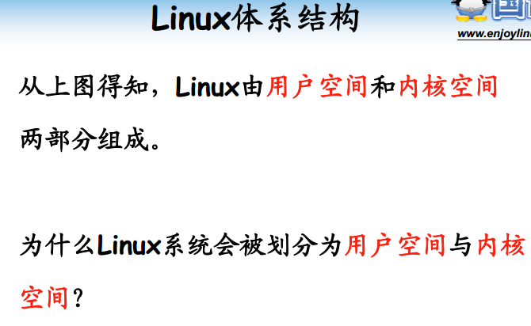
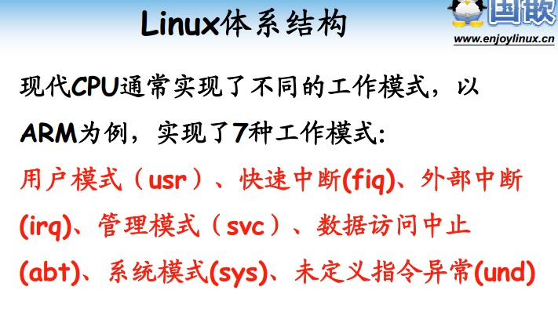
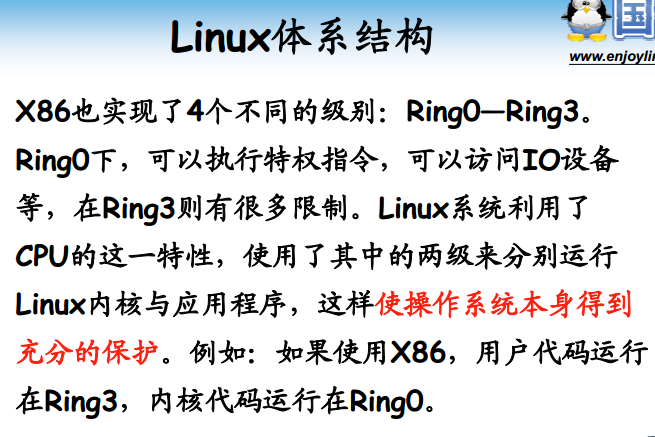
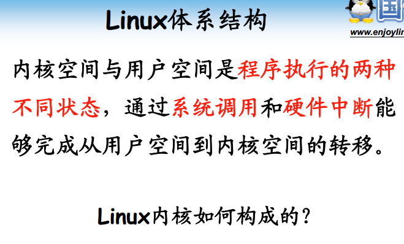
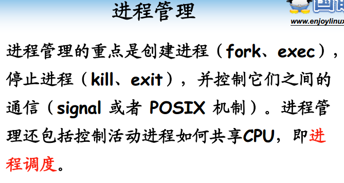
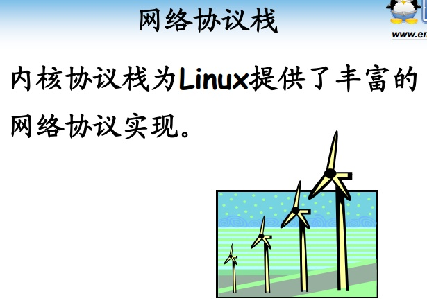
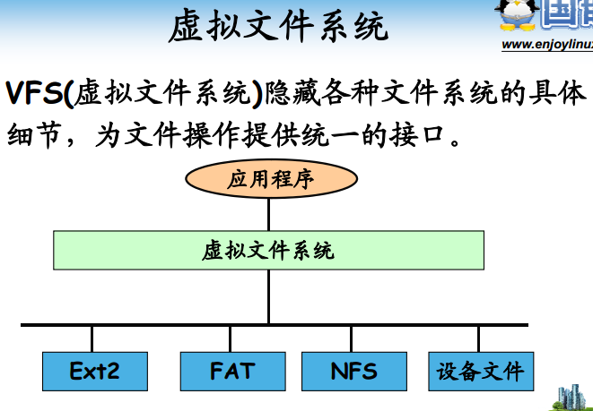
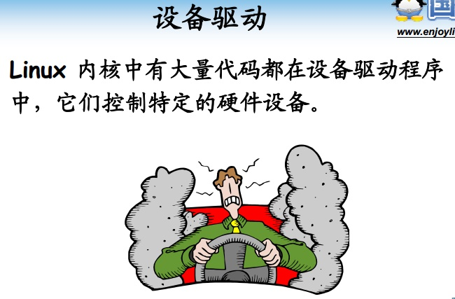

<!-- TOC depthFrom:1 depthTo:6 withLinks:1 updateOnSave:1 orderedList:0 -->

- [第2课-Linux内核简介](#第2课-linux内核简介)
	- [课程索引](#课程索引)
	- [Linux系统架构](#linux系统架构)
	- [Linux内核架构](#linux内核架构)
	- [系统调用接口](#系统调用接口)
	- [进程管理](#进程管理)
	- [内存管理](#内存管理)
	- [网络协议栈](#网络协议栈)
	- [虚拟文件系统](#虚拟文件系统)
	- [设备驱动](#设备驱动)
	- [总结](#总结)

<!-- /TOC -->

# 第2课-Linux内核简介

## 课程索引

## Linux系统架构

## Linux内核架构

## 系统调用接口

## 进程管理

## 内存管理

## 网络协议栈

## 虚拟文件系统

## 设备驱动

## 总结
