<!-- TOC depthFrom:1 depthTo:6 withLinks:1 updateOnSave:1 orderedList:0 -->

- [第4课-Linux内核配置与编译](#第4课-linux内核配置与编译)
	- [课程目标](#课程目标)
	- [课程索引](#课程索引)
	- [配置内核](#配置内核)
		- [为什么要配置内核？](#为什么要配置内核)
		- [如何配置内核](#如何配置内核)
			- [make config - 文本交互配置](#make-config-文本交互配置)
			- [make menuconfig - 图形化交互配置](#make-menuconfig-图形化交互配置)
			- [配置技巧](#配置技巧)
		- [内核配置结果](#内核配置结果)
	- [内核编译](#内核编译)
	- [编译zImage](#编译zimage)
	- [编译内核模块](#编译内核模块)
	- [制作ramdisk](#制作ramdisk)
	- [安装内核x86](#安装内核x86)
	- [清理内核编译环境](#清理内核编译环境)
	- [总结](#总结)

<!-- /TOC -->
# 第4课-Linux内核配置与编译

## 课程目标

      bootloader
      内核映像 2MB
      文件系统
      内核源代码是如何转换成内核映像？

## 课程索引

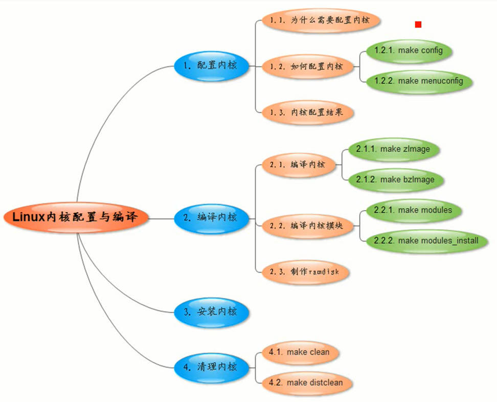

## 配置内核

### 为什么要配置内核？

      选择合适的功能，不需要的去掉

      软件选择，基于硬件和软件
      把没有用到的部分去掉。这就是配置内核
      很形象的例子就是登山的时候选择装备

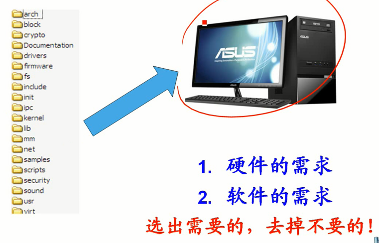

### 如何配置内核

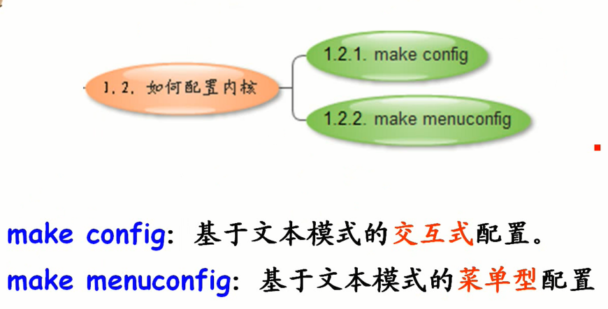

      一定要在内核源代码顶层目录运行
#### make config - 文本交互配置

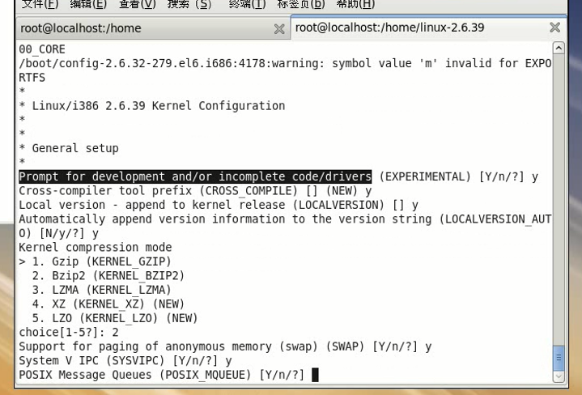

#### make menuconfig - 图形化交互配置

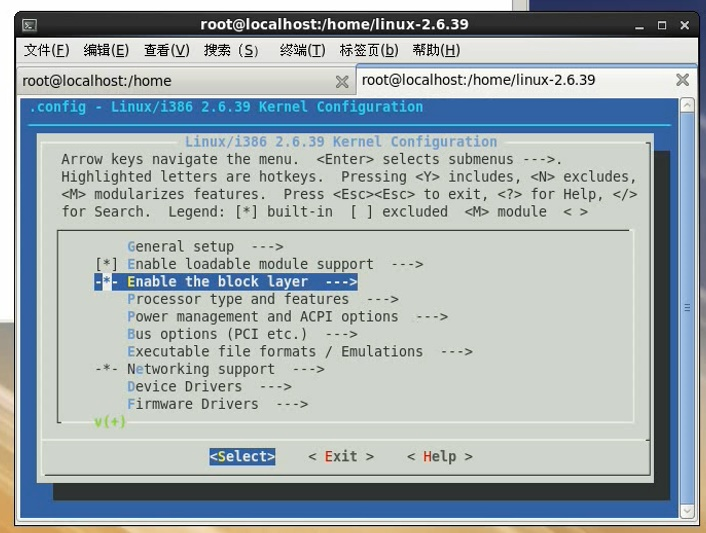

      直观，简单，高效。一般选用make menuconfig

#### 配置技巧

      回车 - 进入子菜单项
      可以鼠标点击
      <M> - 编译选择该功能。模块，放到硬盘中的特定文件夹下，需要的时候加载，不需要删除，节省内存
      <*> - 编译选择该功能。合并成一体内核镜像zImage文件。
      < > - 编译不选用该功能
      bootloader加载内核镜像zImage到内存中，一开机就在内存中

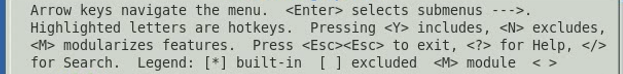

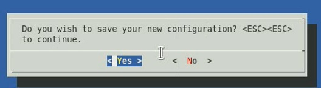

      配置保存在.config，顶层目录影藏

### 内核配置结果

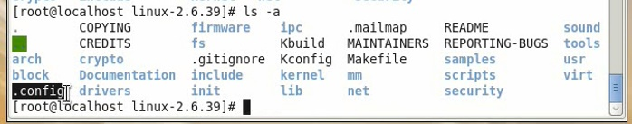

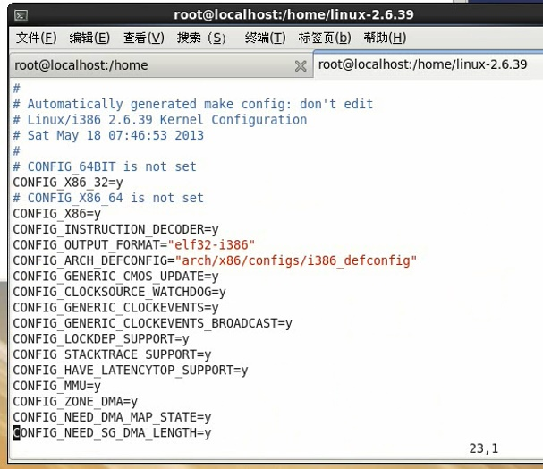

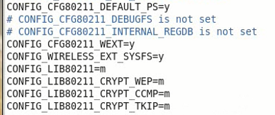

      每一项对应一行，CONFIG_开头，其后才是项的名字
      y - 表示编译进zImage
      m - 模块形式编译
      可直接修改.config配置文件
      可以不用一一配置，多是用make menuconfig配置
      或者使用一个已有的配置结果文件.config配置文件
            cp /boot/.config ./
      不清楚的配置项，保持默认值，不配置

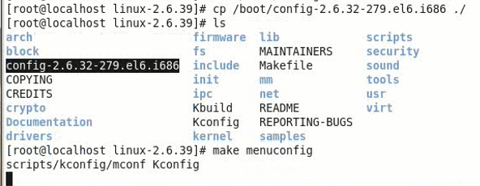

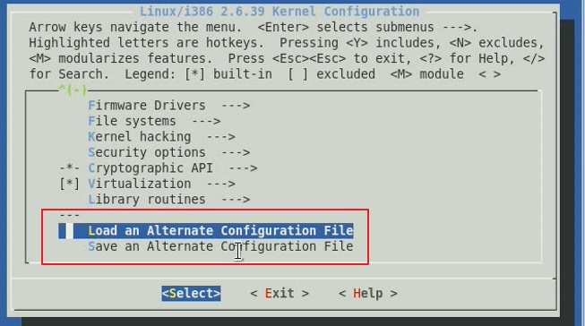

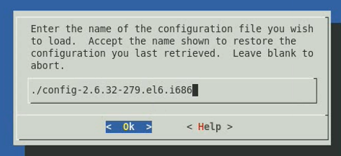

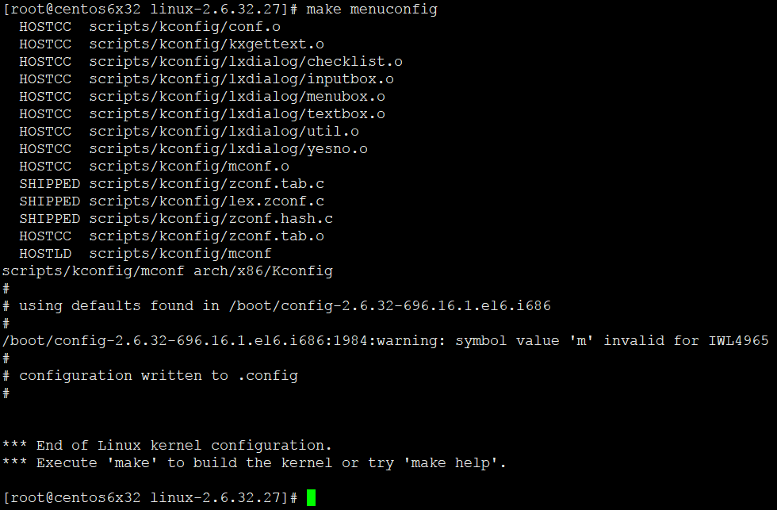

      尽可能找到可以参考的配置
      基于需求，进行小调整
      内核自带一波参考配置文件

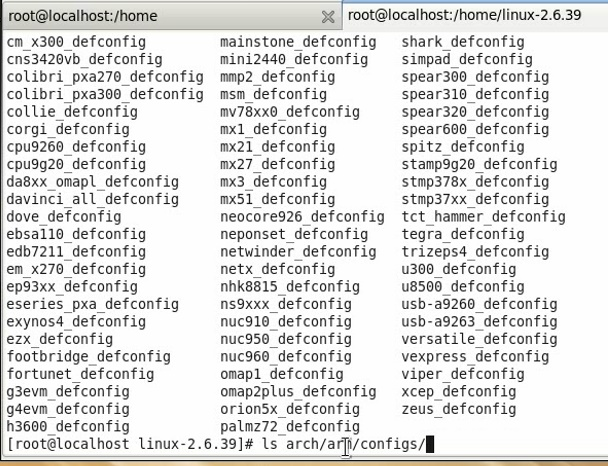

      x86也有一波默认配置，make menuconfig第一次运行的时候就是加载的它，根据当前平台加载

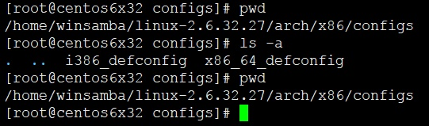

      如果要配置mips，你懂得，make menuconfig的时候翻到最下面，选择需要加载的配置

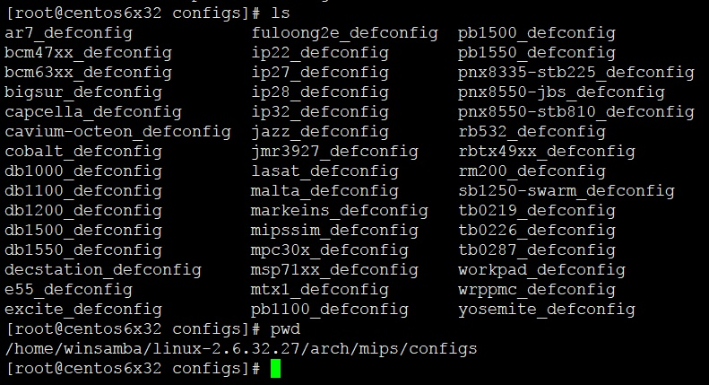

## 内核编译

## 编译zImage

      2.6.32内核已经很大了，不能使用make zImage，编译会报错。
      zImage只支持老的kernel版本

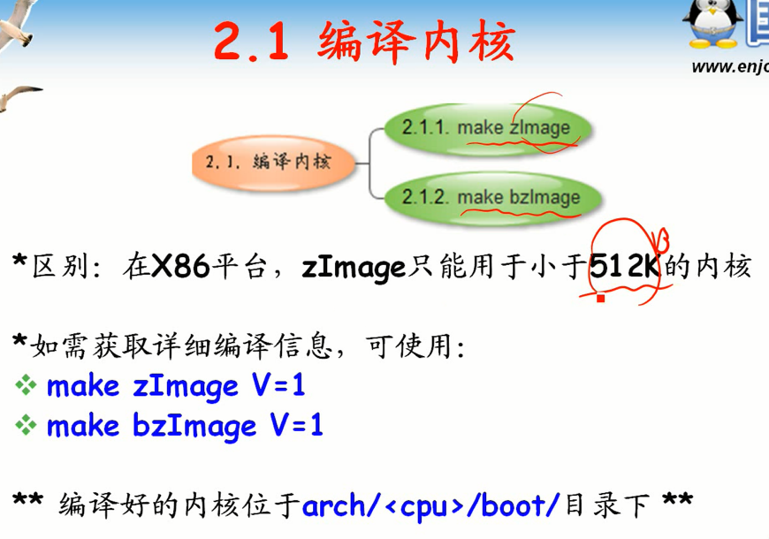

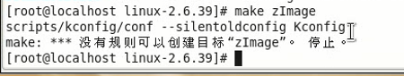

      使用编译选项可以输出更详细的编译信息

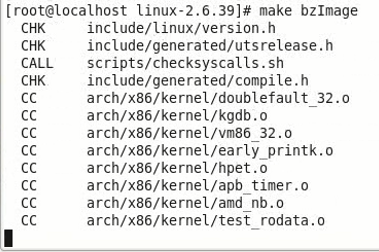

      大概需要十多分钟

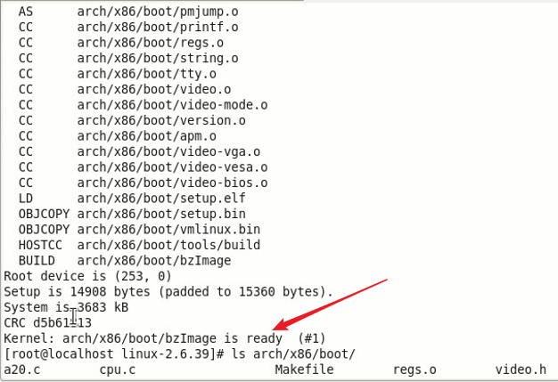

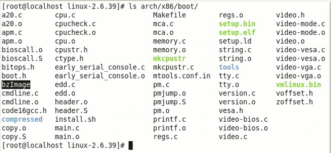

## 编译内核模块

      选择为M的就是内核模块

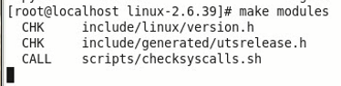

      编译内核模块的时间需要三十分钟左右，也是漫长到家了

      编译完成后，各个内核模块都是散落在不同目录下，以.ko结尾

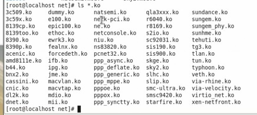

      make module_install只是把散落在各个目录下的ko文件放到同一个目录下
      放在/lib/modules/新建一个内核版本的子目录

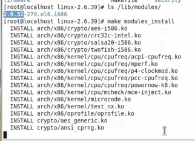

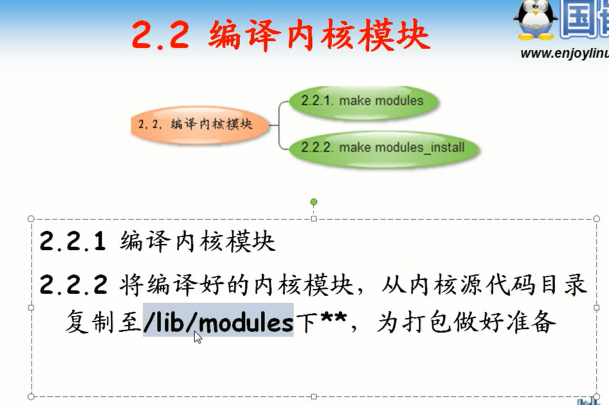

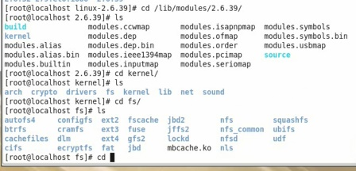

## 制作ramdisk

      内核模块打包

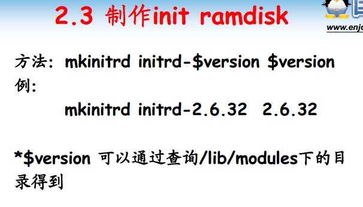

      mkinitrd  打包成的文件名  /lib/modules子目录名字
      第二个参数不用给出/lib/modules，默认自动从该目录找
      生成的文件存放在执行mkinitrd的工作目录下

## 安装内核x86

      拷贝bzImage和initrd到/boot分区，供grub2调用
      所以还有在grub中添加内核启动参数
      重启进入grub选择

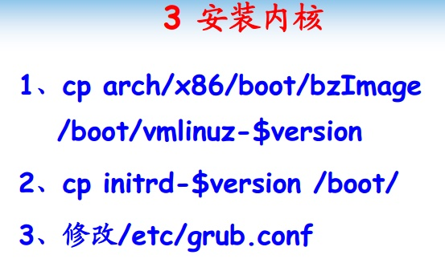

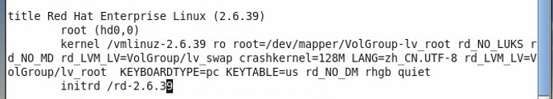

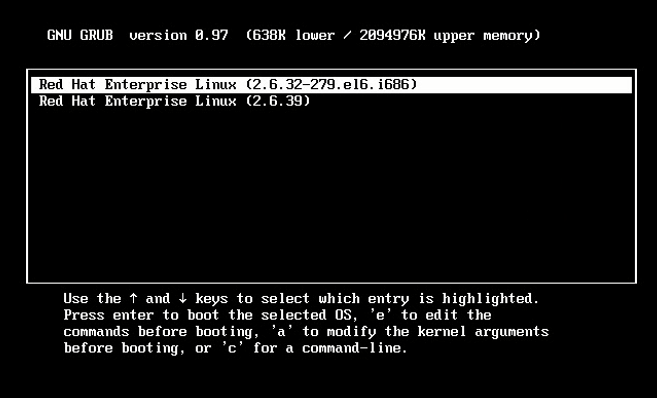

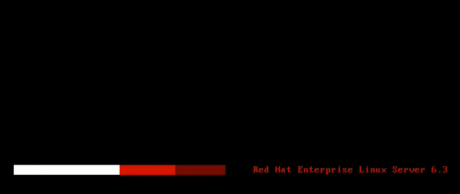

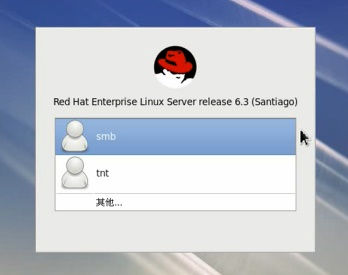

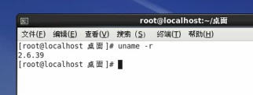

      仅内核发生变化，但是rootfs并没有发生变化

## 清理内核编译环境

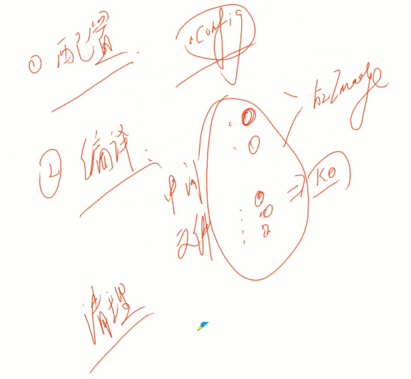

      make clean:清除.o和.ko文件，不清除.config配置文件

      make distclean:清除.o和.ko文件以及.config配置文件

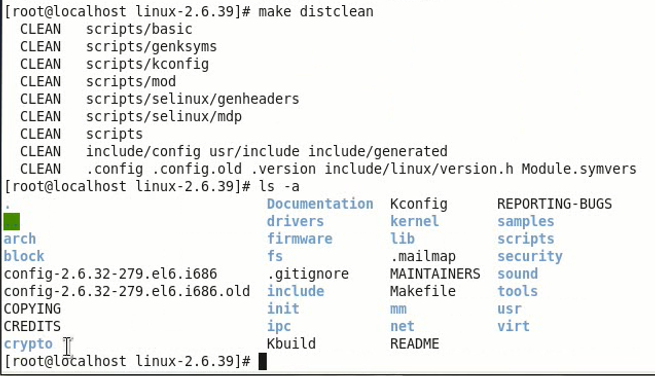

## 总结
