<!-- TOC depthFrom:1 depthTo:6 withLinks:1 updateOnSave:1 orderedList:0 -->

- [第5课-Linux内核模块开发](#第5课-linux内核模块开发)
	- [课程索引](#课程索引)
	- [什么是内核模块](#什么是内核模块)
	- [内核模块设计](#内核模块设计)
		- [主体部分设计-思维导图设计](#主体部分设计-思维导图设计)
		- [自己动手编写内核模块](#自己动手编写内核模块)
		- [内核模块Makefile编写](#内核模块makefile编写)
		- [编译内核模块](#编译内核模块)
		- [多个源代码编译成一个内核模块](#多个源代码编译成一个内核模块)
		- [安装/卸载内核模块](#安装卸载内核模块)
		- [可选项使用](#可选项使用)
		- [LKM模块参数传递](#lkm模块参数传递)
	- [符号导出](#符号导出)
	- [内核打印](#内核打印)
	- [总结](#总结)

<!-- /TOC -->

# 第5课-Linux内核模块开发

## 课程索引

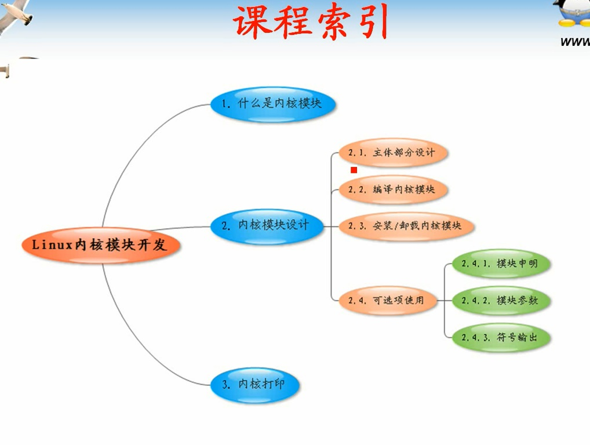

内核模块技术与内核配置与编译时Linux开发基础，内核级开发，驱动开发基础

## 什么是内核模块

      bzImage一旦加载就一直存储在内存中，各个内核功能都在内存中，选取使用。
      但是如果功能需求比较多，bzImage就会体积大。因此把不需要的功能放到硬盘中。
      需要的时候访问硬盘加载。这种机制就是内核模块机制。

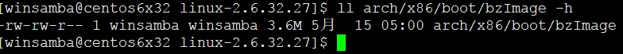

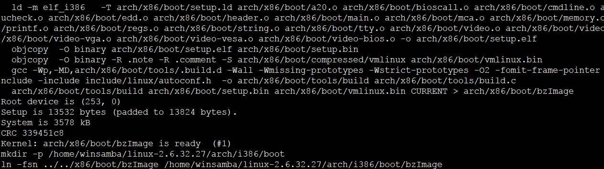

      动态安装卸载。Windows打补丁需要重启，而内核模块不需要重启，立即生效。

## 内核模块设计

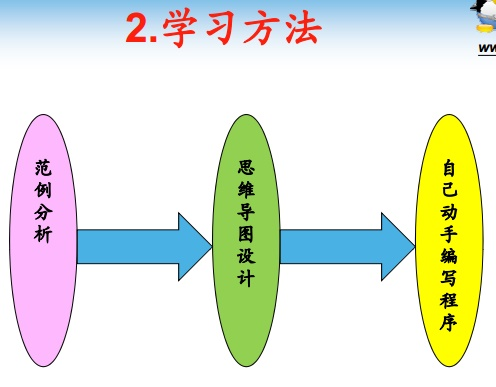

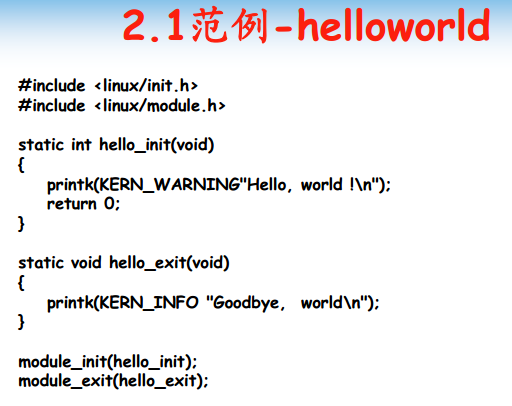

      没有main函数，入口呢？
        必须有module_exit、module_init宏定义
      安装的时候调用，卸载的时候调用。
      头文件有两个必须包含
        <linux/init.h>
        <linux/module.h>

### 主体部分设计-思维导图设计

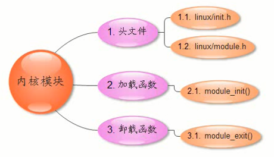

### 自己动手编写内核模块

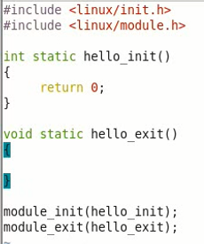

### 内核模块Makefile编写

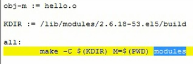

### 编译内核模块

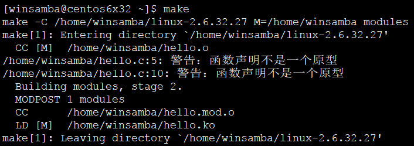

### 多个源代码编译成一个内核模块

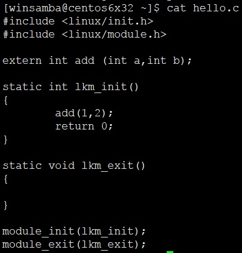

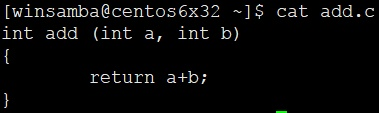

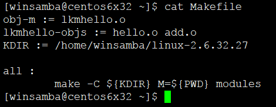

      需要在Makefile中列出目标

### 安装/卸载内核模块

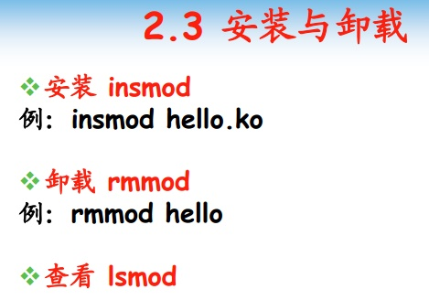

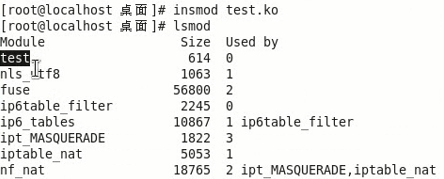

      used by : 表示当前模块被引用的次数

### 可选项使用

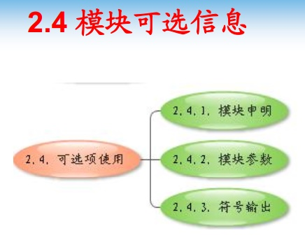

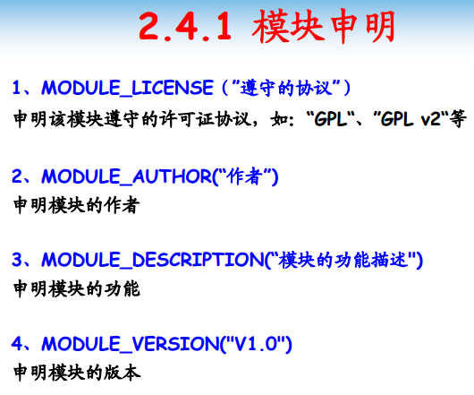

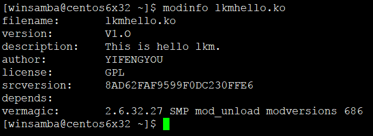

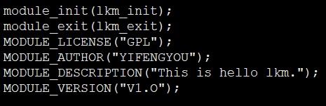

      对功能没有影响

### LKM模块参数传递

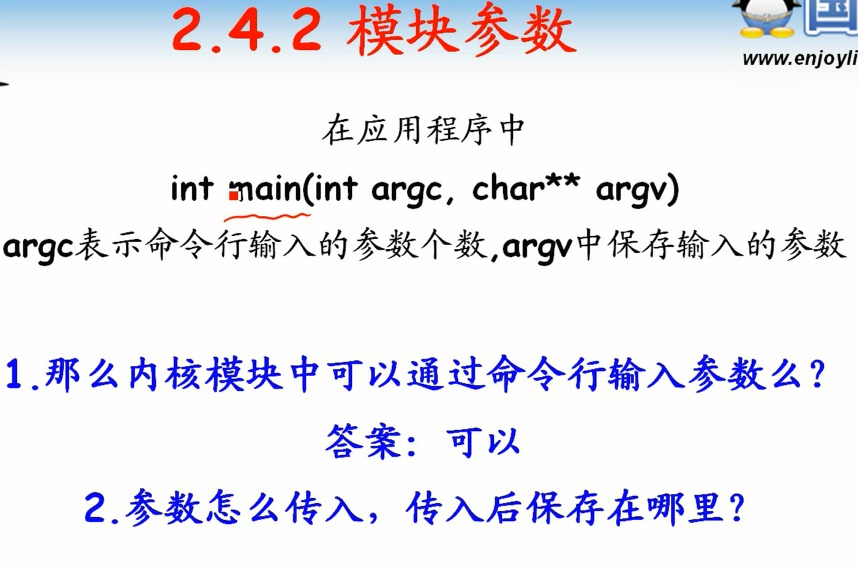

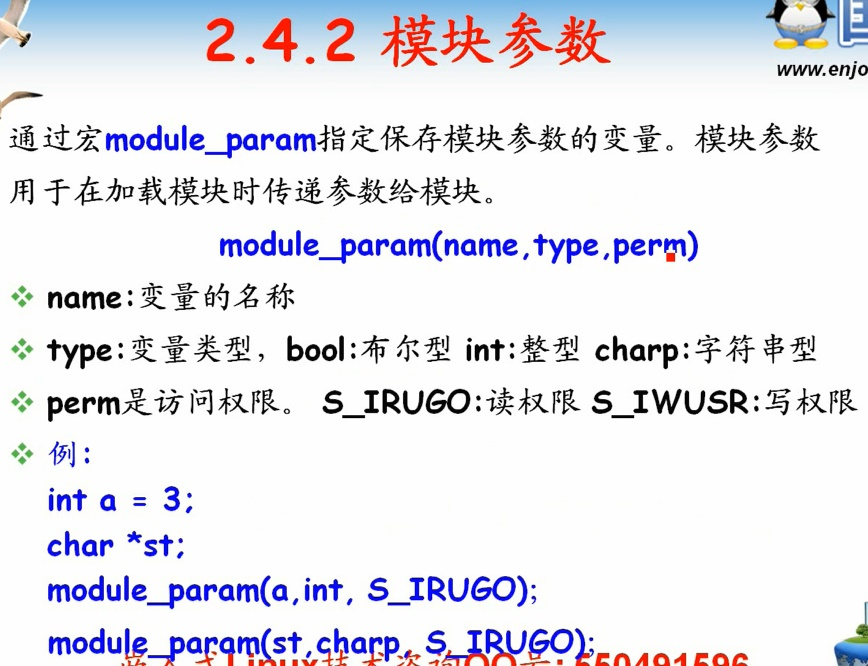

      程序当中定义变量，接收参数

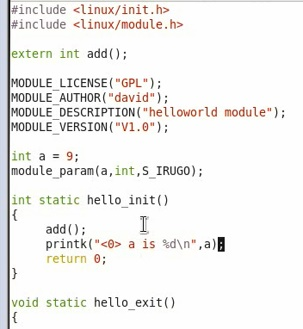

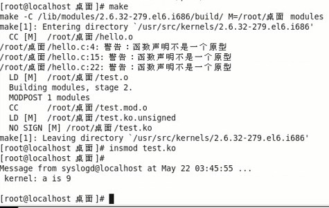

      字符串参数不需要分配空间，定义一个指针即可

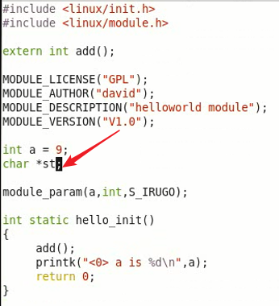

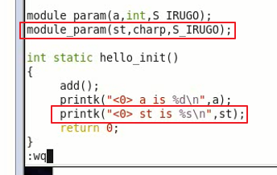

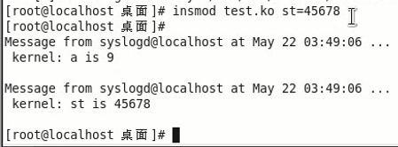

## 符号导出

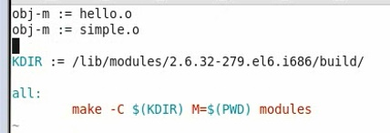

      有几个obj-m就有几个内核模块

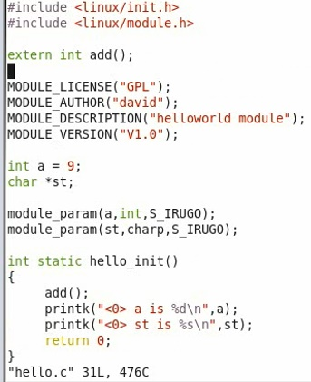

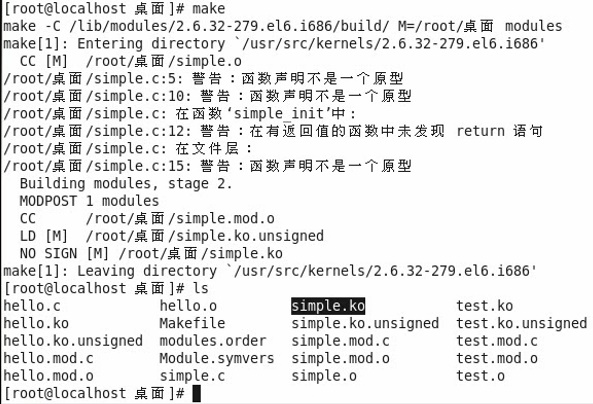

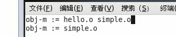

      尴尬，这个错误真特么弱智~~~

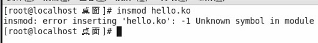

      提示，未定义符号，add

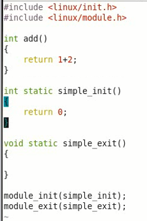

      又一个弱智错误

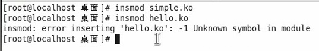

      先加载simple.ko，然后再hello.ko也不行。
      因为模块要导出才能用。不然只是自己使用。

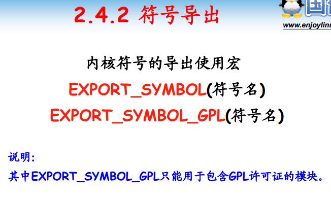

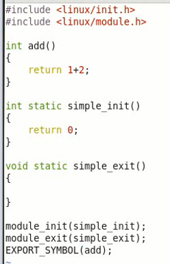

      还有可以限制必须支持GPL模块才能使用的功能。

## 内核打印

      printk函数，内核打印函数
      dmesg可以查看到，而不是在终端。终端能看到的基本是syslogd输出的。

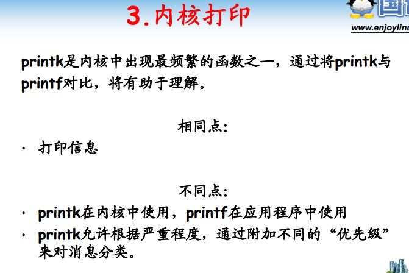

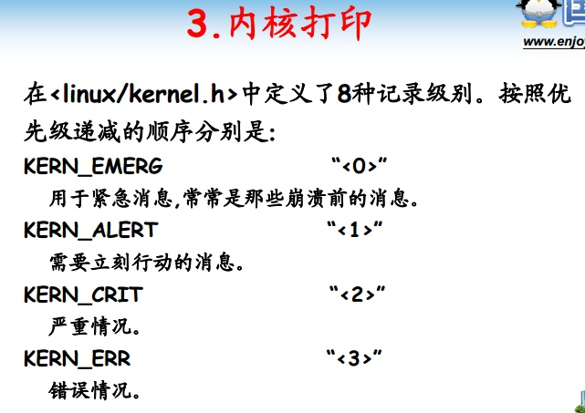

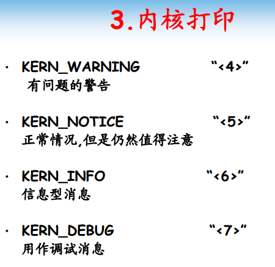

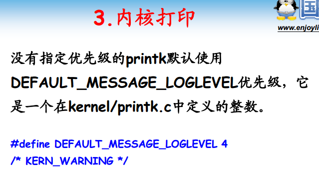

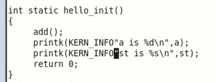

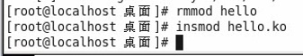

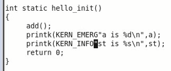

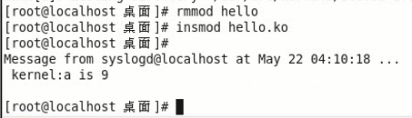

      不同级别打印信息不同

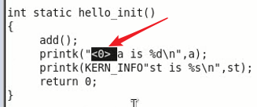

      等价效果，用这中方式更骚气
      默认不设定打印级别的时候，其实就是4级KREN_WARNING,不会在屏幕输出。

## 总结

