<!-- TOC depthFrom:1 depthTo:6 withLinks:1 updateOnSave:1 orderedList:0 -->

- [第6课-U-Boot新手入门](#第6课-u-boot新手入门)
	- [课程索引](#课程索引)
	- [嵌入式软件层次](#嵌入式软件层次)
	- [编译U-Boot](#编译u-boot)
		- [配置UBoot](#配置uboot)
		- [编译UBoot](#编译uboot)
	- [UBoot烧写](#uboot烧写)
	- [UBoot命令详解](#uboot命令详解)
		- [UBoot帮助命令](#uboot帮助命令)
		- [UBoot环境变量相关命令](#uboot环境变量相关命令)
		- [UBoot程序下载命令](#uboot程序下载命令)
		- [UBoot内存操作命令](#uboot内存操作命令)
		- [UBoot Flash操作命令](#uboot-flash操作命令)
		- [UBoot程序执行命令](#uboot程序执行命令)
		- [UBoot设置自动启动](#uboot设置自动启动)
	- [总结](#总结)

<!-- /TOC -->

# 第6课-U-Boot新手入门

## 课程索引

      如何使用UBoot，如何二次开发

## 嵌入式软件层次

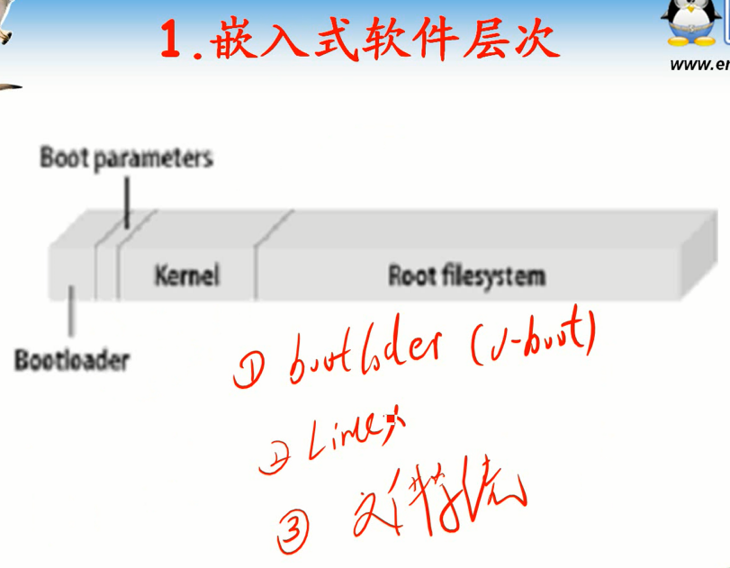

      一步一步来，然后就可以自己在开发板搭建一个完整的嵌入式系统

## 编译U-Boot

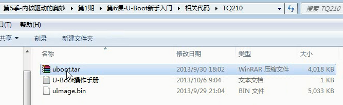

      找到对应开发板的Uboot。拷贝到samba服务器，解压缩

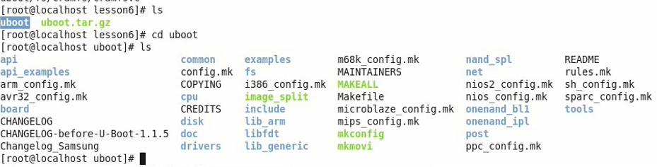

### 配置UBoot

      首先要配置。源码可以编译成N多个开发板，但是最终运行只能在一个开发板上运行。
      在Makefile中列出了一大波配置，找到自己开发板的配置项，然后make 该配置项

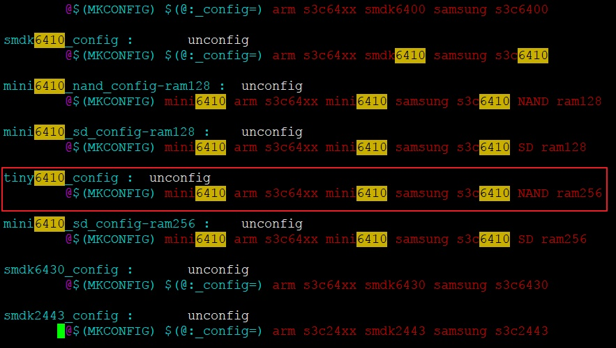

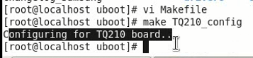

### 编译UBoot

      指定架构，编译器，编译大概持续2分钟左右的时间

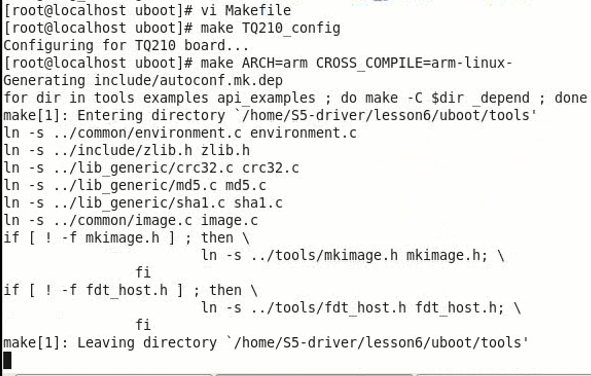

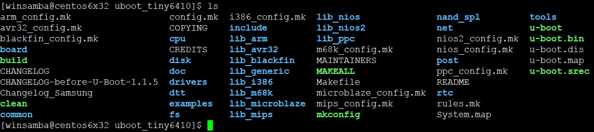

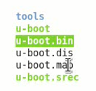

      uboot.bin就是可以烧写的二进制映像

## UBoot烧写

      烧写到NandFlash

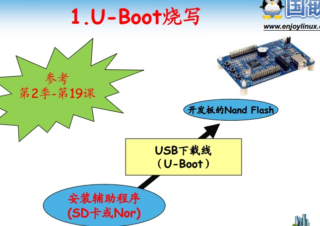

      烧写前都要格式化一下

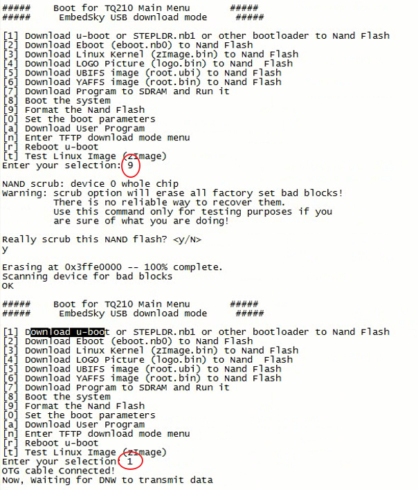

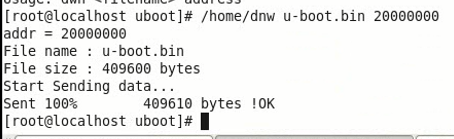

      可以看到UBoot菜单

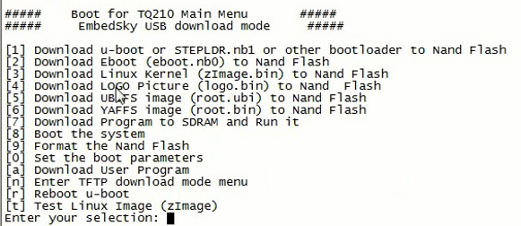

      输入q退出快速选择菜单，进入命令行
      这个其实跟grub一回事儿。grub也有命令行

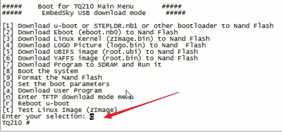

## UBoot命令详解

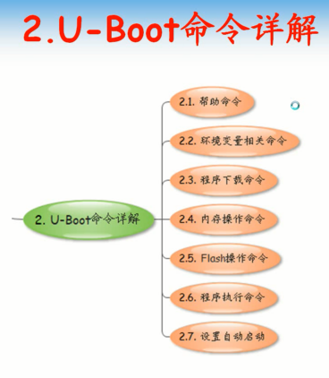

### UBoot帮助命令

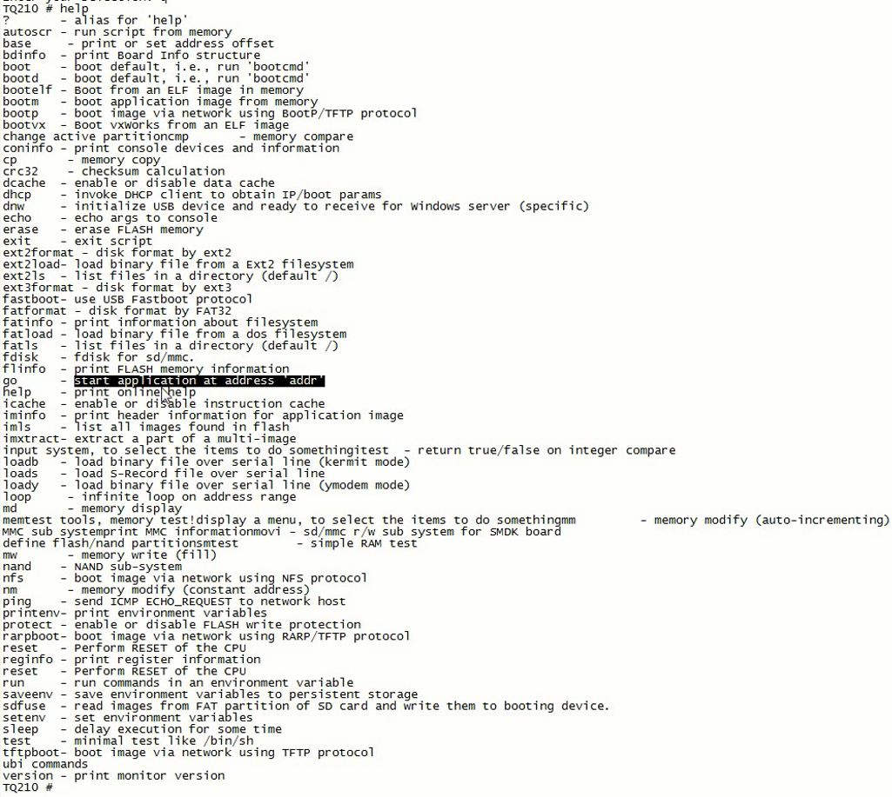

### UBoot环境变量相关命令

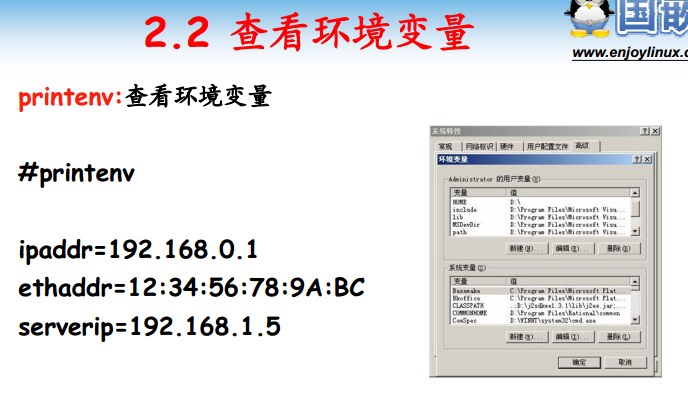

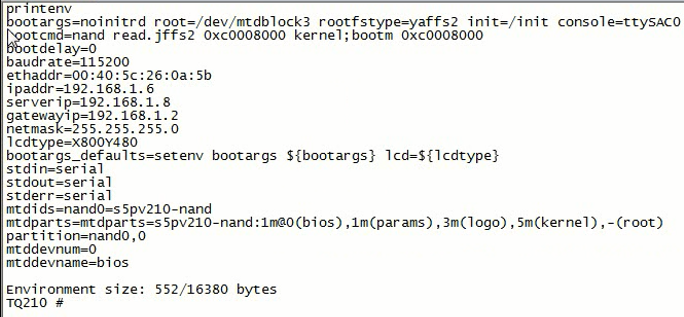

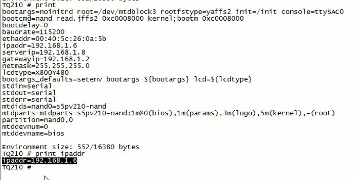

      print = printenv
      输入当个环境变量名，可查看其值。如果存在的话

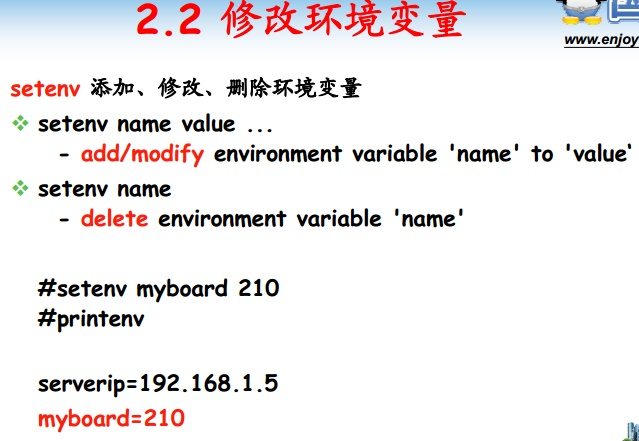

			setenv 可以修改也可以删除环境变量

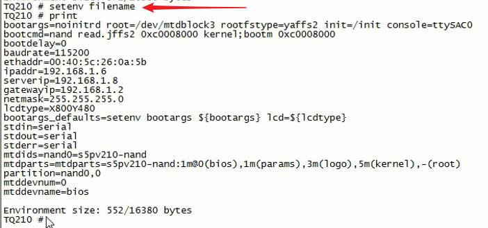

			saveenv 保存环境变量到Flash中，重启开发板依然有效

### UBoot程序下载命令

			不建议使用串口，太慢了。通常使用网络方式
			USB驱动要求，串口慢，就剩网络了

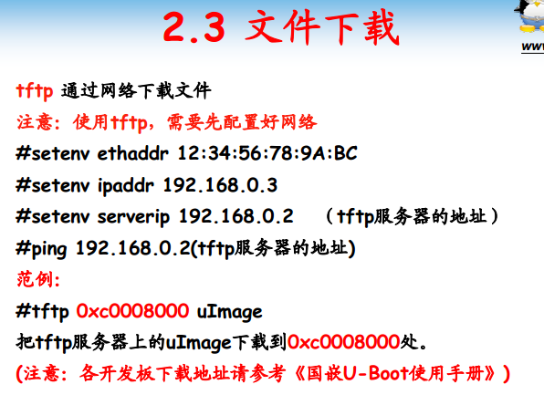

			保证网络链路畅通，设定开发板MAC地址，ip地址。保持一个网段
			作为tftp客户端，宿主机作为tftp服务器端

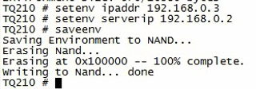

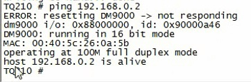

			windows、虚拟机、开发板尽可能放到同一个网段。
			关闭防火墙。。其实挺傻的操作。
			虚拟机桥接方式，不使用NAT
			开发板接到交换机、路由器上

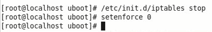

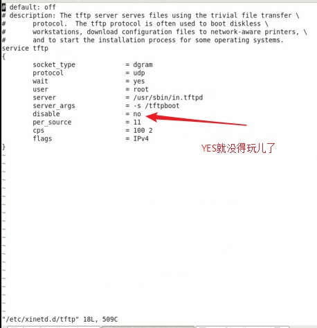

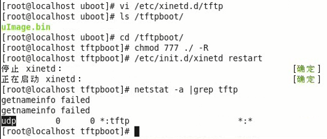

			没有开MMU地址一般是根据开发板不同 2,3,5开头，开了MMU就是0xC...

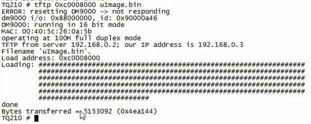

### UBoot执行程序

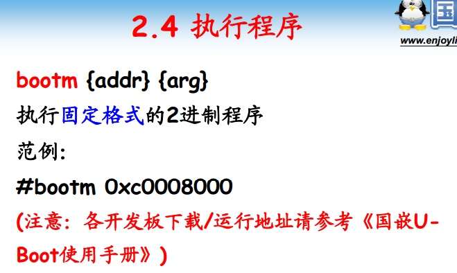

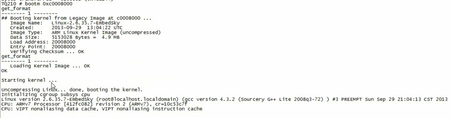

			执行固定格式的二进制程序
				程序包含头，os信息，创建信息，数据大小，入口点，加载地址等等

### UBoot内存操作命令

#### md

			md.b 字节方式显示

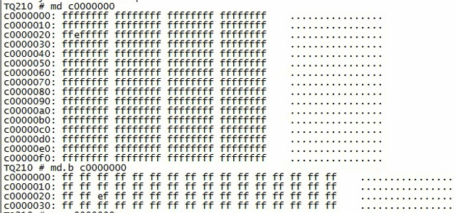

#### mm

			mm:memory modify
			空格回车即可退出修改

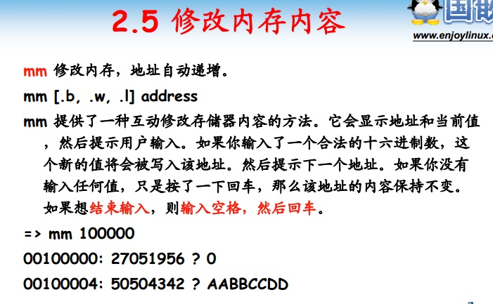

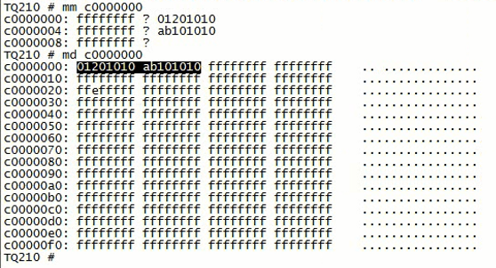

### UBoot Flash操作命令

#### nand erase

#### nand write/read

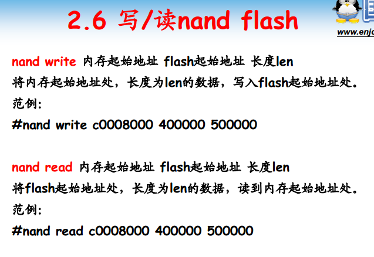

			写到Flash然后再写回内存，还是可以启动内核，就完美了

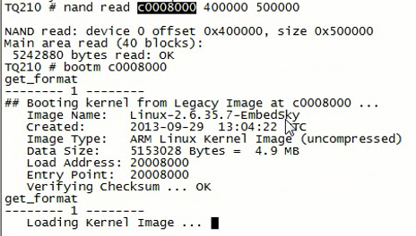

#### 设置自动启动

			开机之后自动执行命令
			下载镜像或者从NandFlash提取内核镜像到内存中，然后bootm跳转执行。
			命令是写到环境变量中的，也就是UBoot启动过程中检测是否自动执行，是的话执行改命令
			该命令格式有格式，需要用 \; 间隔 多个命令之间，该分隔符前后都应该有空格
			别忘了saveenv
			重启之后自动执行

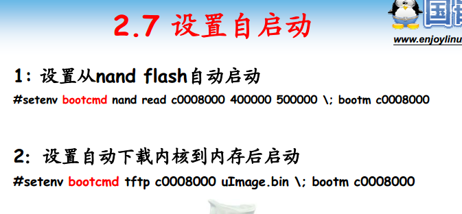

			调试阶段一般是从tftp下载镜像执行

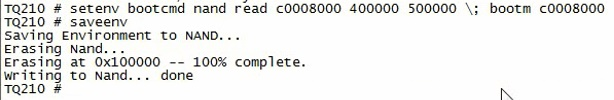

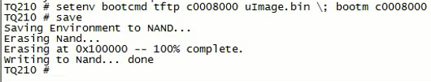

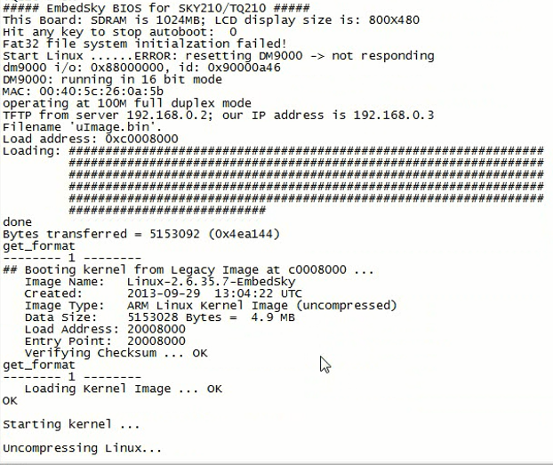

## 总结

			文档中有给出相应写死参数

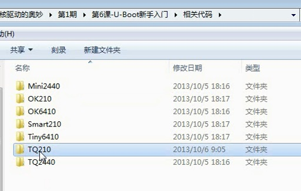

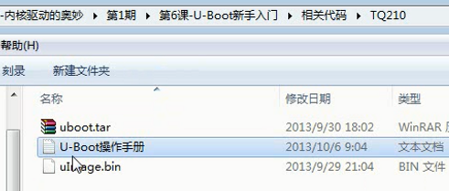

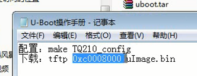
