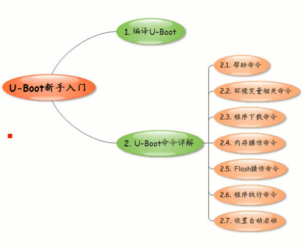

<!-- TOC depthFrom:1 depthTo:6 withLinks:1 updateOnSave:1 orderedList:0 -->

- [第6课-U-Boot新手入门](#第6课-u-boot新手入门)
	- [课程索引](#课程索引)
	- [编译UBoot](#编译uboot)
	- [UBoot命令详解](#uboot命令详解)
	- [总结](#总结)

<!-- /TOC -->

# 第6课-U-Boot新手入门

## 课程索引

      如何使用UBoot，如何二次开发

## 编译UBoot

## UBoot命令详解

## 总结
