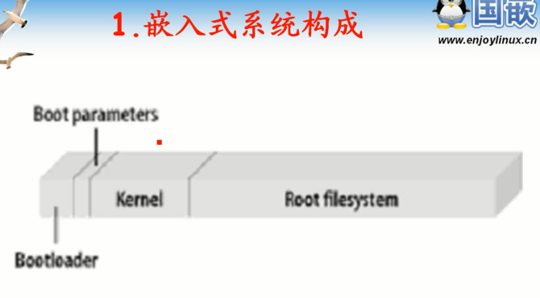
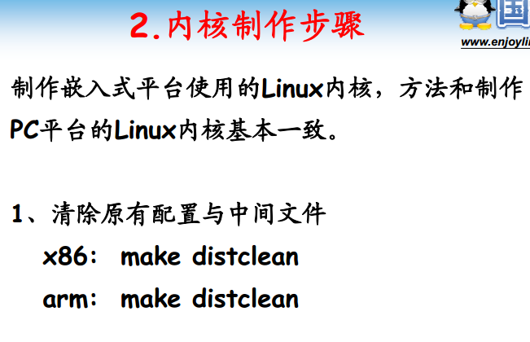
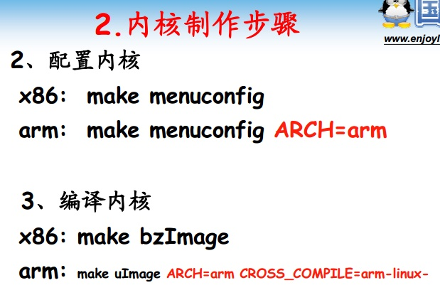

<!-- TOC depthFrom:1 depthTo:6 withLinks:1 updateOnSave:1 orderedList:0 -->

- [第7课-嵌入式Linux内核制作](#第7课-嵌入式linux内核制作)
	- [嵌入式系统构成](#嵌入式系统构成)
	- [内核制作步骤](#内核制作步骤)
	- [总结](#总结)

<!-- /TOC -->
# 第7课-嵌入式Linux内核制作

## 嵌入式系统构成

## 内核制作步骤

## 总结
