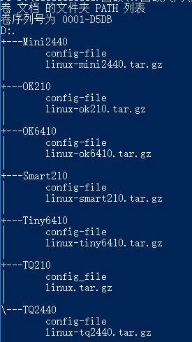
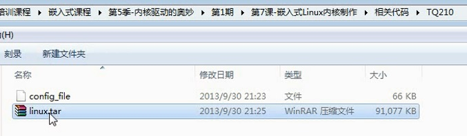
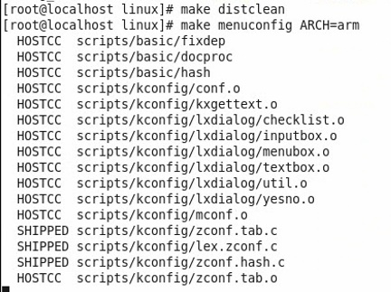
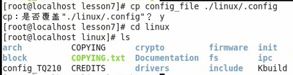
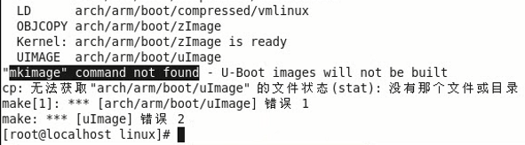
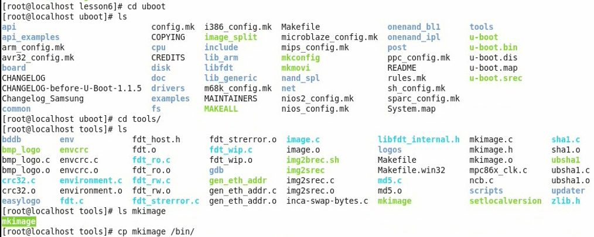
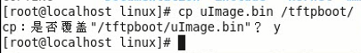
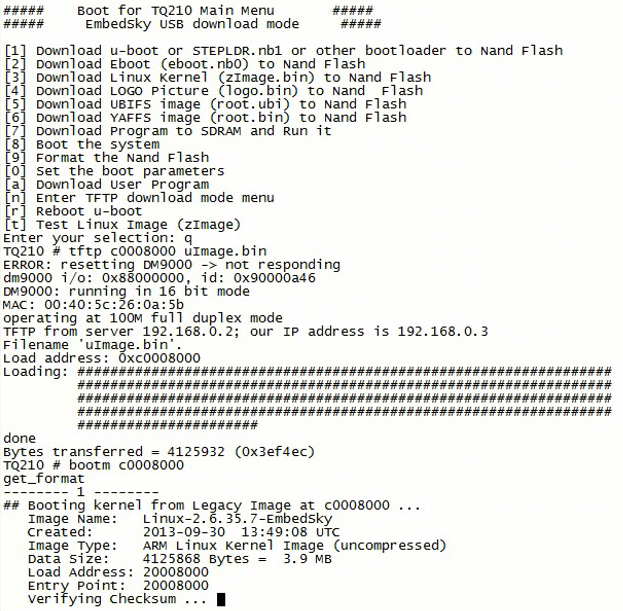

<!-- TOC depthFrom:1 depthTo:6 withLinks:1 updateOnSave:1 orderedList:0 -->

- [第7课-嵌入式Linux内核制作](#第7课-嵌入式linux内核制作)
	- [嵌入式系统构成](#嵌入式系统构成)
	- [内核制作步骤](#内核制作步骤)
		- [平台配置文件.conf](#平台配置文件conf)
		- [交叉编译](#交叉编译)
	- [总结](#总结)

<!-- /TOC -->
# 第7课-嵌入式Linux内核制作

## 嵌入式系统构成

## 内核制作步骤

### 平台配置文件.conf

      拷贝对应源码到宿主机，然后解包
      使用提供的config文件，重命名成.conf

      在ARM平台需要配置参数ARCH=arm
      在MIPS平台需要配置参数ARCH=mips
      make menuconfig ARCH=arm就会列出默认的通用的arm配置文件。
      当然我们不用它，使用官方给的比较靠谱。
      其实你一开始用官方的.conf文件都可以不用执行make menuconfig
      改命令其实就只影响.conf文件而已，不影响其他。

### 交叉编译

      make uImage 嵌入式平台内核镜像比较小，x86就要用bzImage毕竟比较大
      还要指定交叉工具链
      大概持续5分钟左右

      错误？为何
      UBoot可执行文件都要在文件有文件头，文件头就是mkimage工具添加
      mkimage是在UBoot代码中，可能你改了UBoot相关加载程序的代码，不能使用通用mkimage，因此你需要列出来。
      把mkimage拷贝到/bin目录下即可

      运行一下试试

      kernel panic。但是最后在挂载根文件系统的时候出错了，因为找不到根文件系统

## 总结
