<!-- TOC depthFrom:1 depthTo:6 withLinks:1 updateOnSave:1 orderedList:0 -->

- [第8课-根文件系统制作](#第8课-根文件系统制作)
	- [嵌入式系统构成](#嵌入式系统构成)
	- [课程索引](#课程索引)
	- [建立根文件系统目录与文件](#建立根文件系统目录与文件)
		- [创建目录](#创建目录)
		- [创建设备文件](#创建设备文件)
		- [加入配置文件](#加入配置文件)
		- [添加内核模块](#添加内核模块)
		- [编译busybox](#编译busybox)
	- [挂载根文件系统到内核](#挂载根文件系统到内核)
		- [文件系统类型](#文件系统类型)
		- [使用initramfs挂载](#使用initramfs挂载)
		- [NFS挂载](#nfs挂载)
	- [总结](#总结)

<!-- /TOC -->

# 第8课-根文件系统制作

## 嵌入式系统构成

      根文件系统
        根：指的就是第一个文件系统，Linux可以包含多种文件系统，但是第一个必须得有，不然内核没办法启动
        文件系统：EXT系列，btfs、FAT、NTFS

      目录及目录下的所有文件即为文件系统表象

## 课程索引

## 建立根文件系统目录与文件

### 创建目录

### 创建设备文件

      什么是设备文件？
      Linux绝大部分设备会以设备文件的形式存在。操作设备就是对设备增删改查。

      mknod 怎么玩儿？？

### 加入配置文件

### 添加内核模块

      编译内核模块之后模块是散落在各个子目录当中的。
      需要先安装模块/lib/modules/`uname -r`
      指定安装路径，给出根路径即可

### 编译busybox

      busybox - 嵌入式开发中的瑞士军刀

      必须使用静态

      必须指定交叉编译

      指定安装路径

      make 编译

      make install安装，实际上就是拷贝过程

## 挂载根文件系统到内核

      Linux系统如何使用这些目录文件？
        选择何种文件系统？

### 文件系统类型

      yaffs2 UbiFS 可读写
      clanfs 只读
      Jffs2 可读写
      内存文件系统中Ramdidsk比较老，将内存模拟成磁盘。
      Ramdisk：划分大小固定，超过无法处理，内存空间浪费
      Initramfs：事先不用指定大小，可以动态扩展。
        启动速度块。性能更好，多使用它。只能上电状态维持。
        因此需要增加一个存储设备的文件系统。有的目录用initramfs，有的目录用存储设备文件系统。
      网络文件系统nfs：主要是在开发阶段使用

### 使用initramfs挂载

      必须先创建一个软链接

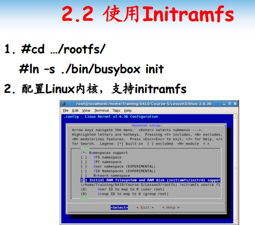

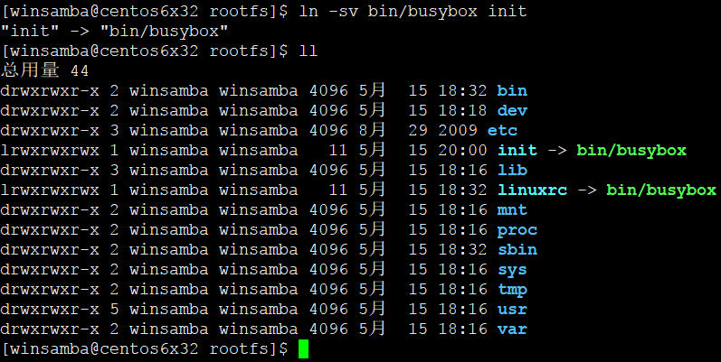

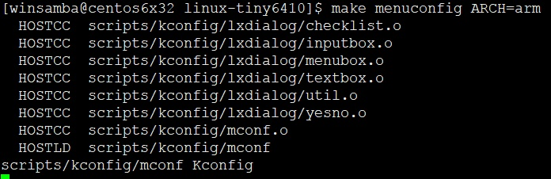

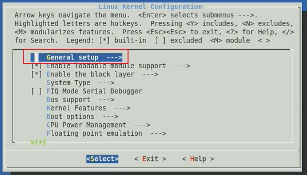

      勾选，设置路径

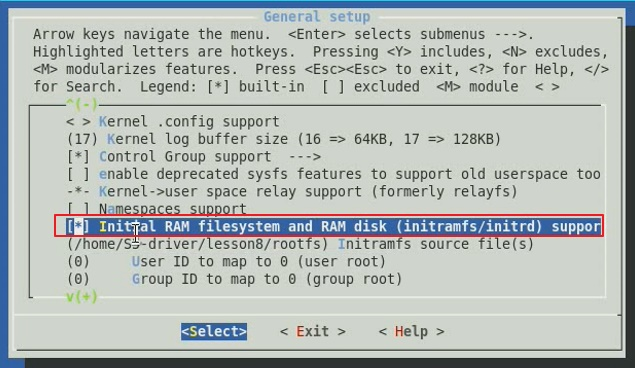

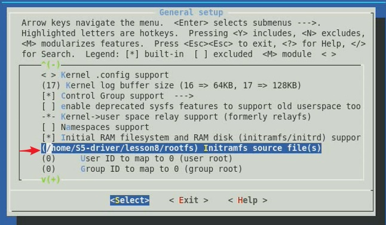

      重新编译内核

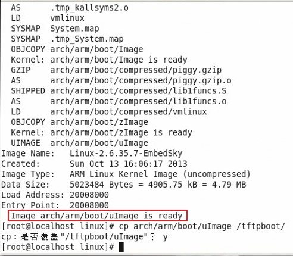

      进入UBoot设置环境变量

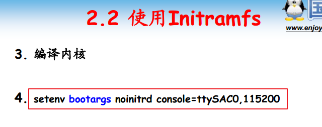

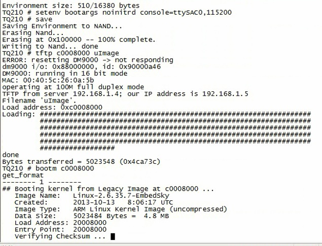

      即可启动内核

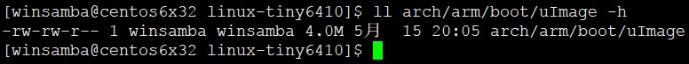

### NFS挂载

      initramfs是在开发板内存中，如果想要读写该文件系统就要全部重做镜像。这很麻烦。
      先要在rootfs中添加好，然后重新编译内核。
      uImage包含两个部分，一个部分是内核，另一个部分是initramfs。
      如果要频繁更改其内容，过程太繁琐。因此有了NFS挂载

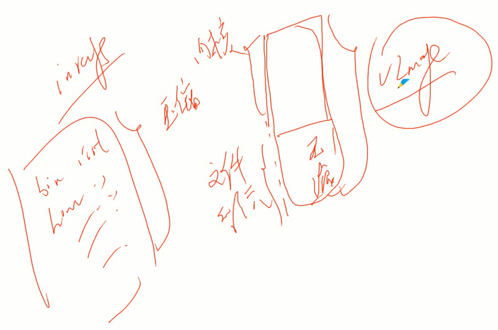

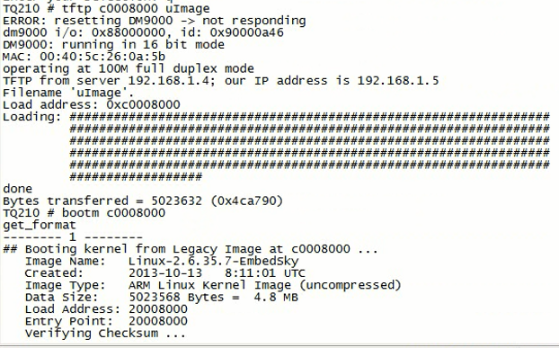

      首先内核配置开启该选项

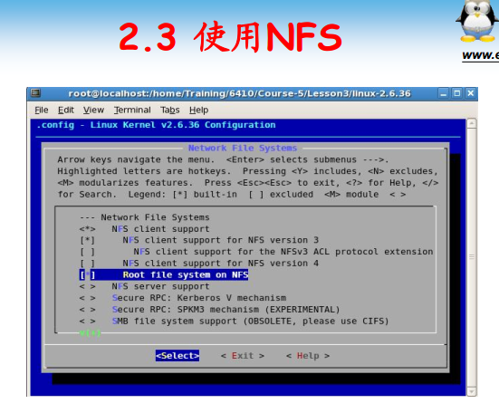

      去掉initramfs配置。然后进入filesystem选项

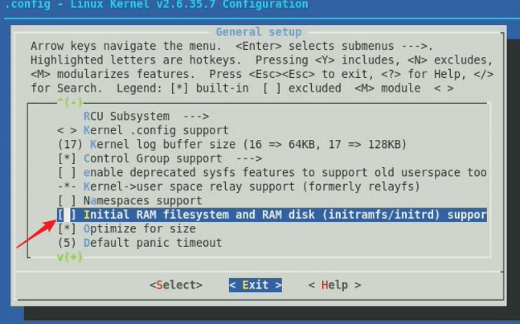

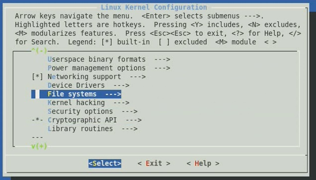

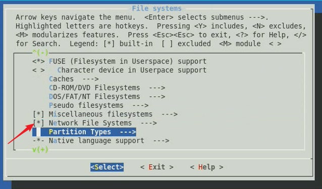

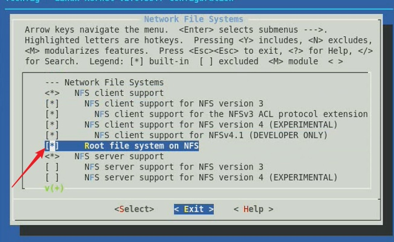

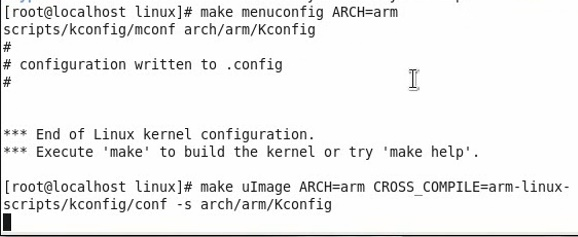

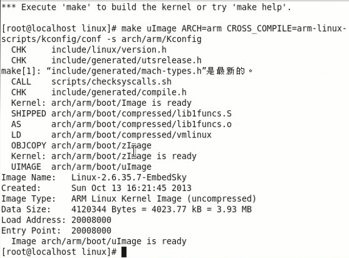

      配置启动参数，参数是针对UBoot，并且可以存储在NandFlash中的固定位置。

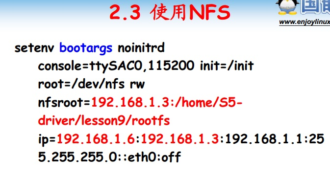

      off：关闭dhcp

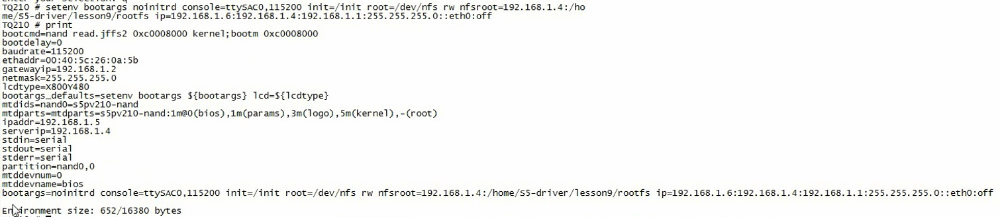

      启动前确保nfs启动

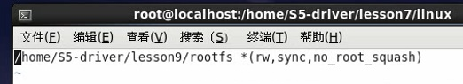

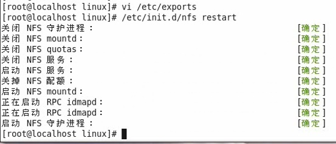

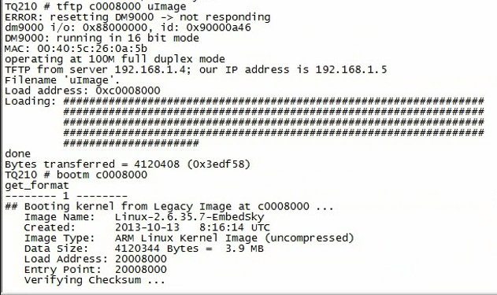

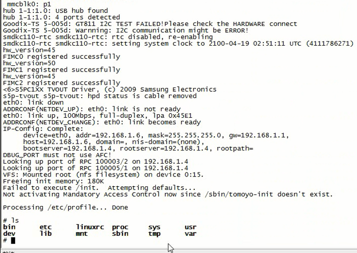

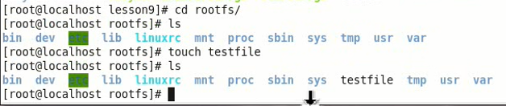

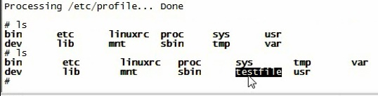

      宿主机增上改查文件，立马在开发板中起效。

      做成产品时，不会用到。nfs只会在开发阶段使用。而initramfs是在产品中使用。

## 总结
