<!-- TOC depthFrom:1 depthTo:6 withLinks:1 updateOnSave:1 orderedList:0 -->

- [第9课-Linux内存管理子系统](#第9课-linux内存管理子系统)
	- [课程索引](#课程索引)
	- [内存管理模型](#内存管理模型)
		- [内存管理子系统模型](#内存管理子系统模型)
		- [内存管理子系统职能](#内存管理子系统职能)
	- [地址映射管理](#地址映射管理)
		- [虚拟地址空间分布](#虚拟地址空间分布)
		- [虚拟地址转化为物理地址](#虚拟地址转化为物理地址)
	- [物理内存分配管理](#物理内存分配管理)
	- [总结](#总结)

<!-- /TOC -->
# 第9课-Linux内存管理子系统

## 课程索引

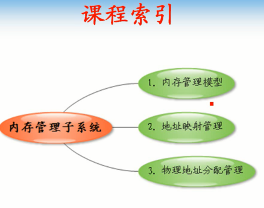

## 内存管理模型

      Linux内存管理子系统

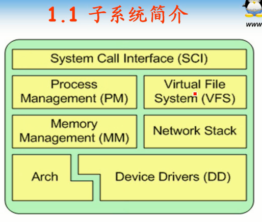

      体系结构相关代码
      系统调用接口
      进程管理接口
      内存管理子系统
      驱动程序
      网络协议栈
      虚拟文件系统

### 内存管理子系统模型

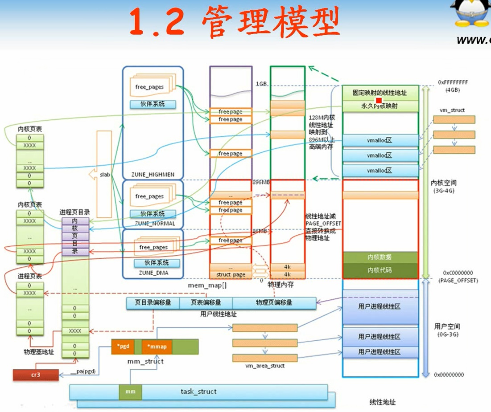

### 内存管理子系统职能

      物理内存分配
      虚拟地址映射：虚拟地址到物理地址

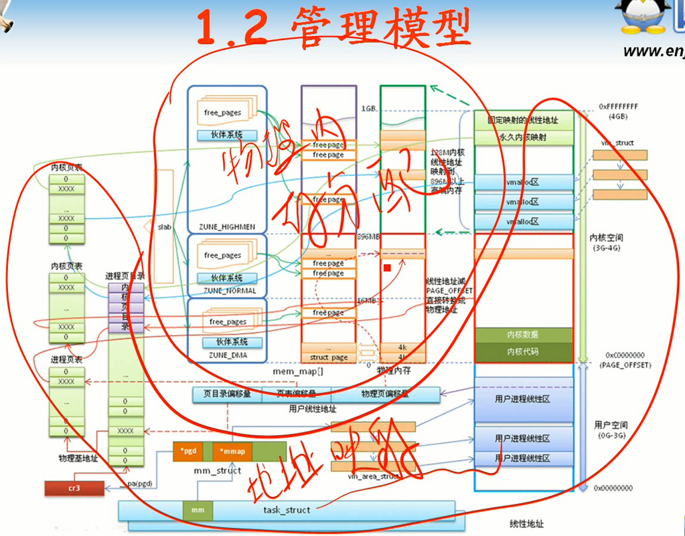

## 地址映射管理

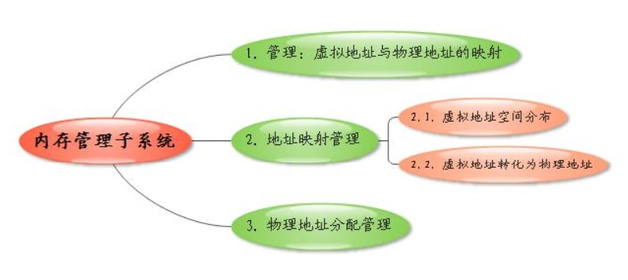

### 虚拟地址空间分布

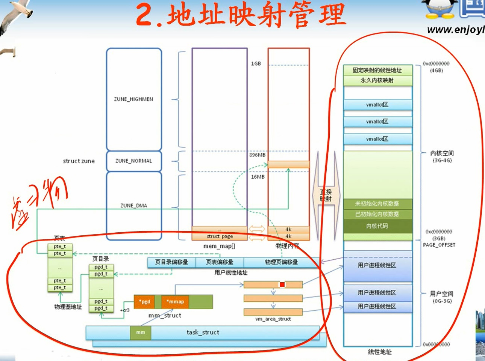

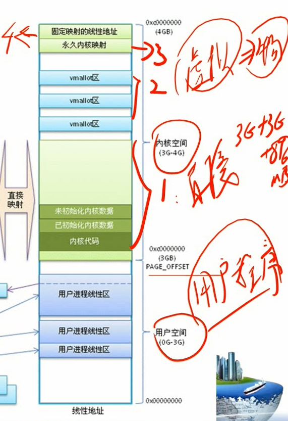

### 虚拟地址转化为物理地址

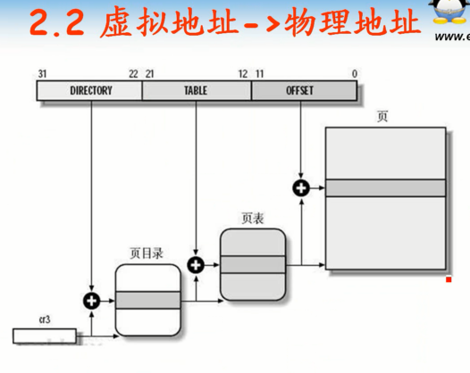

      高10位作为偏移，加上页表基地址
      取得物理页基地址，低12位偏移
      896MB是个分界线，低端内存，高端内存
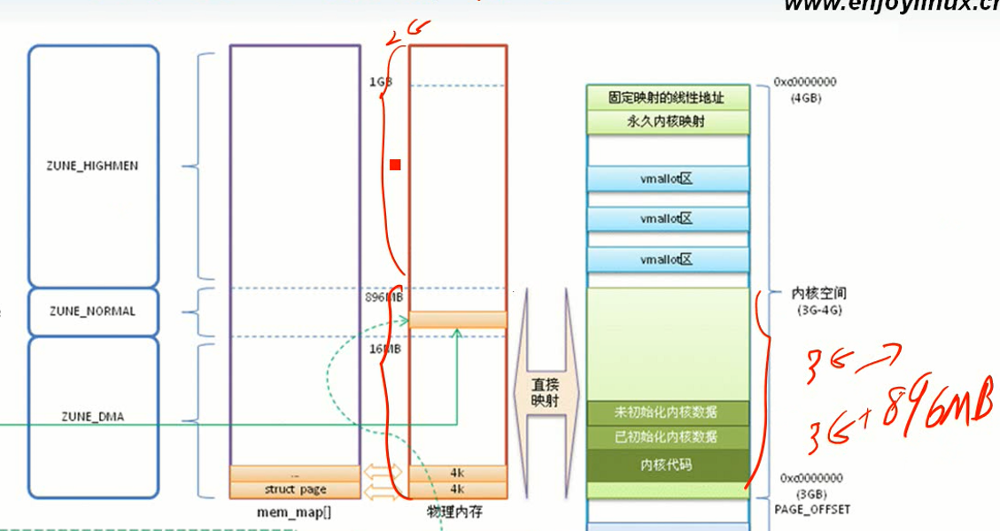

      物理地址和虚拟地址之间固定差值3G，直接映射

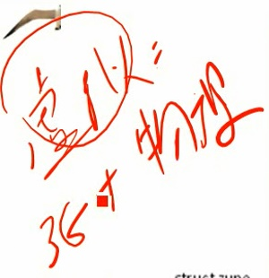

      vmalloc可以再高端也可以在低端

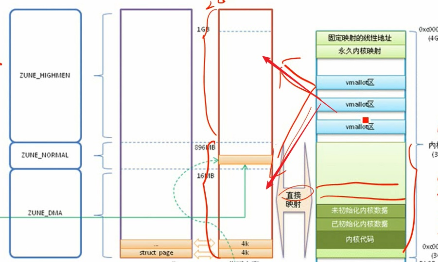

      访问固定寄存器

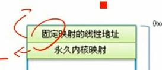

      内存四个区域区别？
      除了直接映射，其他几个区域都要页表转换

## 物理内存分配管理

      有虚拟地址，不一定有物理内存。
      好比电影票，你有票，但是没有分配座位，只有你去了才给你分配。
      只有访问虚拟地址的时候才会分配物理内存。

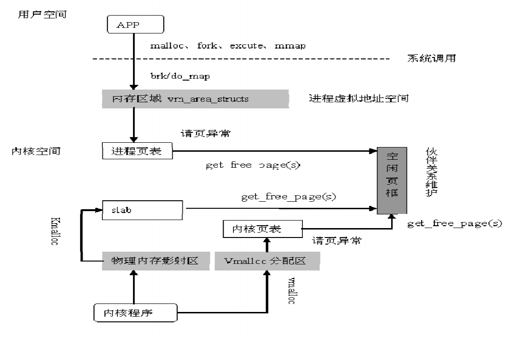

      kmalloc通过slab分配
      vmalloc、malloc都要通过请页异常

## 总结
